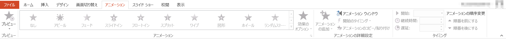
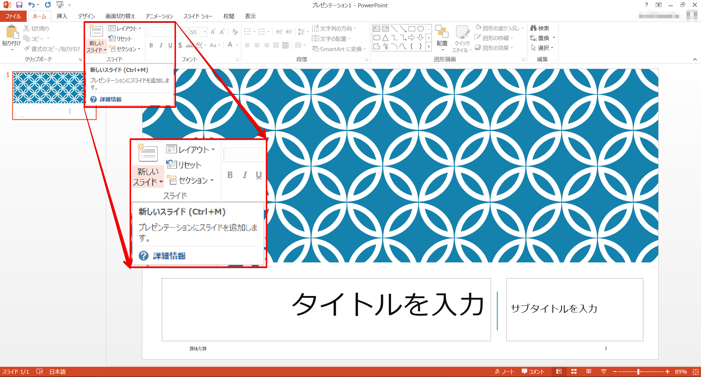
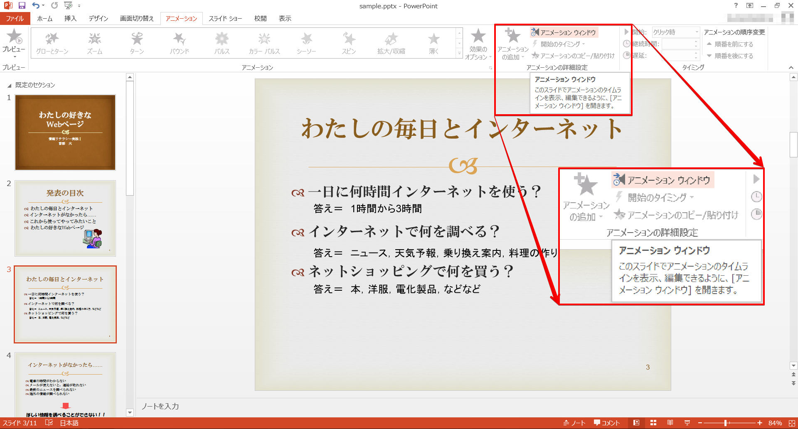
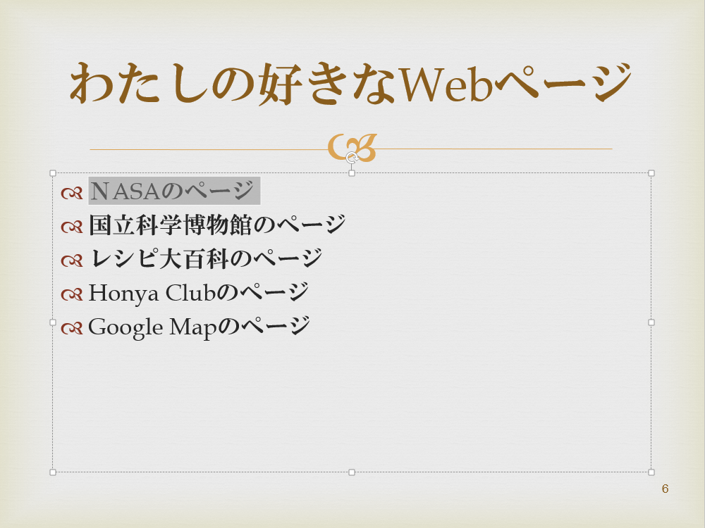

最初にPowerPointの使い方について勉強します。
そして今回と次回を使ってスライドを作り、最終回にプレゼンテーションを実演してもらいます。
持ち時間は5分としますので、時間内に良いプレゼンテーションができるようにがんばりましょう。

なおプレゼンテーションに用いるソフトは各種あります。 
この授業の教材はHTML (Hyper Text Markup Language) を用いて作成し、プレゼンテーションをしています。
この手法には、スライドの作成が容易であり、参照や引用がネットワークを通じて自由にできるといった利点があります。

授業では広く用いられている PowerPoint というソフトを使うことにします。

プレゼンテーションとは
----------------------

プレゼンテーションとは、発表者が聞き手に対して、なにか伝えたいこと、アピールしたいことなどを話すことです。
その話の中で、視覚的な資料を使うことで、聞き手により効果的な伝達ができるため、
近年ではパソコンを用いたプレゼンテーションが多くの場合に用いられるようになりました。
もちろん、写真やポスターなども広くプレゼンテーションに用いられています。
皆さんにとって一番身近なプレゼンテーションは、テレビのコマーシャルかもしれません。

PowerPointを使って「わたしの好きなWebページ」というテーマでプレゼンテーションを作成した例があります。
プレゼンテーションについて、さらにPowerPointでプレゼンテーションの何ができるのか考えてみましょう。

-   [わたしの好きなWebページ](sample.pptx)

Microsoft PowerPointの起動
--------------------------

1. [スタート]をクリックします
1. [すべてのプログラム] - [Microsoft Office] - [Microsoft Office PowerPoint 2013] をクリックします

プレゼンテーションの作成と保存
------------------------------

### プレゼンテーションの作成・既存プレゼンテーションのオープン

また既存プレゼンテーションは、目的の文書のあるフォルダに移動し、そのアイコンをダブルクリックで開くこともできます。

### 文書の保存

全てのアプリケーションに共通することですが、様々なトラブルにより制作途中のデータが失われてしまうことがあります。それを防ぐためにも、**こまめに保存する**ように心がけましょう。

#### 初めてプレゼンテーションを保存する

1.   [ファイルの種類の変更] をクリックして必要な保存形式を選択します
1.   [名前を付けて保存] をクリック - 保存したいフォルダに移動します
1.  ファイル名を入力し [Enter] キーもしくは [保存] をクリックします

保存形式は[名前を付けて保存]のウィンドウで[ファイルの種類]から選択することもできます。

<dl>
<dt>プレゼンテーション(.pptx)</dt>
<dd>Microsoft Office PowerPoint2007以降のバージョンで使用できる形式で保存します。</dd>
<dd><strong>PowerPoint2003以前とは互換性がないので注意しましょう</strong>。</dd>
<dt>PowerPoint 97-2003 プレゼンテーション(.ppt)</dt>
<dd>PowerPoint97からPowerPoint2003までと完全に互換性のある形式で保存します。</dd>
<dt>OpenDocument プレゼンテーション(.odt)</dt>
<dd>OpenDocumentという、Office以外のソフトと互換性のある形式で保存します。</dd>
<dt>PowerPoint スライドショー(.ppsx)</dt>
<dd>作成したプレゼンテーションをスライドショー表示で保存します。</dd>
<dt>PowerPoint 画像化プレゼンテーション(.pptx)</dt>
<dd>プレゼンテーションと同じ拡張子ですが、各スライドを画像に変換して保存します。</dd>
</dl>

この他にもPDFやXPS形式で保存することができます。

<strong>情報基礎教室における制約事項</strong>

情報基礎教室では、PDFを印刷すると、システム上の理由で印刷にかなりの時間がかかってしまいます。

#### 既存の文書の変更を保存する

1.  （[ファイル]タブ）をクリックします
1.  （[上書き保存]）をクリックします

あるいは、クイックアクセスツールバーの  [上書き保存] をクリックします。

### PowerPointの終了

1.  （[ファイル]タブ）をクリックします
1.  （[終了]）をクリックします

あるいは、ウィンドウ右上の閉じるボタンをクリックします。

Microsoft Office PowerPoint 2013の概要
--------------------------------------

### ウィンドウ構成

メインウィンドウの白い面がスライド画面です。
ここにプレゼンテーションで表示させたいスライドを作成します。

左の画面には今まで作りためたスライドが縮小版で表示されます。
アウトラインでは文字内容のみが表示されます。
新規作成ではとりあえず 1 枚空(から)スライドが表示されています。

### リボン

プレゼンテーションを作成していく際によく利用するコマンドを割り当てたボタンが機能ごとにパネルに分類され、配置されています。

リボン上部のタブ状になった[ホーム]、[挿入]、[デザイン]、[画面切り替え]、[アニメーション]、[スライドショー]、[校閲]、[表示]をクリックすることによって、各機能のパネルに切り替えることができます。もしくは、カーソルがリボン上にあるときにホイールを回すと、切り替えることができます。

#### ホーム

新しいスライドの作成や文字装飾、図形描画などのコマンドが収納されています。

#### 挿入

表や図、メディアクリップなどを挿入します。

#### デザイン

スライドの背景や向きなどを設定します。

#### 画面切り替え

1つのスライドから次のスライドに移動するときにアニメーション効果をつけることができます。

#### アニメーション

アニメーションの挿入や順序、タイミングなどを設定します。

#### スライドショー

スライドショーの開始やリハーサル、ナレーションの録音などができます。

#### 校閲

スペルチェックや翻訳、コメントの挿入などできあがったプレゼンテーションを校正を行います。

#### 表示

PowerPointの画面での表示の仕方を設定します。

パネルの右下にある  を押すと、より詳しく各項目を設定することができます。

また、カーソルを使用したいコマンドの上で静止させると、そのコマンドの説明を見ることができます。

プレゼンテーションを作る流れ
----------------------------

### スライドの準備(背景のデザインとマスタースライドの設定)

内容を作り始める前に、スライド全体のデザインを考えましょう。

一つのプレゼンテーションでは、一つの流れのある内容を発表するため、全体の話が一貫して見えるように、スライドのデザインもある程度統一して作る必要があります。
具体的には、どのスライドにも共通に入れておきたい項目(たとえば、背景デザイン、フッターなど)を設定します。

これは誰もが必ずすべきことではありませんが、もし自分のプレゼンテーションに必要だと思ったら積極的に利用しましょう（使わない場合と見比べてみて、見やすいほうを使う、あるいはほかの人にアドバイスしてもらうなどして、ぜひいろいろと検討してみてください）。
フッターにはページ情報、タイトル、プレゼンテーションの日付、会議名称・場所などを表示するのがよいでしょう。

まずここでは、これから作成するスライドに共通するバックグラウンド(背景)のデザインを導入します。
PowerPointにはさまざまな背景デザインが用意されています。
この中で自分の好みにあうものがあればそれを選択します。
もちろん自分で別のデザインを作ることも可能ですし、背景を単一色で統一することもできます。

&#9312; [デザイン]リボン - [テーマ]の中から使いたいデザインを選びます。

テーマの  [その他] を押すとテーマのデザインの一覧を見ることができます。

また、デザインの上にカーソルを置くと、プレビューを見ることができます。

さらに、各スライドの文字のフォントやサイズ、色、フッターなどを共通して設定するために、マスタースライドの設定を行います。

&#9313; [表示]リボン -  [スライドマスタ] をクリックします。

&#9314; フォントサイズや色、箇条書きのレベルなどを好きな形式に変更します。
その形式が今後このプレゼンテーションを作成していくに際して、標準の設定となります。

&#9315;  [マスタ表示を閉じる] を押して、通常表示に戻ります。

&#9316; [表示]リボン -  [ヘッダーとフッター] をクリックします。

&#9317; 日付/時刻、フッター、(スライド番号)を設定し、[すべてに適用]を押します。

**[すべてに適用]を押すと、全てのスライドが、[適用]を押すと選択したスライドのみが、設定されます。**

ここでの設定も必須ではありません。多くの項目は、スライドデザインによって最初から設定されています。
また、スライドデザインを使わなくても、あらかじめPowerPointが用意した標準設定がありますのでそれを利用すれば問題はありません。

### スライドの作成

ここまででスライドの準備が終わりました。あとはプレゼンテーションの流れにあわせてスライドを作成していきます。

[ホーム]リボン -  [新しいスライド] から必要なレイアウトのスライドを選択します。

一般的に、プレゼンテーションの最初のスライドは「表紙」ですので、PowerPointでは最初の一枚目が自動的に表紙のレイアウトになっています。
レイアウトの変更は可能です。

このようにして、話したいことにあわせて、スライドを作っていきます。

間違って作ったスライドや、必要のないスライドを削除したい場合は、左ウィンドウで[スライド]タブをクリックし、削除するスライドを右クリックして[スライドの削除]をクリックします。

### スライドショー

スライドが完成したら、実際にスライドショーで見てみましょう。

[スライドショー]リボン - "スライドショーの開始"パネルにある  [最初から] をクリックします。

また、複数スライドを作った場合、任意のスライドからスライドショーを始めたいときは、
[スライドショー]リボン - "スライドショーの開始"パネル -  [現在のスライドから] を押します。

スライドは、あくまでもプレゼンテーションのための補助資料ですので、発表者の話の内容と合っているか、視覚的な効果としてわかりやすいか、意味があるかなどの点をよくチェックしましょう。

PowerPointの機能の紹介
----------------------

PowerPointでは、プレゼンテーションでの視覚的な効果をより強めるために、さまざまな機能を使うことができます。

ここでは、冒頭に紹介した「わたしの好きなWebページ」というプレゼンテーションの中で使っている「アニメーション」「ハイパーリンク」「クリップアート」という3つの視覚効果の使い方を見ていきましょう。

### アニメーション

ここでは，最初に表示される3つの疑問に対し、それぞれの「答え」として順番に表示させます。

&#9312; [アニメーション]リボン -  [アニメーション ウィンドウ] をクリックします。
すると、"アニメーション ウィンドウ"が現れました。

&#9313;  まず、一つめの答えになる"答え ＝ 1時間から3時間"を選択します。

&#9314;  [アニメーション]リボン - [アニメーションの追加] - [開始] - [スライドイン]を押します。

&#9315;  アニメーションが追加されました。同様に他の二つの答えも設定します。

これでアニメーションの設定ができました。
[再生]や[アニメーション]リボン - [プレビュー]を押すと、アニメーションを確認することができます。

"開始"や"方向"、"速さ"を調節することによって、よりわかりやすくプレゼンテーションを行うことができます。
[アニメーション]リボン - [効果のオプション]を開くことによって、さらに詳細な設定を行うことができます。

[効果のオプション]は"アニメーションウィンドウ"でアニメーション横の[▼]を押しても開きます。

### ハイパーリンク

3つのWebページを紹介するときに、ハイパーリンクを利用しています。

リンクのついている文字は色が変わり、下に線が引かれています（文字色は変わらない場合もあります）。
スライドショーで表示させると、文字の上をクリックしたときに、リンク先へ移動するという仕組みです。

&#9312; リンクをはりたい"NASAのページ"を選択します。

&#9313; [挿入]リボン -  [ハイパーリンク] を押します。

&#9314; 7ページ目の"NASAのページ"にリンクをはります。選択をして、[OK]を押します。

リンクがはられた証拠に文字色が変わり、下線が付きました。
スライドショーを実行し、リンクを押してみると、7 ページ目の"NASAのページ"へリンクできていることが確認できます。

ハイパーリンクでは、ほかのファイルやWebページなどもリンク先として指定することができます。
例で示したスライドを参考に、さまざまな使い道を考えてみましょう。

### クリップアート

PowerPointには、自分で絵を描かなくても、イメージを伝えるために役立つ絵が用意されています。
Wordなどでも使える「クリップアート」です。

今回は 2 ページ目にコンピュータのクリップアートを挿入します。

&#9312; [挿入]リボン -  [クリップアート] を押します。

&#9313; 検索ワード"コンピュータ"で検索をかけます。

&#9314; 任意の画像を選択し、挿入します。レイアウトを考えて、好きな場所に移動させてください。

ほかのファイルの図や、写真なども[挿入]リボンから挿入することができます。
もちろん、図にアニメーションやハイパーリンクをつけることも可能です。

課題
----

「わたしの好きなWebページ」というタイトルで、下記の条件を踏まえたプレゼンテーションを作ってみましょう。

-   少なくとも3枚は図を使用すること（クリップアートでも、自分で作成した図でもかまいません）
-   ハイパーリンク、アニメーションを1回以上利用すること

必要な場合はExcelでグラフや表などを作成してもいいでしょう。

