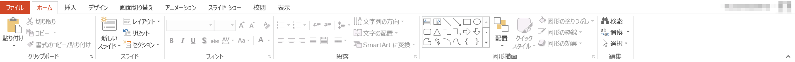
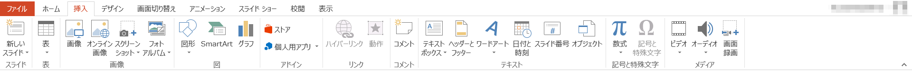
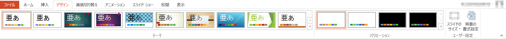
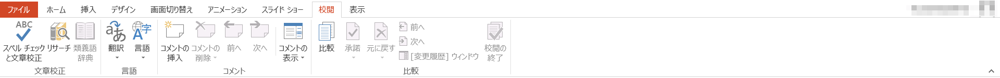
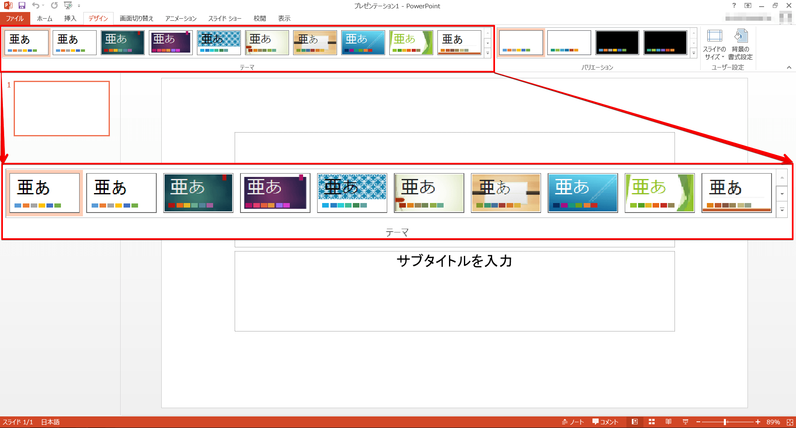
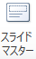
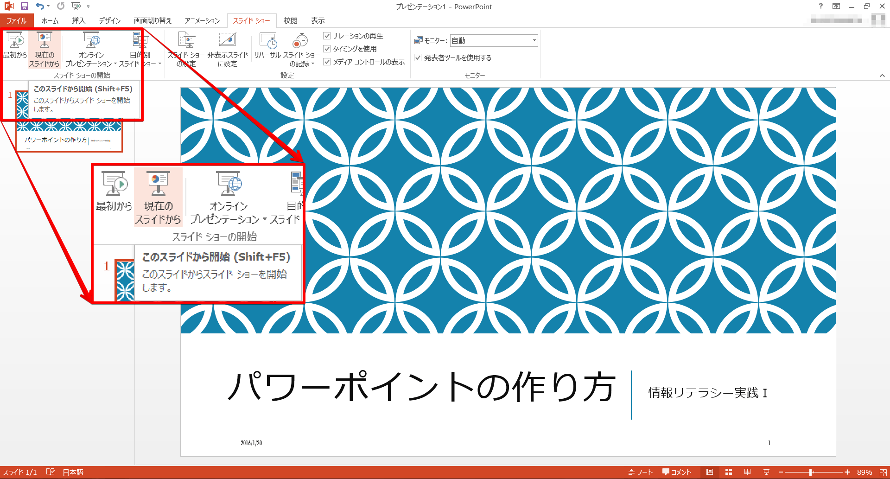
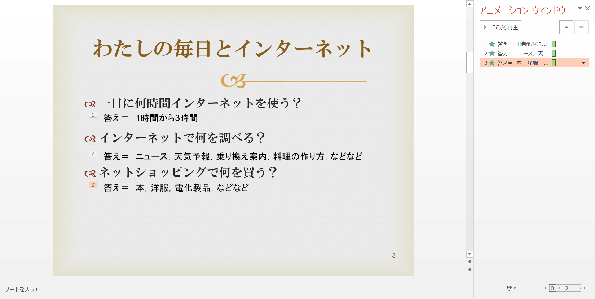
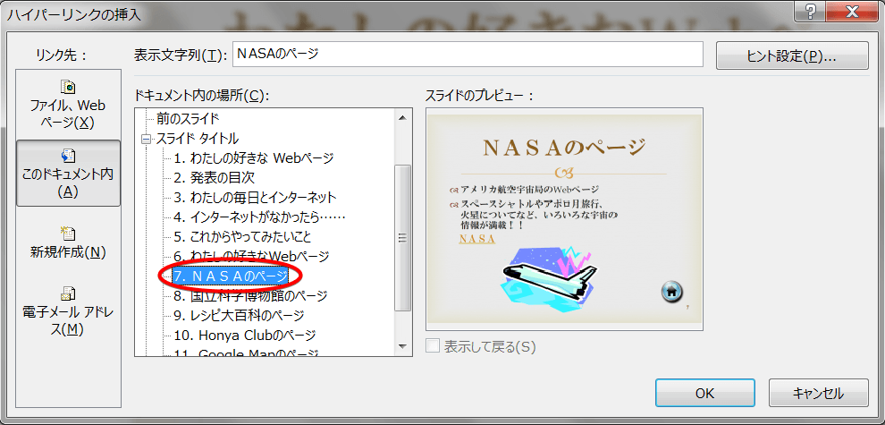
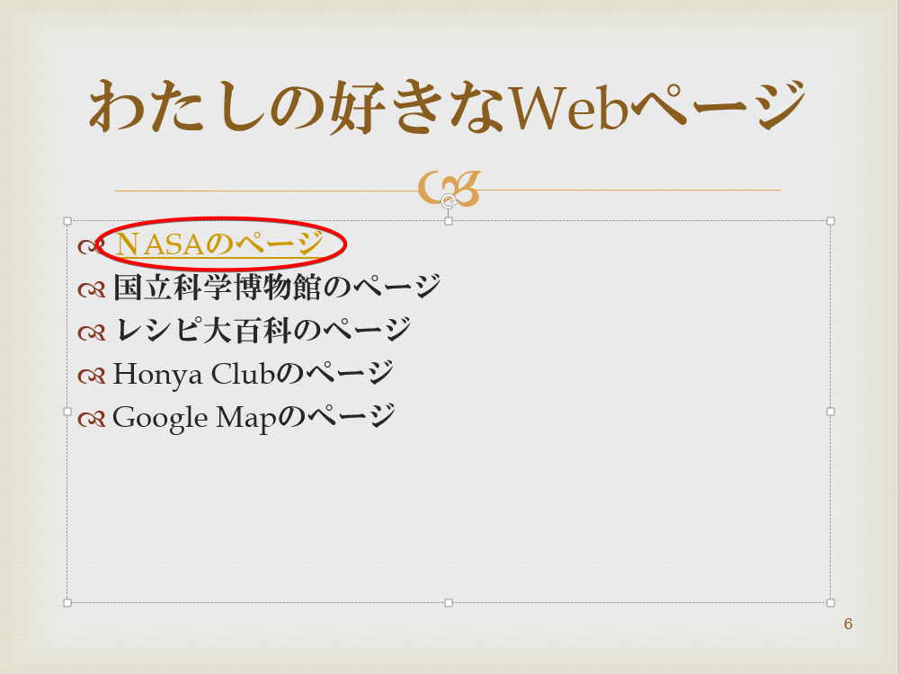

プレゼンテーションとは
----------------------

プレゼンテーションとは、発表者が聞き手に対して、なにか伝えたいこと、アピールしたいことなどを話すことです。
その話の中で、視覚的な資料を使うことで、聞き手により効果的な伝達ができるため、
近年ではパソコンを用いたプレゼンテーションが多くの場合に用いられるようになりました。
もちろん、写真やポスターなども広くプレゼンテーションに用いられています。
皆さんにとって一番身近なプレゼンテーションは、テレビのコマーシャルかもしれません。

プレゼンテーションに用いる視覚的な資料を作成する方法は各種あります。
例えば、この授業の教材はHTML (Hyper Text Markup Language) を用いて記述しています。
HTML を用いたプレゼンテーションでは、ウェブ上の資料を用いた参照や引用が容易にできるといった利点があります。

授業では、プレゼンテーション資料の作成に広く用いられているソフトウェア PowerPoint を扱います。
そして今回と次回を使ってスライドを作り、最終回にプレゼンテーション実演の時間を設けます。

ここに、PowerPoint を使って「わたしの好きなWebページ」というテーマでプレゼンテーションを作成した例があります。
プレゼンテーションについて、さらに PowerPoint はプレゼンテーションにおいてどのように利用できるのか考えてみましょう。

-   [わたしの好きなWebページ](sample.pptx)

Microsoft PowerPointの起動
--------------------------

1. [スタート]をクリックします
1. [すべてのプログラム] - [Microsoft Office] - [PowerPoint 2013] をクリックします

プレゼンテーションの作成と保存
------------------------------

PowerPoint を起動すると、スタート画面が表示されます。

ここで、新規にプレゼンテーションを作成するか、あるいは既存のプレゼンテーションファイルを開くかを選びます。

新規に作成する場合は、左側のサムネイルから利用したいテーマを選ぶことで、そのテーマを適用したファイルが新規作成されます。

また既存ファイルの場合は、Windows エクスプローラーで目的のファイルのあるフォルダに移動し、そのアイコンをダブルクリックで開くこともできます。

### 文書の保存

全てのアプリケーションに共通することですが、様々なトラブルにより制作途中のデータが失われてしまうことがあります。
それを防ぐためにも、作業中は**こまめに保存する**ように心がけましょう。

#### 初めてプレゼンテーションを保存する

1.   [ファイルの種類の変更] をクリックして必要な保存形式を選択します
1.   [名前を付けて保存] をクリック - 保存したいフォルダに移動します
1.  ファイル名を入力し [Enter] キーもしくは [保存] をクリックします

保存形式は[名前を付けて保存]のウィンドウで[ファイルの種類]から選択することもできます。

<dl>
<dt>PowerPoint プレゼンテーション(.pptx)</dt>
<dd>PowerPoint 2007 以降で利用できる標準形式で保存します。</dd>
<dt>PowerPoint 97-2003 プレゼンテーション(.ppt)</dt>
<dd>Microsoft Power Point 97 から PowerPoint 2003 までで標準利用されていた形式で保存します。</dd>
<dt>OpenDocument プレゼンテーション(.odp)</dt>
<dd>Microsoft Office 以外のオフィス製品でも利用できる、オフィススイートの共通形式で保存します。</dd>
<dt>PowerPoint スライドショー(.ppsx)</dt>
<dd>作成したプレゼンテーションをスライドショー表示で保存します。</dd>
<dt>PowerPoint 画像化プレゼンテーション(.pptx)</dt>
<dd>プレゼンテーションと同じ拡張子ですが、各スライドを画像に変換して保存します。</dd>
<dt>PDF(.pdf)</dt>
<dd>PDF形式で保存します。Excel がインストールされていない環境でも、PDF に対応するソフトウェアがあれば開くことができます。</dd>
</dl>

<strong>情報処理教室における制約事項</strong>

情報処理教室では、PDFを印刷すると、システム上の理由で印刷にかなりの時間がかかってしまいます。

#### 既存の文書の変更を保存する

1.   をクリックします
1.  （[上書き保存]）をクリックします

あるいは、クイックアクセスツールバーの  [上書き保存] をクリックします。

### ファイルを閉じる

1.   をクリックします
1.  [閉じる]をクリックします

開いているファイルを閉じるだけで、PowerPoint は終了しません。

### PowerPoint の終了

ウィンドウ右上の閉じるボタンをクリックします。

Microsoft PowerPoint 2013の概要
-------------------------------

### ウィンドウ構成

メインの領域に表示される白い紙のような部分が、1枚のスライドを表しています。
ここに文字や図表を配置していきます。

左の領域には、プレゼンテーションファイル内のスライドがサムネイル表示されます。
新規作成した状態では、1ページ目のタイトル用スライドが表示されています。
スライドを複数まとめたものが一つのプレゼンテーションファイルとなります。

### リボン

画面上部のリボンには、プレゼンテーション作成のための処理を割り当てたボタンが、機能ごとにパネルに分類され、配置されています。

リボン上部のタブ状になった[ホーム]、[挿入]、[デザイン]、[画面切り替え]、[アニメーション]、[スライドショー]、[校閲]、[表示] をクリックすることによって、各機能のパネルに切り替えることができます。もしくは、リボンにカーソルを合わせてマウスホイールを回すと、切り替えることができます。

#### ホーム

新しいスライドの追加や文字装飾、図形描画などの処理がまとめられています。

#### 挿入

表や画像、図、メディアクリップなどを挿入します。

#### デザイン

背景や文字色などをセットにした "テーマ" や、配色パターンのセットである "バリエーション" を使い、デザインを変更します。

#### 画面切り替え

あるスライドから次のスライドに移動するときに、アニメーション効果をつけることができます。

#### アニメーション

スライド内の要素に対してアニメーションの効果を設定したり、順序・タイミングを調整します。

#### スライドショー

スライドショー表示をコントロールします。リハーサルやナレーションの録音なども行えます。

#### 校閲

スペルチェックや翻訳、コメントの挿入などできあがったプレゼンテーションファイルに対する校正のメニューです。

#### 表示

PowerPoint の画面での表示方法を設定します。

パネルの右下に  ボタンが表示されている場合は、より詳しく各項目を設定することができます。

また、それぞれのボタンにカーソルをポイントすると、その機能の説明を見ることができます。

プレゼンテーションを作る流れ
----------------------------

### スライドの準備(背景のデザインとマスタースライドの設定)

内容を作り始める前に、スライド全体のデザインを考えましょう。

一つのプレゼンテーションでは、一つの流れのある内容を発表するため、全体の話が一貫して見えるように、スライドのデザインもある程度統一して作る必要があります。
具体的には、下記のような項目が各スライドで共通に表示したい項目です。

* 背景デザイン
* フッター
* スライド番号

これは誰もが必ずすべきことではありませんが、もし自分のプレゼンテーションに必要だと思ったら積極的に利用しましょう。
使わない場合と見比べてみて、見やすいほうを使う、あるいはほかの人にアドバイスしてもらうなどして、ぜひいろいろと検討してみてください。
フッターにはページ情報、タイトル、プレゼンテーションの日付、会議名称・場所などを表示するのがよいでしょう。

まずここでは、これから作成するスライドに共通する背景のデザインを導入します。
PowerPoint にはさまざまなテーマが用意されています。
この中で自分の好みにあうものがあればそれを選択します。
もちろん自分で別のデザインを作ることも可能ですし、背景を単一色で統一することもできます。

&#9312; [デザイン]リボン - [テーマ]の中から使いたいデザインを選びます。

テーマの  [その他] を押すとテーマのデザインの一覧を見ることができます。

また、デザインの上にカーソルを置くと、現在のファイルにテーマを適用した場合のプレビューを見ることができます。

さらに、各スライドの文字のフォントやサイズ、色、フッターなどを共通して設定するために、マスタースライドの設定を行います。

&#9313; [表示]リボン -  [スライドマスタ] をクリックします。

&#9314; フォントサイズや色、箇条書きのレベルなどを好きな形式に変更します。
その形式が今後このプレゼンテーションを作成していくに際して、標準の設定となります。

&#9315;  を押して、通常表示に戻ります。

&#9316; [表示]リボン -  をクリックします。

&#9317; 日付/時刻、フッター、(スライド番号)を設定し、[すべてに適用]を押します。

**[すべてに適用]を押すと、全てのスライドが、[適用]を押すと選択したスライドのみが、設定されます。**

ここでの設定も必須ではありません。多くの項目は、テーマによって最初から設定されています。

### スライドの作成

ここまででスライドの準備が終わりました。あとはプレゼンテーションの流れにあわせてスライドを作成していきます。
一般的に、プレゼンテーションの最初のスライドは「表紙」ですので、PowerPoint では最初の一枚目が自動的に表紙のレイアウトになっています。
レイアウトの変更も可能です。

[ホーム]リボン -  から必要なレイアウトのスライドを選択します。

このようにして、話したいことにあわせて、スライドを作っていきます。

間違って作ったスライドや、必要のないスライドを削除したい場合は、左の領域で削除するスライドを右クリックして [スライドの削除] をクリックします。

### スライドショー

スライドが完成したら、実際にスライドショーで見てみましょう。

[スライドショー]リボン - "スライドショーの開始"パネルにある  をクリックします。

また、複数スライドを作った場合、任意のスライドからスライドショーを始めたいときは、
[スライドショー]リボン - "スライドショーの開始"パネル -  をクリックします。

スライドは、あくまでもプレゼンテーションのための補助的な資料です。
発表者の話の内容と合っているか、視覚的な効果としてわかりやすいか、意味があるかなどの点をよくチェックしましょう。

PowerPointの機能の紹介
----------------------

PowerPointでは、プレゼンテーションでの視覚的な効果をより強めるために、さまざまな機能を使うことができます。

ここでは、冒頭に紹介した「わたしの好きなWebページ」というプレゼンテーションの中で使っている「アニメーション」「ハイパーリンク」「クリップアート」という3つの視覚効果の使い方を見ていきましょう。

### アニメーション

ここでは，最初に表示される3つの疑問に対し、それぞれの「答え」として順番に表示させます。

&#9312; [アニメーション]リボン -  をクリックします。
画面右に "アニメーション ウィンドウ" が現れました。

&#9313;  まず、一つめの答えになる"答え＝ 1時間から3時間"を選択します。

&#9314;  [アニメーション]リボン - [アニメーションの追加] - [開始] - [スライドイン]を押します。

&#9315;  アニメーションが追加されました。同様に他の二つの答えも設定します。

これでアニメーションの設定ができました。
[再生]や[アニメーション]リボン - [プレビュー]を押すと、アニメーションを確認できます。

"開始" や "方向"、 "速さ" を調節することによって、動きをつけたプレゼンテーション資料が作成できます。
[アニメーション]リボン - [効果のオプション] では、さらに詳細な設定を行うことができます。

[効果のオプション]は"アニメーションウィンドウ"でアニメーション横の[▼]からも表示できます。

### ハイパーリンク

3つのWebページを紹介するときに、ハイパーリンクを利用しています。

文字にハイパーリンクを設定すると、多くのテーマでは文字色が変わり、下線が表示されます。
スライドショーでは、ハイパーリンクが設定された文字をクリックすることで、設定されたリンク先のスライドまでジャンプできます。

&#9312; リンクをはりたい "NASAのページ" を選択します。

&#9313; [挿入]リボン -  [ハイパーリンク] を押します。

&#9314; 7ページ目の "NASAのページ" にリンクをはります。選択をして、[OK] を押します。

文字色が変わり、下線が付きました。
スライドショーを実行し、リンクを押してみると、7 ページ目の"NASAのページ"へリンクできていることが確認できます。

ハイパーリンクでは、ほかのファイルやWebページなどもリンク先として指定することができます。
例で示したスライドを参考に、さまざまな使い道を考えてみましょう。

### イメージ画像の挿入

プレゼンテーション資料では、イメージを伝えるために画像を利用することもできます。

今回は 2 ページ目に、コンピューターの画像を配置します。
コンピュータ内にファイルとして保存されている画像を利用することもできますが、ここではオンライン画像を検索して挿入します。

&#9312; [挿入]リボン -  を押します。

&#9313; "Bing イメージ検索" にキーワード `コンピュータ` を入力し、[Enter] キーを押します。

&#9314; Bing イメージ検索では、標準ではウェブ上のクリエイティブ・コモンズ・ライセンスが明記された画像を検索し、候補として表示します。
画像をクリックし、下部のリンクをクリックすると出典のウェブページが表示されます。ライセンスを確認し、利用目的にあった画像を探してください。

参考資料 [著作権とライセンス](../appendix/copyrights.html)

&#9315; 任意の画像を選択し、挿入します。レイアウトを考えて、好きな場所に移動させてください。

課題
----

「わたしの好きなWebページ」というタイトルで、下記の条件を踏まえたプレゼンテーションを作ってみましょう。

-   少なくとも３枚は図を使用すること
    - オンライン画像でも、自分で作成した図でもかまいません
    - 自分以外の著作物の場合はライセンスに注意し、適切に使用してください
-   ハイパーリンク、アニメーションを１回以上利用すること

必要な場合はExcelでグラフや表などを作成してもいいでしょう。

