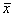

母集団と標本について
--------------------

日常的に、私たちは実に様々なデータに囲まれており、時として自らデータを集める必要があります。

例えば大学生の1か月分の食費を調べたいと考えます。
しかし、全国の大学生全員を調べるわけにはいきませんので、100人や200人など限られた数のデータを用います。
このとき、全国の大学生全員を母集団、母集団から抽出（サンプリング）されたデータを**標本**と呼びます。

標本を抽出する場合はデータに偏りが表われないよう、無作為に抽出すること（ランダムサンプリング）が重要です。



わかりやすくするために単純化した例を挙げます。

テレビ局Aが行なった調査により、内閣の支持率が 40 %だったとします。
これはそのテレビ局Aが日本国民全体の中から無作為に 2000 人を選出して
アンケートに答えてもらった結果、その 2000 人の中で 40 %の人が内閣を支持したということです。
これは決して日本国民全体の支持率ではありません。
しかし、統計的には日本国民全体の支持率と推測できます。

つまり、母集団が日本国民全体となり、標本がアンケートを受けた 2000 人になります。

母集団の分散の推定
------------------

### 母分散（不偏分散）と標本分散

平均値を中心に、データがどのくらいばらついているのかを示した数値を**分散**といいます。求める式は以下の通りです。

分散 = ((データ - 平均値) ^2  の総和) &divide; (標本数)

無作為に抽出された標本のデータから求められる分散の値（標本分散）は、
標本を構成するデータがそれぞれ異なるため、必ずしも一致しません。
平均化した標本分散の値を、母集団の分散（母分散）と考えることもできそうですが、
標本分散の平均は母分散の値よりも少し小さくなることがわかっています。
そこで、標本数から 1を引いて算出する**不偏分散**という値を用います。
不偏分散は母分散の推定値となります。

母分散 (不偏分散) = ((データ - 平均値) ^2 の総和) &divide; (標本数 - 1)

標本数から1を引いた値を**自由度**といいます。

振り返って考えてみると、先に載せた分散の式は、標本分散を求める式であることがわかるかと思います。

標本分散 = ((データ - 平均値) ^2 の総和) &divide; (標本数)

### Excelによる2つの分散の算出

では、実際に母分散（不偏分散）と標本分散をExcelで算出してみましょう。

前回の講義の練習1で使用したExcelファイルを開いてください。以下のような状態になっているはずです。



まずは式を構成する値を計算します。

&#9312; 列Dを選択し、[ホーム]リボン - [セル]タブの [挿入] から [シートの列を挿入] を2回クリックします。





&#9313; "D1" に "平均からの差"、"E1" に "差の2乗" と入力します。入力したテキストが見えるように列の幅を調節します。



&#9314; "D2" に `=A2-$H$2` と入力します。絶対参照 [F4] は[過去の資料](../../excel/02/index.html)を参考にしてください。





&#9315; また、"E2" に `=D2^2` と入力します。





&#9316; "D2" と "E2" セルを選択し、オートフィルを使って、全ての国語の点数における平均からの差と差の2乗を計算します。





&#9317; "D22" セルに "差の2乗の総和" と入力します。



&#9318; "E22" セルに `=sum(E2:E21)` と入力します。





これで分散を計算する準備が整いました。

&#9319; "G17" セルと"G18"セルに、それぞれ"不偏分散"、"標本分散"と入力します。



&#9320; "H17" セルに `=E22/(H14-1)` と入力します。





不偏分散が求まりました。

&#9321; 次に、"H18" セルに `=E22/H14` と入力します。





標本分散が求まりました。

ここで、"M8" セルの値と "H17" セル、"H18" セルの値を見比べてみます。



このように、データ分析を用いて算出する分散は、不偏分散であることがわかります。
データ分析による分散を用いる場合はこの点によく注意をしましょう。

ちなみに、以前に練習した関数VARは母分散（不偏分散）を求める関数で、標本分散の算出には、別に以下のような関数が与えられています。

国語の場合

-   母分散（不偏分散） : `=VAR(A2:A21)`
-   標本分散 : `=VAR.P(A2:A21)`

分散の単位に注目をすると、式の中で2乗をしているため、例えばcm（センチメートル）のデータの分散は、単位が平方センチメートルとなってしまいます。

分散の値の平方根（ルート）をとり、単位をそろえた値を、**標準偏差**（SD : standard deviation）といいます。

実際にExcelで計算をしてみましょう。平方根は `SQRT` という関数を用います。

&#9312; "G20" セルに "標準偏差（不偏）"、 "G21" セルに "標準偏差（標本）" と入力し、テキストが見えるように列の幅を調節します。



&#9313; "H20" セルに `=SQRT(H17)` と入力します。





&#9314; オートフィルを用いて "H21" に標本の標準偏差を求めます。



分散と同様に、以前に練習した関数 `STDEV`、またはデータ分析から求めた標準偏差は母標準偏差の推定値となります。
標本の標準偏差を算出する関数と区別をする必要がありますので注意をしましょう。

国語の場合

-   標準偏差（不偏） : `=STDEV(A2:A21)`
-   標準偏差（標本） : `=STDEV.P(A2:A21)`

母集団の平均の推定
------------------

### 区間推定

次に母集団の平均と標本の平均について考えてみます。
平均も分散と同様に、無作為抽出した標本から得られる平均（標本平均）は
それぞれ抽出されたデータが異なるため、やはり必ずしも値が一致するわけではありません。
しかし、分散とは異なり、標本平均はさらに平均することで、母集団の平均（母平均）とほぼ等しくなります。

つまり、標本平均の値から、母平均を含む値の範囲を推定することができます。これを**区間推定**といいます。

### Excelによるt値の算出

### 有意水準$\alpha$の設定

例えば、２つの平均値の差を検討したい場合、まず「２つの母平均に差はない」と仮説を立てます。これを**帰無仮説**といいます。

データから統計検定量と呼ばれる値(z値やt値など)を算出し、その統計検定量が出現する確率を求めます。
その際、この確率と比較する基準となる値を設けますが、これを**有意水準**（$\alpha$）と呼びます。
統計検定量の起こる確率がこの有意水準よりも小さいとき、偶然でなく、まれなことが起こった、
すなわち統計的に有意なことが起こったと考え、帰無仮説が誤りだったと考えます。
したがって、この場合、帰無仮説は棄却され、2つの母平均に差はないとはいえないという結論に至ります。
有意水準には 5 ％($\alpha$ = 0.05) と 1% ($\alpha$ = 0.01) とがありますが、
5 ％に比べて 1 ％の方がより条件が厳しくなります。



### t分布表

検定統計量t値は下記の数式から求めることができます。



は標本平均、<i>$\mu_0$</i> は母平均、<i>s</i> は標本の標準偏差、<i>n</i> は標本の大きさ（サンプルサイズ）です。





t分布はこのようなグラフを描きます。
グラフを見てわかるように、t分布は正規分布に似たつりがね型の分布ですが、自由度 (標本数 - 1) によってそのかたちが変化します

例えば標本数が小さいときはグラフが平べったい形状をとり、標本数は大きいときは正規分布に近づきます。

このようにt値は確率（95%か99%）と自由度によって変わるため、一般的に以下のt分布表を見ます。



### Excelの操作

ではExcelでt値を算出してみましょう。
今回の練習では `=TINV(確率,自由度)` という関数を用います。

&#9312; "G23" セルに有意水準$\alpha$、"G24" にt値（95%信頼区間）を入力します。今回は95%の確率を用いるため、"H23" セルに 0.05を入力します。

{% screenshot 03_31analysis01.png "有意水準αとt値（95%信頼区間）" %}

&#9313; "H24" セルに `=TINV(H23,H14-1)` と入力し、t値を算出します。

{% screenshot 03_32analysis02.png "t値（95%信頼区間）" %}

{% screenshot 03_33analysis03.png "t値（95%信頼区間）算出後" %}

算出したt値をt分布表で確認してみましょう（確率は 95%、自由度は19）。

### 母平均の信頼区間

母平均が 95%の確率で含まれているような値の範囲を**95%信頼区間**といいます。
（確率99％では、99％信頼区間）

標本平均は推定値ですが、この標本平均から母平均の取り得る範囲が95%となる区間を推定します。

母平均 $\mu$ の信頼区間は下記のように求められます。

母平均 $\mu$ の（1 - $\alpha$）&times; 100%信頼区間：



は標本平均、<i>s</i> は不偏標準偏差（母標準偏差の推定値）、<i>n</i> は標本サイズ、
<i>tn-1($\alpha$)</i> は、自由度 n-1 のt分布における100 &times; $\alpha$%点を示します。
（なお、<i>tn-1($\alpha$)</i> は両側確率$\alpha$のｔの臨界値を示すものとする。数式の<i>s</i> は$\sigma$（母標準偏差）と書かれることもある。）

より簡潔に式を表すと

標本平均 - t &times; 標本平均の標準偏差 (標準誤差) $< \mu <$ 標本平均 + t &times; 標本平均の標準偏差 (標準誤差)

となります。実際に信頼区間を求めてみましょう。

1.  "G25" セルに "下限信頼$\mu$L"、"G26" セルに "上限信頼$\mu$U" と入力します。
2.  "H25" セルに `=H2-H24*H3` と入力します。
3.  "H26" セルに `=H2+H24*H3` と入力します。

表に示された標本のデータから、52.45 $< \mu <$ 70.24 という信頼区間がわかりました。
すなわち「母平均が 95%の確率で 52.45 から 70.24 までの間に含まれる」と推定することができます。

標本数が多いほど信頼区間も狭くなり、標本平均はより母平均に近くなります。

課題
----

### 課題 1

本講義で操作した手順を参考に、算数の平均点の信頼区間を求めてみましょう。

### 課題 2

ある地域におけるガソリン（レギュラー： 1 リットル）の価格を調べたところ、以下のようになりました。
価格の母平均の信頼区間を求めてみましょう。

{ 126.4 円， 127.3 円， 126.9 円， 127.4 円， 125.8 円， 127.2 円， 127.1 円， 128.0 円 }

