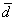

母平均の差に関する検定と推定
----------------------------

扱う統計データは対応のないデータと対応のあるデータの2つに分けることができます。
データを統計的に処理する場合、この対応のあるなしが重要な要素となってきます。

データを見る際には注意して見ましょう。

### 対応のないデータ

一方のグループのデータが、もう一方のグループのデータとは無関係な場合のデータです。
グループ内のデータの順番を入れ替えることができます。

例 : 2つの病棟間の最高血圧、2つのクラスの得点など

この対応のないデータの場合は、まず、等分散性の検定を行います。その後に差の検定を行います。

-   等分散を仮定する（Studentのt検定）
    -   2つの母平均の差に関する検定
-   等分散を仮定しない(Welchのt検定)
    -   2つの母平均の差に関する検定

### 対応のあるデータ

一方のグループのデータともう一方のグループのデータがペアになっている場合のデータです。
グループ内のデータの順番を入れ替えることができません。

例 : 最高血圧と最低血圧、前期と後期の得点など

こちらは、等分散性の検定を行わず、検定を行うことができます。

-   ２つの母平均の差に関する検定

### 目的変数と説明変数

複数の変数を用いて、分析を行う場合、目的変数と説明変数という概念が必要になってくる場合があります。

<dl>
<dt>目的変数(y) : 被説明変数、従属変数</dt>
<dd>
回帰分析などにおいて予測や要因分析を行う変数のことです。
物事の結果とも言えます。被説明変数、従属変数とも呼ばれます。
回帰直線モデル (y = a0 + a1x1 + &hellip; + anxn) では y に相当します。
</dd>
<dt>説明変数(x) : 独立変数</dt>
<dd>
目的変数に影響を与えていると考えられる変数のことです。
物事の原因とも言えます。独立変数とも呼ばれます。
回帰直線モデル (y = a0 + a1x1 + &hellip; + anxn) では x1 &hellip; xn に相当します。
</dd>
</dl>

等分散を仮定したときの2つの母平均の差の検定（対応のないデータ）
---------------------------------------------------------------

### 練習 1

ある学校のA組とB組のテスト結果について調べたところ、以下のような結果が得られました。
A組とB組ではクラスの平均点に差があるといえるでしょうか。

表 1  : ある学校のテスト結果（点）



### 仮説の設定

-   帰無仮説 H0 : &mu;A = &mu;B A組とB組では平均点に差があるとはいえない
-   対立仮説 H1 : &mu;A &ne; &mu;B A組とB組では平均点に差がある

### 有意水準 *&alpha;* の設定

有意水準 *&alpha;* = 0.05 とします。

### 共通分散 *V* の算出

共通分散 *V* は以下の数式で求めることができます。



*SA*、*SB* = 各グループの平方和、
*nA*、*nB* = 各グループのデータ数、
*&phi;A* = *nA-1*、*&phi;B* = *nB-1*

### 検定統計量 *t* 値の算出

今回は、以下の数式で検定統計量 *t* 値は求まります。



### *p* 値の算出

有意水準と比較する確率 *p* 値を求めます。
*p* 値は、自由度 <i>&phi;A</i> + <i>&phi;B</i> のt分布において、| *t* | 以上の値が発生する確率です。

### 判定

*p* 値 &le; 有意水準 *&alpha;* &rarr; 帰無仮説 H0 を棄却する。

*p* 値 &ge; 有意水準 *&alpha;* &rarr; 帰無仮説 H0 を棄却しない。

### Excelの操作

Excelを使って、練習 1 に取り掛かりましょう。

&#9312; まず、表 1 を入力しましょう。

&#9313; 次に、2つのデータが等分散しているかどうかを検定します。[データ] リボンの [データ分析] をクリックし、[F検定 : 2標本を使った分散の検定]を選択します。





&#9314; 変数1、2にそれぞれA組・B組のデータ範囲を入力します。出力先は同じシート中のどこかを選択するとよいでしょう。



&#9315; [OK]をクリックすると出力結果が表示されます。
*p* 値等が `##` となってしまう場合はセルが小さすぎる可能性があります。横幅を広げてみましょう。



*p* 値 = 0.430614 &gt; 有意水準 *&alpha;* = 0.05であるので、このデータには等分散性があるといえます。

&#9316; したがって、検定を行うにはstudentのt検定を用います。データ分析から今度は[t検定 : 等分散を仮定した2標本による検定]を選択します。



&#9317; さきほどと同じように、変数1，2にはデータの範囲を入力します。出力先は先ほどのF検定の結果に上書きしないよう注意しましょう。



出力結果



*p* 値 = 0.030929 が求まりました。
設定した有意水準 *&alpha;* は 0.05 です。
よって、*p* 値 = 0.030929 &lt; 有意水準 *&alpha;* = 0.05 であるので、帰無仮説 H0 は棄却されます。
したがって、A組とB組で点数の母平均には差があると判断します。

等分散を仮定しないときの2つの母平均の差の検定（対応のないデータ）
-----------------------------------------------------------------

### 練習 2

ある学校のC組とD組のテスト結果について調べたところ、以下のような結果が得られました。
C組とD組ではクラスの平均点に差があるといえるでしょうか。

表 2  : ある学校のテスト結果（点）



### 仮説の設定

-   帰無仮説 H0 : &mu;C = &mu;D C組とD組では平均点に差があるとはいえない
-   対立仮説 H1 : &mu;C &ne; &mu;D C組とD組では平均点に差がある

### 有意水準 *&alpha;* の設定

有意水準 *&alpha;* = 0.05 とします。

### 検定統計量 *t* 値の算出（Welchのt検定）

今回は、以下の数式で検定統計量 *t* 値を求めます。



### 等価自由度 *&phi;** の算出

以下の数式で、等価自由度 *&phi;** を求めます。



### *p* 値の算出

有意水準と比較する確率p値を求めます。
*p* 値は、自由度 *&phi;** において、| *t* | 以上の値が発生する確率です。

### 判定

*p* 値 &le; 有意水準 *&alpha;* &rarr; 帰無仮説H0を棄却する。

*p* 値 &gt; 有意水準 *&alpha;* &rarr; 帰無仮説H0を棄却しない。

### Excelの操作

Excelを用いて、練習 2 に取り掛かりましょう。

&#9312; まず、表 2 を入力しましょう。練習1と同じようにデータ分析のF検定を用い、等分散性の検定を行います。





&#9313; *p* 値 = 0.01824 &lt; 有意水準 *&alpha;* = 0.05より等分散性があるとは言えません。
したがって、今回のt検定では[t検定 : 分散が等しくないと仮定した2標本による検定]を用います。



&#9314; 出力結果



*p* 値 = 0.024411 が求まりました。
よって、*p* 値 = 0.024411 &lt; 有意水準 *&alpha;* = 0.05 であるので、C組とD組では点数の母平均に違いがあると判断されたことになります。

2つの母平均の差の検定（対応のあるデータ）
-----------------------------------------

### 練習 3

次のデータはある通年授業における、大学生 12 人の前期試験と後期試験の評点を示したものです。
後期試験の成績（B）は、前期試験の成績（A）よりも向上していると考えられるでしょうか。

表 3  : 試験の評点（点）



### 仮説の設定

-   帰無仮説 H0 : &mu;B - &mu;A = 0 後期の成績は前期の成績より向上しているとはいえない
-   対立仮説 H1 : &mu;B - &mu;A &gt; 0  後期の成績は前期の成績より向上している

### 有意水準 *&alpha;* の設定

有意水準 *&alpha;* = 0.05 とします。

### 各ペアごとの差の算出

前期の評点と後期の評点を1つのペアとして扱います。

*di* = *xAi* - *xBi*

この式から、各ペアごとの差を求めます。さらに、差 *di* の平均値 と
分散 *Vd* の算出を行います。

### 検定統計量 *t* 値の算出

今回は、以下の式で検定統計量 *t* 値が求まります。



### *p* 値の算出

有意水準と比較する確率 *p* 値を求めます。
*p* 値は、自由度 *&phi;* = n-1 のt分布において、| *t* | 以上の値が発生する確率です。

### 判定

*p* 値 &ge; 有意水準 *&alpha;* &rarr; 帰無仮説 H0を棄却する。

*p* 値 &lt; 有意水準 *&alpha;* &rarr; 帰無仮説 H0を棄却しない。

### Excelの操作

Excelを用いて、練習 3 に取り掛かりましょう。

&#9312; まず、表 3 を入力します。対応のあるデータでは等分散性を検定する必要はありません。
[データ分析]から[t検定 : 一対の標本による平均の検定]



&#9313; 変数1，2にそれぞれのデータ範囲を入力します。



出力結果



*p* 値 = 0.023102 が求まりました。
よって、*p* 値 = 0.023102 &lt; 有意水準 *&alpha;* = 0.05 であるので、帰無仮説 H0 は棄却されます。
前期の平均点 63.5833 と後期の平均点 69.75 には有意差があることがわかり、後期試験の成績（B）は、前期試験の成績（A）よりも向上していると判断できます。

課題 1
------

A、Bの両地方で収穫した同種の大豆のタンパク質の含有率を調べたところ、次の結果が得られました。
含有率の正規性を仮定して、地方差が認められるか、有意水準 5 ％で検定してください。

表 4  : A、B地方の大豆のタンパク質含有率（％）



課題 2
------

次のデータはA市内のあるレストランとB市内のあるレストランのアルバイトの時給を示しています。
2地域のレストランのアルバイトの時給に差はあるでしょうか。

表 5  : A市、B市のあるレストランのアルバイトの時給（円）



課題 3
------

次のデータは 7 人があるダイエット法によりダイエットを行った前後の体重を表しています。
このダイエット法で体重の変化は見られたと言って良いでしょうか。
また、2つの母平均の差を信頼率 95 ％で区間推定してください。

表 6  : あるダイエット法の前後の体重(kg)



