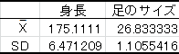
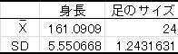
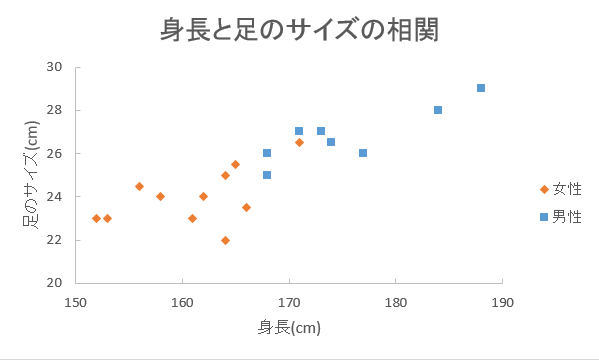

相関分析
--------

### 相関関係

2つの変数xとyがあるときに、xの変化に伴って、yも変化するような関係を**相関関係**といいます。
相関関係を調べるには散布図や相関係数を用います。

相関関係には正の相関関係と負の相関関係、無相関に分けられます。
この正負は後で述べる相関係数によって変わります。

-   正の相関関係 : xが増加していったとき、yも増加している。xとyが比例している関係。
-   負の相関関係 : xが増加していったとき、yは減少している。xとyが比例(傾きが負)している関係。
-   無相関 : xとyに関係が見出せない。

散布図
------

相関関係の有無を視覚的に表す図です。
2つの変数の内、一方を横軸にとり、もう一方を縦軸にとって、対応するデータを 1 点ずつプロットしていきます。



### 散布図の分析

散布図の分析では以下のような点に着目します。

-   はずれ点がないか
-   2つの変数xとyの間にはどのような関係があるか &rarr; 直線／曲線／無関係
-   グループが形成されているか

上図を見てみると、ある程度の点が身長 145?170、体重 40?70 の範囲でグループを形成しているように見えます。
そのグループは左下から右上がりになっていて、身長と体重には比例の関係があるように思われます。
体重 80 以上に幾つかはずれ点が見らますが、大幅に外れているとはいえなさそうです。

このように視覚的に分布を見ることによって、xとyの 2 変数の関係に方向性が見えてきます。
その方向性がデータをよく表しているかどうか、計算によって判定します。

### 練習 1

次のデータは、あるクラスの生徒20人の身長（x）と足のサイズ（y）を測定したものです。このデータをグラフで表現し、身長xと体重yの関係を把握してください。

表 1  : 20 人の身長と足のサイズ（0:男性 1:女性）



### Excelの操作

まず、データをExcelに入力します。

-   A列の1行目に"身長"と入力し、20人分の身長を順に入力。
-   B列の1行目に"足のサイズ"と入力し、20人分の足のサイズを入力。
-   C列の1行目に"性別"と入力し、男性を0、女性を1として20人分の性別を入力。

このように、データを入力してください。



### 並べ替え

&#9312; 次のようにデータを3列分選択して[ホーム]リボン - [並べ替えとフィルター] -
[ユーザー設定の並べ替え]をクリックします。



&#9313; 最優先されるキーを[性別]と選択し、以下の設定で並べ替えを実行します。



出力結果

性別を基準に、身長・足のサイズもともに並べ替えられています。



### 散布図

&#9312; まず、男性(0)のみ9人分の身長と足のサイズを選択して、[挿入]リボンのグラフの中から[散布図]をクリック -
[散布図(マーカーのみ)]をクリックして散布図を挿入します。



&#9313; このようなグラフが出来上がります。



&#9314; 女性でも同様に散布図を作成します。



&#9315; 男性のグラフを選択した状態で、グラフツールの[デザイン]リボンの[データの選択]をクリックします。



&#9316; 凡例項目で足のサイズが選択されていることを確認し、[編集(E)]をクリックします。



&#9317; 系列名に"男性"と入力し、決定します。



&#9318; 男性のグラフをコピーし、女性のグラフ上に貼り付けます。



男女でマーカーの異なる散布図ができました。

マーカーがわかりやすくなるように凡例を出しましょう。
グラフを選択した状態でグラフツール[デザイン]リボンの[グラフのレイアウト]から[グラフ要素の追加]をクリック、[凡例]にカーソルを合わせて表示したい位置を選択します。



&#9319; グラフを整えていきます。
足のサイズは 20?30 cmまで表示すれば十分なので、縦軸を選択して[軸の書式設定]から最小値と最大値を設定します。
最小値を20、最大値を30、目盛間隔を2、目盛りの種類を内向きにします。





同じように横軸を選択し、[軸の書式設定]からも最小値を150、最大値を190に設定し、目盛りの種類を内向きにします。



&#9320; また、より見やすくするために、次のようにグラフを設定してください。

-   グラフのタイトルを"身長と足のサイズの相関"にする
-   目盛り線は消す
-   横軸ラベルを"身長(cm)"縦軸ラベルを"足のサイズ(cm)"として軸ラベルを作成する

方法がわからない場合は情報リテラシー実践Tの表計算ソフトによるデータ処理(2)を参照してください。

出力結果



散布図を見ると、左下から右上がりに点が分布しているように見えます。
身長と足のサイズには正の相関関係があるのかもしれません。
それを確かめるために、次の項で相関係数を求めます。

また、グラフ中の字のサイズや枠線の設定などを変更して、より自分の見やすいように工夫することもできます。



相関係数
--------

相関係数は、相関関係の有無を数量的に調べるために用います。

-   相関係数 *r* の範囲 :  -1 &le; *r* &le; 1
    -   値が + のとき、正の相関関係があるといいます
    -   値が?のとき、負の相関関係があるといいます
    -   値が 0 に近い場合は、無相関であるといいます

相関係数 *r* は以下の数式で求めることができます。



また、相関係数の絶対値によって、その相関の強さがわかります。

-   0.7 &le; | *r* | 強い相関あり
-   0.4 &le; | *r* | &lt; 0.7 中程度の相関あり
-   0.2 &le; | *r* | &lt; 0.4 弱い相関あり
-   | *r* | &lt; 0.2 ほとんど相関なし

### 練習 2

練習1のデータから、相関係数を求めてみましょう。

### Excelの操作

練習 1 を継続して使用します。

男女別に身長と足のサイズの間に相関があるといえるかを求めてみましょう。

まずは、男性(0)から確かめます。

&#9312; 適当なセルを選択し、"男性の身長と足のサイズの相関"と入力しておきます。

&#9313; [データ]リボン - [データ分析]をクリックします。



&#9314; [相関]を選択し[OK]をクリックします。



&#9315; 次のように入力し、[OK]をクリックして相関分析をします。

-   [入力範囲]に、男性の身長と足のサイズが入力されている範囲を選択する。（先頭の行に文字を含んでいてOK）
-   [先頭行をラベルとして使用]にチェックを入れる。
-   出力先に、適当なセルを選択する。



出力結果



身長と足のサイズの相関として表示されているF5のセルの値が今回求める相関係数です。

これで相関係数 *r* = 0.840923 と求められました。
ここから、男性について、身長と足のサイズには強い正の相関関係が成り立つことがわかります。

身長が大きくなるにつれて足のサイズも大きくなるといえそうです。

&#9316; 女性についても同様に相関係数を求めましょう。
その際に、ラベルとなる1行目を選択、コピーし、11行目に[コピーしたセルの挿入]をすると男性の場合と同じように求められます。



出力結果



相関係数 *r* = 0.52698 と求められました。
男性ほど高くはないようですが、中程度の相関があるといえそうです。

### 論文では

論文では下記のようになります。

>   表1に関して、男性について相関係数を求めたところ、強い正の相関関係が認められた (*r* = 0.840923)。
>   よって、男性は身長が高くなるにしたがって、足のサイズは大きくなる傾向があるといえる。
>
>   また、女性についても求めたところ、中程度の正の相関が認められた (*r* = 0.52698)。
>   よって、女性も身長が高くなるにしたがって、足のサイズは大きくなる傾向があるといえる。

**なお、相関関係が見られたからといって、一方がもう片方の原因になっている、という因果関係が示されたわけではありませんので、注意しましょう。**

**また、標本数が少ない場合、求めた相関係数が信頼できる値とはいえない場合もあります。そのため、次項の相関係数の検定が行われます。**

相関係数の検定
--------------

### 練習 3

練習1のデータに関して、無相関の検定をしてみましょう。

### 無相関の検定

幾つかの標本が得られたときに、その相関係数を求めます。
その標本から得られた相関係数 *r* とは別に母集団の母相関係数 *&rho;* が存在します。

-   母集団の相関係数 : 母相関係数 *&rho;*
-   標本の相関係数  : （標本）相関係数 *r*

標本は母集団全体を表しているわけではないので、母相関係数 *&rho;* = 相関係数 *r* とは言えません。
母相関係数 *&rho;* = 0 でも相関のある標本が抽出された場合もありえます。

そこでまず、母相関係数 *&rho;* = 0 かどうかを検定します。
これを **無相関の検定** と言います。

### 仮説の設定

-   帰無仮説 H0 : *&rho;* = 0 母相関係数は 0 である（相関係数が存在しない）
-   対立仮説 H1 : *&rho;* &ne; 0 母相関係数は 0 ではない（相関係数が存在する）

### 有意水準 *&alpha;* の設定

有意水準 *&alpha;* = 0.05 とします。

### 検定統計量 *t* 値の算出

今回は以下の数式で検定統計量 *t* 値を求められます。



### *p* 値の算出

有意水準と比較する確率 *p* 値を計算します。*p* 値はt分布において、| *t* |以上の値が発生する確率です。

### 判定

*p* 値 &le; 有意水準 *&alpha;* &rarr; 帰無仮説 H0を棄却する

*p* 値&gt;有意水準 *&alpha;* &rarr; 帰無仮説 H0を棄却しない

### Excelの操作

引き続き、練習 1 を継続して使用します。

身長と足のサイズについて求めた相関係数は有意なものといえるでしょうか？

&#9312; 先ほどの続きに、相関係数や *t* 値などを求めていきます。
次のように準備をしてください。

-   I2のセルに"無相関検定(男性)"と入力する
-   その下のセルから順に、"相関係数"
-   "標本数n"
-   "t値"
-   "自由度"
-   "p値" と入力。

このようになります。



&#9313; "相関係数"と入力したセルの隣 "J3" に、先ほど求めた男性の身長と足のサイズの相関係数を入力します。



&#9314; "標本数n"の隣 "J4" には、標本数 (= ここでは男性の人数) を入力します。
今回は標本数が少ないので自分でも数えられますが、標本数が多い場合のことも考えて、`COUNT` 関数を使います。

[数式]リボン - [関数の挿入] から `COUNT` 関数を選択し、男性の身長の全データを選択範囲として、男性の人数を数えます。



出力結果



&#9315; 次に、上記 *t* 値を求める式を参考にして数式を入力し、*t* 値を求めます。
"t値"の隣 "J5" に`=ABS(J3*SQRT(J4-2)/SQRT(1-J3^2))` と入力します。

出力結果



&#9316; 自由度を求めます。
ここでは 人数 - 2 となるよう、"J6"に `=J4-2` と入力します。

出力結果



これまで求めた値をもとに、*p* 値を求めます。
[数式]リボン - [関数の挿入] から `TDIST` 関数を選択します。

Xに *t* 値 `J5`、自由度に `J6`、分布は両側検定として `2` と指定し、OKをクリックします。



出力結果



*p* 値は 0.003786 と求められました。
*p* 値 = 0.003786 &lt; 有意水準 *&alpha;* = 0.05 なので、帰無仮説 H0 は棄却されます。
すなわち、男性の身長と足のサイズの間には、有意な相関が存在するといえます。
また、相関係数は 0.849023 と強い相関が認められるため、身長が大きくなると足のサイズも大きくなると判断されます。

また、女性についても同様に無相関検定を行います。

出力結果



*p* 値は 0.095784 と求められました。
*p* 値 = 0.095784 &gt; 有意水準 *&alpha;* = 0.05 なので、帰無仮説 H0 は棄却されません。
先ほど求めた女性の身長と足のサイズの相関係数は有意ではないということになりました。

実際はここから、今回のデータでは、身長は高くても足のサイズは大きくない女性もいたり、
データにばらつきがあったために有意ではないという結果になったと考えられる、などと考察を進めていきます。
一般に、標本数が少ないほど、有意な相関は認めにくくなります。

### 論文では

論文では以下のような形になります。

>   男性の身長と足のサイズの相関(n = 9)
>
>   
>
>   女性の身長と足のサイズの相関(n = 11)
>
>   
>
>   上の表は、男性、女性それぞれの身長と足のサイズについての平均および標準偏差を示したものである。
>
>   
>
>   また、上図はその散布図である。
>
>   男性については相関係数 *r* = 0.840923 であり、t検定を行ったところ有意であった（*p* &lt; 0.05）。
>   よって、男性では身長が大きくなると足のサイズが大きくなるといえる。
>
>   女性については相関係数 *r* = 0.52698 であり、t検定を行ったところ有意ではなかった（*p* &gt; 0.05）。
>   よって、この女性の集団からは身長が大きくなると足のサイズが大きくなるとはいえない。

課題 1
------

次の表は、あるクラスの生徒 10 名を対象に行った家庭のCD数と音楽の試験結果（得点）の調査をまとめた表です。
CD数と音楽の得点には相関関係が見られるでしょうか。

相関係数を求め、無相関検定をし、相関関係を考察してください。

表 3  : CD数（枚）と音楽の得点（点）



