Microsoft Wordの起動
--------------------

1.  [スタート] をクリックします
1.  [すべてのプログラム] - [Microsoft Office] - [Word 2013] をクリックします

文書の作成と保存
----------------

### 文書の作成

####  新規作成

1. Word を起動すると、スタート画面が表示されます。
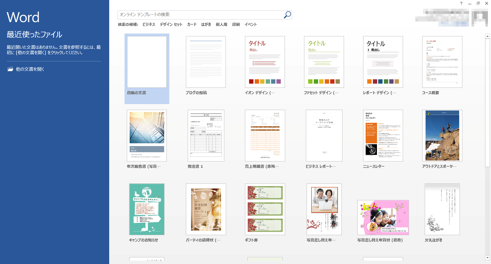

ここで、新規にプレゼンテーションを作成するか、あるいは既存のプレゼンテーションファイルを開くかを選びます。

新規に作成する場合は、右側のサムネイルから利用したいテーマを選ぶことで、そのテーマを適用したファイルが新規作成されます。

また既存ファイルの場合は、Windows エクスプローラーで目的のファイルのあるフォルダに移動し、そのアイコンをダブルクリックで開くこともできます。

#### 既存文書のオープン（改訂、再編集）

1.   [ファイル] タブをクリックします
1.  [コンピュータ] から [参照] をクリックしてファイルを選択して開きます。

### 文書の保存

全てのアプリケーションに共通することですが、様々なトラブルにより制作途中のデータが失われてしまうことがあります。それを防ぐためにも、**こまめに保存する**ように心がけましょう。

#### 初めて文書を保存する

1.   [ファイル] タブをクリックします
1.  [名前を付けて保存] - 保存したいフォルダを参照します
1.  ファイル名を入力し [Enter] キーもしくは [保存] をクリックします。

保存形式は[名前を付けて保存]のウィンドウで[ファイルの種類]から選択することができます。

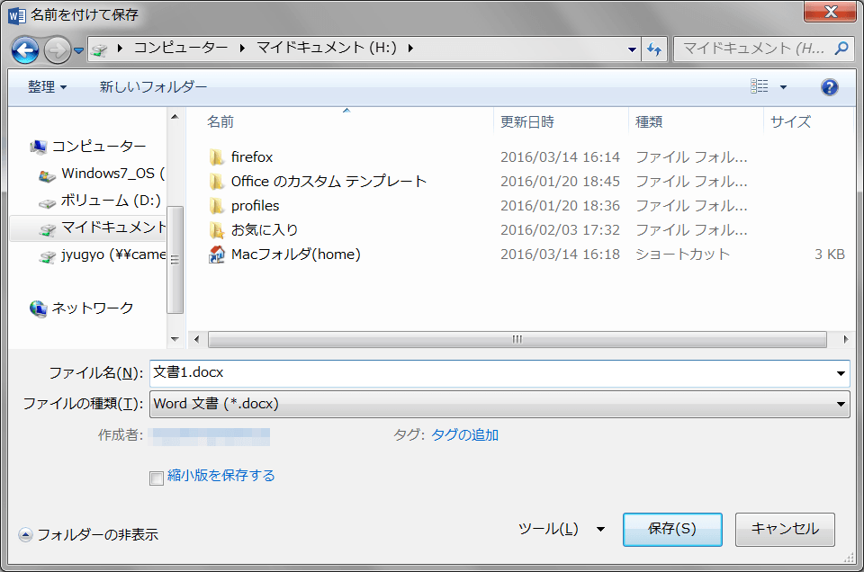

もしくは [エクスポート] からファイルの種類の変更をすることも可能です。

<dl>
<dt>Word 文書(.docx)</dt><dd>Word 2007 以降で利用できる標準形式で保存します。</dd>
<dt>Word 97-2003 文書(.doc)</dt><dd>Microsoft Word 97 から Word 2003 までで標準利用されていた形式で保存します。</dd>
<dt>OpenDocument テキスト(.odt)</dt><dd>Microsoft Office 以外のオフィス製品でも利用できる、オフィススイートの共通形式で保存します。</dd>
<dt>Word テンプレート</dt><dd>作成した文書の書式設定を保存します。</dd>
<dt>PDF(.pdf)</dt><dd>PDF形式で保存します。Word がインストールされていない環境でも、PDF に対応するソフトウェアがあれば開くことができます。</dd>
</dl>

<strong>情報処理教室における制約事項</strong>

情報処理教室では、PDFを印刷すると、システム上の理由で印刷にかなりの時間がかかってしまいます。

#### 既存の文書の変更を保存する

1.   [ファイル] タブをクリックします
1.   [上書き保存] をクリックします

あるいは、クイックアクセスツールバーの  [上書き保存] をクリックします。

### Wordの終了

1.   [ファイル] タブをクリックします
1.  [閉じる] をクリックすると現在開いているファイルが閉じられます
1.  ウィンドウ右上の閉じるボタンをクリックするとwordが終了します

Microsoft Word 2013の概要
-------------------------

以下の内容は、基本的に Microsoft Office 2013 で共通です。

### ウィンドウ各部の名称

### クイックアクセスツールバー

よく使うコマンドを表示しておくことができます。

初期設定で表示されているアイコンとその機能は以下の通りです。

-    上書き保存
-    元に戻す
-    繰り返す

 をクリックすると、表示するアイコンのカスタマイズが行えます。

### ファイルタブ

ファイルタブには、新規文書の作成、既存文章を開く、保存、印刷など文書ファイルを操作するコマンドが収納されています。

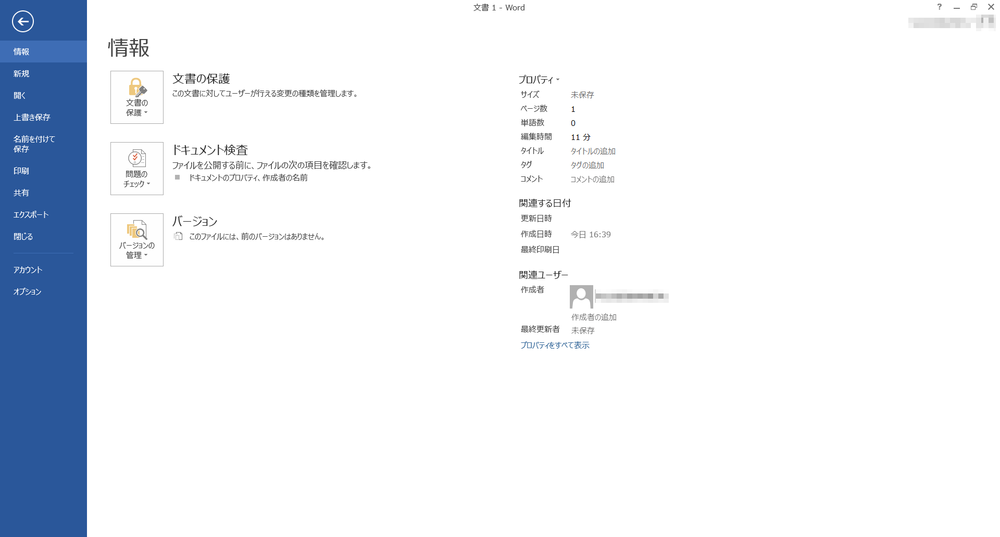

また、[オプション] で、Word自体のより詳細な設定を行うことができます。

### リボン

文書を作成していく際によく利用するコマンドを割り当てたボタンが機能ごとにパネルに分類され、配置されています。

リボン上部のタブ状になった[ホーム]、[挿入]、[ページレイアウト]、[参考資料]、[差し込み文書]、[校閲]、[表示]をクリックすることによって、各機能のパネルに切り替えることができます。もしくは、カーソルがリボン上にあるときにホイールを回すと、切り替えることができます。

#### ホームリボン

主に文字の装飾、切り貼り、編集など文字に関係したコマンドが収納されています。

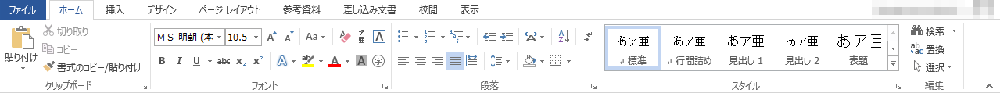

#### 挿入リボン

表や図、ヘッダーやフッターなどを挿入します。

#### デザインリボン

ドキュメント全体のテーマや配色、書式などが設定できます。

#### ページレイアウトリボン

ページのレイアウト、見やすさを設定します。

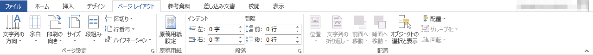

#### 参考資料リボン

目次や脚注など、文書を補助する資料を挿入します。

#### 差し込み文書リボン

はがきなど、特殊なレイアウトの文書を作ることができます。

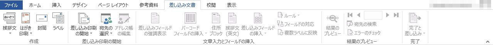

#### 校閲リボン

スペルチェックや文字カウント、コメントの挿入などできあがった文書を校正したり、また、訂正した部分の比較などを行うことができます。

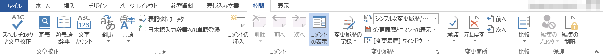

#### 表示リボン

Wordの画面での表示の仕方を設定します。

パネルの右下にある  を押すと、より詳しく各項目を設定することができます。

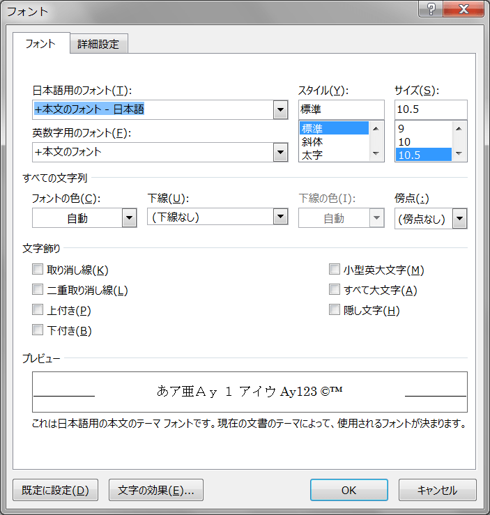

また、カーソルを使用したいコマンドの上で静止させると、そのコマンドの説明を見ることができます。

参考資料 [主なショートカットキー一覧](../../appendix/shortcuts.html)

書類を作る
----------

ここで標準的な文書作成工程をたどりましょう。少し長い文章を打ち込み、その後、書類の書式を整形します。そして、ヘッダー、フッター等を入れて仕上げます。

### 文章の入力

白紙の文書を新規作成し、そこに[課題文章](./introduce.pdf)を**手で**写し取りましょう。この文書をWord学習のたたき台にします。

まずはスタイル等は気にせず、とにかく打ち込みましょう。文章は段落分けで改行するときのみ[Enter]キーを押して、改行します。とりあえず、段落第1行目のスペース（インデント）も無視して結構です。改行以外の文章の構成は無視してください。

このような形になっていれば大丈夫です。

また、編集内容を失わないためにも、**こまめに保存**する癖をつけるようにしましょう。ファイル名は`introduce.docx`として、授業用のフォルダに保存します。

文章を整える
------------

### 文字のフォント、サイズ、スタイル設定



まず、文書の文字の大きさを整えます。

&#9312; 最初の行の "自己紹介カード" を選択（ドラッグ）し、フォントサイズを`16`ptに変更します。

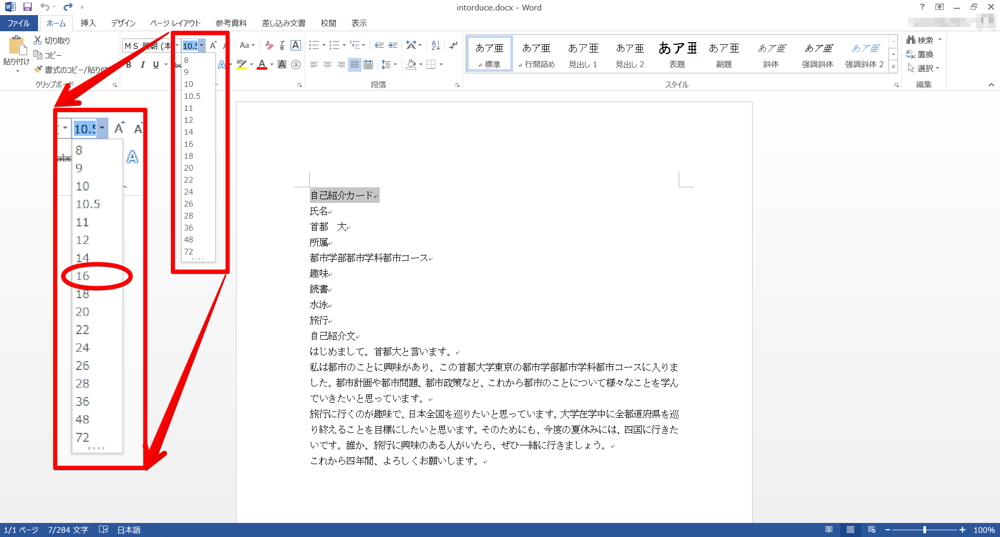

&#9313; 同様に、2行目の"氏名"、4行目の"所属"、6行目の"趣味"、10行目の"自己紹介文"を`14`ptにします。

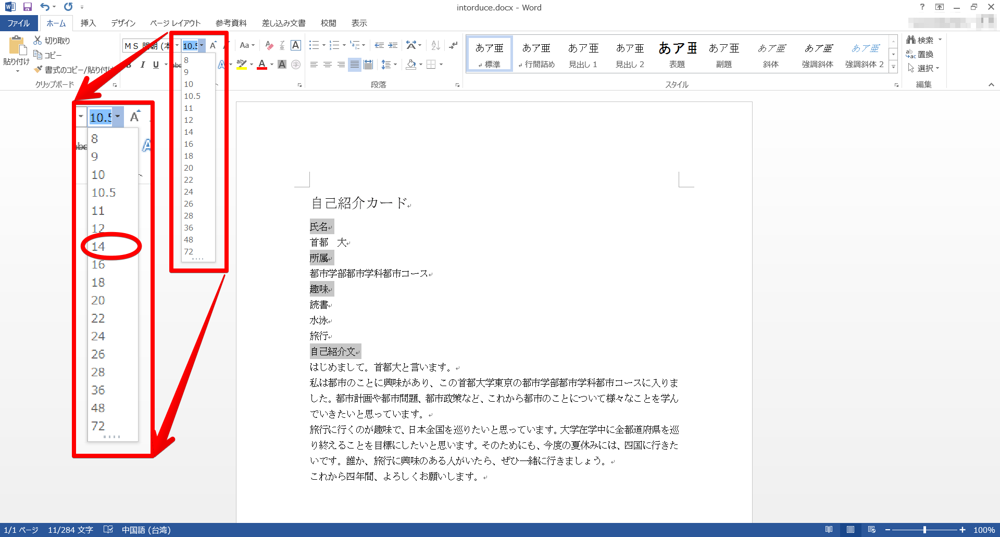

&#9314; さらに3行目の"首都　大"も`12`ptに変更します。

Wordでは、その他にも色々なスタイルに文字を変えることができます。

### 文字を揃える

次に、文字の位置を揃えます。通常では「両端揃え」になっており、左の端から右の端まで改行するまで文章を続けるになります。レイアウトを考える中で、「左揃え」や「右揃え」、「中央揃え」を効果的に用いると、見やすい書類を作成することができます。また、左右の余白に応じて文字を均等に振り分ける「均等割り付け」もあります。

&#9312; 最初の行の左横にカーソルを持って行きます。

&#9313; すると、カーソルの矢印の向きが左上から右上に変わります。その状態で左クリックすると、行全体を選択することができます。

&#9314; [ホーム]リボン の "段落" から  [中央揃え] を押して、文字を揃えます。

これで、この書類の題名となる"自己紹介カード"が見やすくなりました。

### 段落番号と箇条書き

段落番号や箇条書きを用いることで書類の情報をわかりやすく見る人に伝えることができます。
まずは、段落番号を付けてみましょう。

&#9312; "氏名"、"所属"、"趣味"、"自己紹介文"を選択します。複数選択するためには、 [Ctrl] キーを押しながら選択します。

&#9313;  [段落番号] をクリックします。

このように、段落番号をつけることができます。
同様にして、趣味の内容を箇条書きにしてみましょう。
箇条書きの記号はデフォルトでは●ですが、カスタマイズすることもできます。

&#9312; "読書"、"水泳"、"旅行"を選択します。

&#9313;   [箇条書き] の横の下向き三角をクリックします。

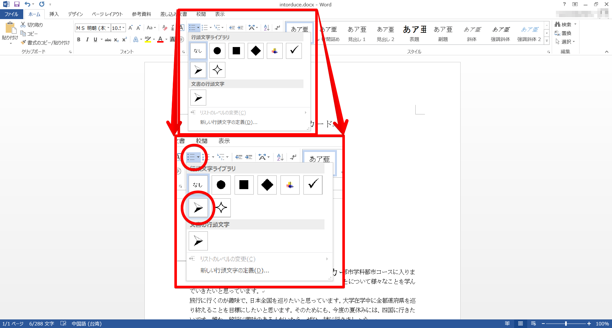

&#9314; 表示された行頭文字ライブラリの中から好きなものを選ことができます。

ライブラリの中にない文字や画像も"新しい行頭文字の定義"を押すことで設定することができます。
段落番号も箇条書きと同じようにカスタマイズすることができます。

### インデント設定

インデントを設定することによって、余白をうまく利用することができます。

現在の状態では、項目となる"氏名"や"所属"、"趣味"、"自己紹介文"の番号とそれぞれの内容が同じ高さで表示されてしまっていて、見にくいです。これらを項目の下につけるために、インデントを用います。

その他、段落の1行目は1字下げ、2行目以降は下げずに文章を続けていくという日本語の特徴的な文法もインデントによって設定することができます。

まず、ルーラーが非表示になっている場合、[表示]リボン の "表示" から □ルーラー のチェックボックスにチェックを入れて、ルーラーを表示しましょう。

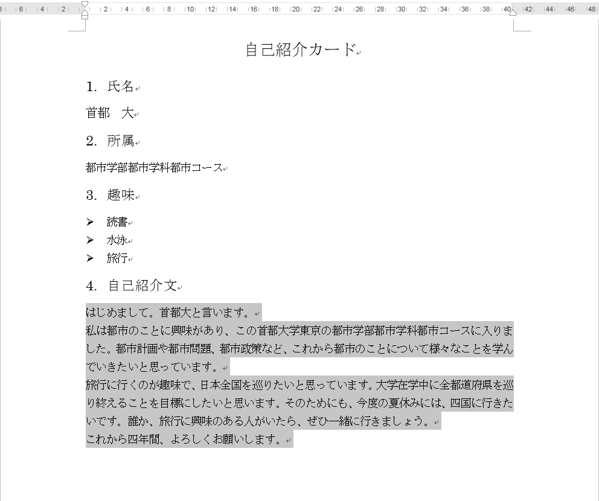

インデントにはそれぞれ以下の役割があります。

-   1 行目のインデント：段落最初の行のインデントの位置
-   ぶら下げインデント：2行目以降のインデントの位置
-   左インデント：最初の行と2行目以降のインデント間隔と保ったままでの段落全体の左インデントの位置
-   右インデント：段落全体の右インデントの位置

&#9312; 自己紹介文の内容（はじめまして〜）を選択してください。

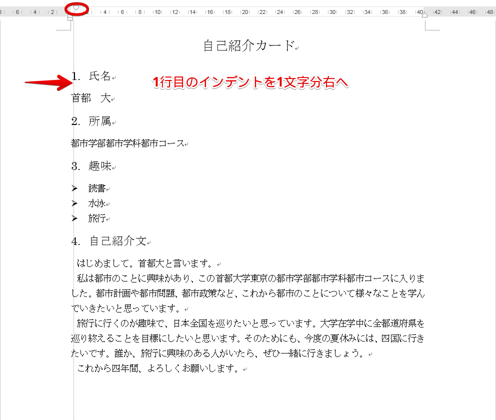

&#9313; 1行目のインデントを1文字分右に動かします。

自己紹介文の内容の1行目を1字下がりました。次に、各項目の内容を下げます。

&#9312; 以下の画像のように内容となる部分を全て選択してください。

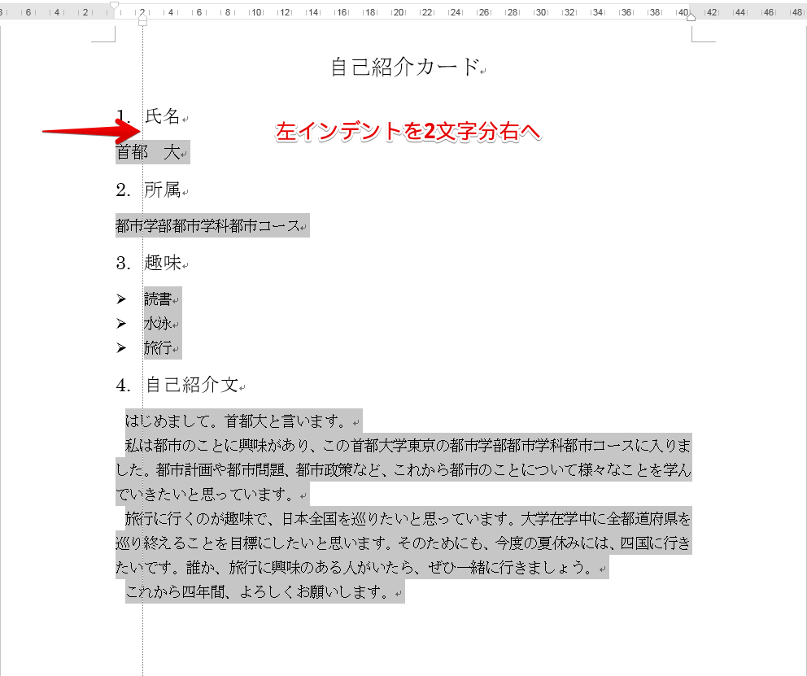

&#9313; 左インデントを 2 文字分右に動かします。

これで随分と見やすくなりました。
また、左インデントは [ホーム]リボンの "段落" にある  や  でもずらすことができます。

インデントはこの他、段落の詳細設定からより詳しく設定することができます。
[ホーム] リボン - "段落"パネルの右下の  をクリックします。

また、ページのレイアウト全体の設定を行うこともできます。[ページレイアウト] リボン - "ページ設定"パネルの右下の  をクリックします。

1 ページの行数や文字数などを設定することができます。

参考資料 [行の間隔を設定する](../appendix/linespace.html)

### ヘッダーとフッター

最後にヘッダーとフッターを設定しましょう。

&#9312; [挿入] リボン -  [ヘッダー] を押します。

&#9313; [空白] を選択します。

&#9314; ヘッダーに自分の学修番号と氏名を打ち込んでください。

これでヘッダー部分に学修番号と氏名が入りました。
ヘッダーやフッターを編集していると、リボンに [ヘッダー/フッター ツール] が表示されます。
次にフッターを設定します。先ほどと同じ[挿入]リボンからも操作可能ですが、現在表示されている [ヘッダー/フッター ツール] から操作してみることにします。

&#9312; [ヘッダー/フッター ツール]  [デザイン] リボン -  --- [ページ番号] を押します。

&#9313; "ページの下部" - "番号のみ2" を選択します。

これでフッターにページ数が入りました。
また[ヘッダーとフッターを閉じる] で通常の編集画面に戻ることができます。
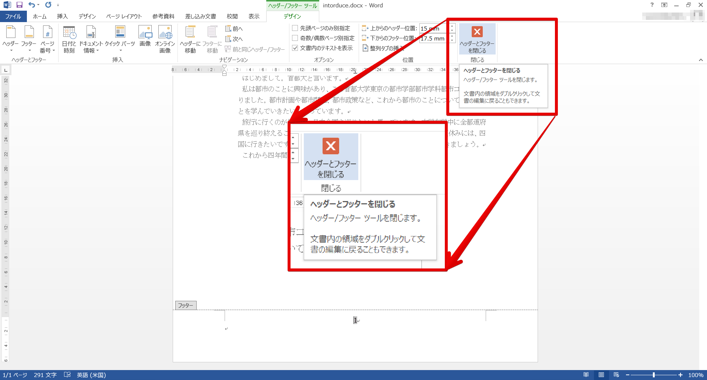

ヘッダーとフッターにはこの他様々な情報を入れることができます。
これでほぼ完成しました。後は、見やすいように微調整してください。

課題 1
------

今回作った課題を参考に自分の自己紹介カードを作成してください。ただし、以下の条件は満たすものとします。

-   1行目の"自己紹介カード"は16pt以上で、中央揃えにする。
-   "氏名"、"所属"、"趣味"、"自己紹介文"の項目を必ず含み、各項目には段落番号を振る。
-   趣味は 3 個以上書き、箇条書きにする。
-   自己紹介文は、3行以上書き、最初の1行目は1字下げることとする。

