アウトラインを作る
------------------

### 初期原稿の入力

簡単な目次付きの街の紹介を作ってみましょう。まず最初に以下のような文書を作ってみましょう。

`town.docx`という名前で保存してください。

### アウトラインの表示

アウトラインを付けるために、画面をアウトライン表示にしましょう。[アウトライン]リボンを表示します。

[表示]リボン -  をクリックします。

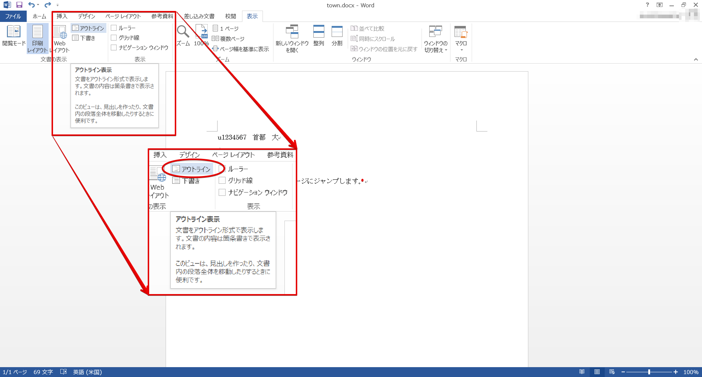

まだ、文章にアウトラインレベルが付けられていないので、全ての文章が本文になっています。

### 見出しを付ける

見出しを付けることによって、文章にアウトラインレベルを付けることができます。

&#9312; まず一番上のレベルになる 9 行目"街の説明"、 10行目"街の名産品・特産品"、 11行目"街の名所・好きな場所"を選択します。

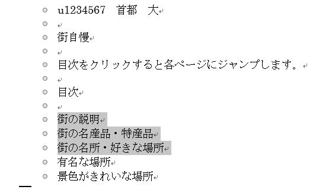

&#9313; [ホーム]リボン - "スタイル"パネルの中から"見出し 1"を選択します。

これで以下のように"街の説明"、"街の名産品・特産品"、"街の名所・好きな場所"を"アウトラインレベル 1"に設定することができました。

&#9314; 次いで、一つ下のレベルになる 12 行目"有名な場所"、 13行目"景色が綺麗な場所"を選択し、"見出し 2"に設定してください。

これで見出しを付けることができました。

#### [アウトライン]リボンの操作

アウトラインレベルの変更は、[アウトライン]リボンでも行うことができます。
[アウトライン]リボン - "アウトラインツール"パネルにポイントされている位置のアウトラインレベルが表示されています。

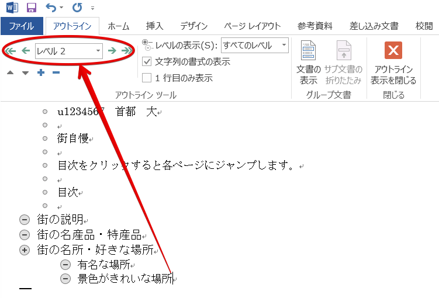

矢印を押すことによって、その文章のアウトラインレベルを変更することもできます。

このようにして、"景色が綺麗な場所"が"アウトラインレベル 1"になりました。"景色が綺麗な場所"は"街の名所・好きな場所"の下位にあたるため、"アウトラインレベル 2"に戻しておきます。

矢印の効果は以下の通りです。

  ------------------------------------------------------------------ --------------------------------------------------
                         見出し 1 に変更する。
       アウトラインレベルを 1 レベル上げる。
     アウトラインレベルを 1 レベル下げる。
                    本文にする。
                   見出しと見出しの下位に属する本文を上に移動する。
                 見出しと見出しの下位に属する本文を下に移動する。
  ------------------------------------------------------------------ --------------------------------------------------

### 詳細な設定

#### 新しいスタイルの設定

また、今回は見出しとして、予め用意された文字スタイル"見出し 1"や"見出し 2"を使用しました。文字スタイルを新しく設定することもできます。

[ホーム]リボン - "スタイルパネル"の  - [新しいスタイル]をクリックします。

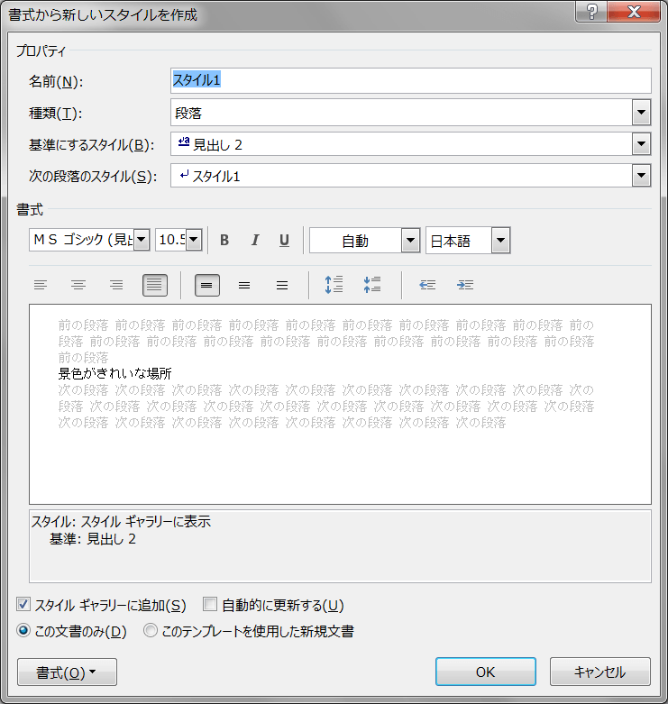

新しい文字スタイルを設定し、"スタイル"パネルに加えることができます。

### アウトラインの設定

アウトラインの設定を行います。Wordには予めいくつかのリストスタイルが用意されています。

&#9312; [ホーム]リボン -  [アウトライン] をクリックします。

&#9313; 任意のリストスタイルを選択します。今回は"1 （ア）①"を選択します。

それぞれ"見出し 1"と"見出し 2"で連番が付けられ、アウトラインが設定できました。

#### 新しいアウトラインの定義

アウトラインやリストスタイルも新しく設定することができます。

[ホーム]リボン -  - [新しいアウトラインの定義]をクリックします。

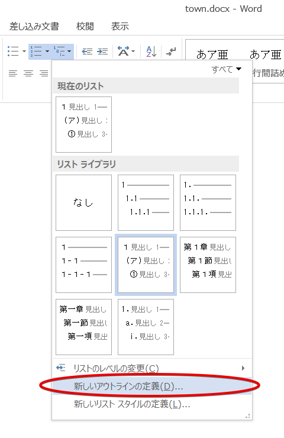

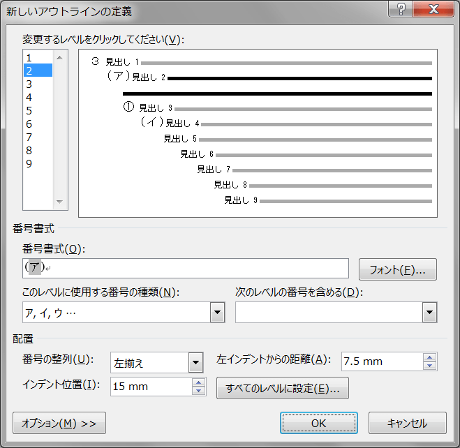

番号書式や左インデントからの距離などアウトラインの詳細な設定を行うことができます。

#### 新しいリストスタイルの定義

[ホーム]リボン -  - [新しいリスト スタイルの定義]をクリックします。

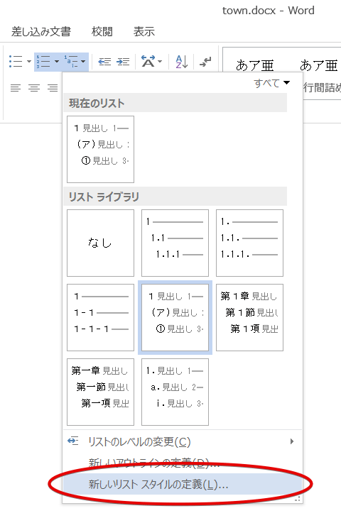

こちらではリストスタイルの詳細な設定を行うことができます。

最後に今後の作業のために、アウトラインを非表示にしましょう。

[アウトライン]リボン - [アウトライン表示を閉じる]を押すと、通常の画面に戻ります。

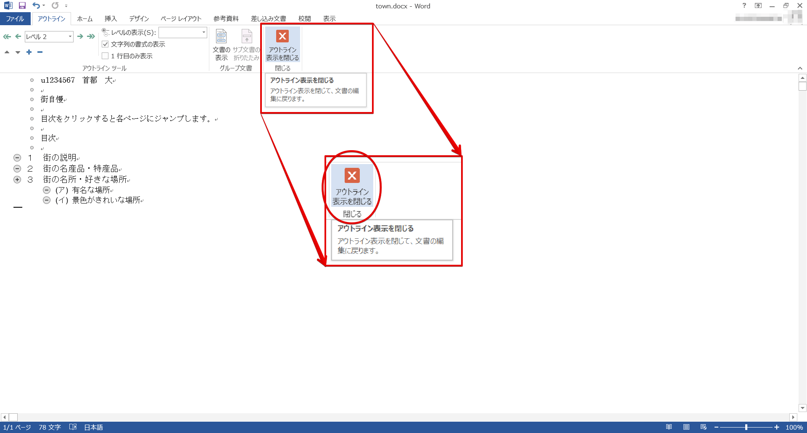

ページ番号の付与
----------------

まず、各"見出し 1"の項目が1ページずつになるように内容とページ区切りを入れます。
街の説明の項目に以下の内容を書き足します。

[挿入]リボン - "ページ" - [ページ区切り]をクリックします。

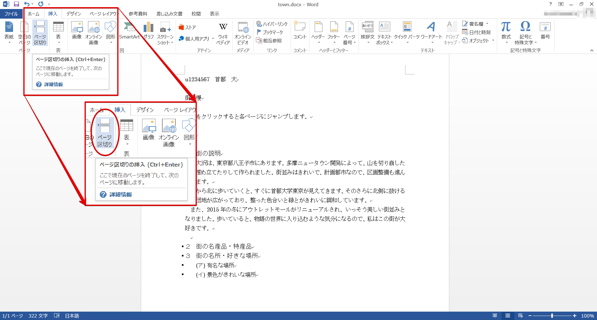
ページが区切られました。

同様に、以下の箇所についてページ区切りを挿入します。

* "2. 街の名産品・特産品" の直前
* "3. 街の名所・好きな場所" の直前

次に、ページ番号を入れていきます。

&#9312; [挿入]リボン - 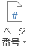 をクリックします。

&#9313; [ページの下部] - [番号のみ 2]を選択し、ページ下部の中央にページ番号が入るようにします。

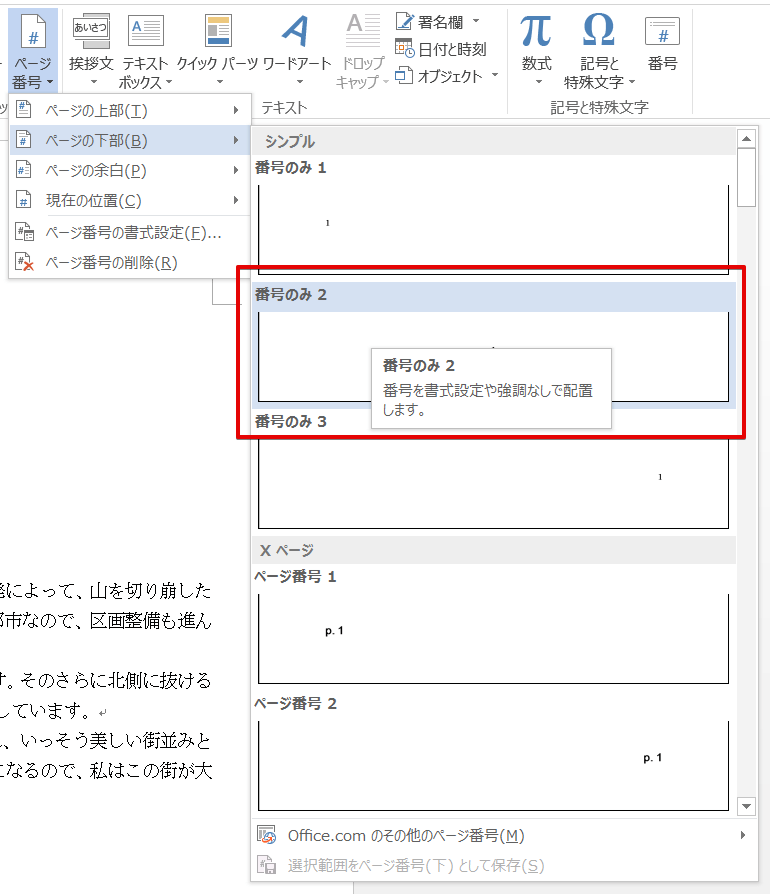

このページ番号はフッターと同じ扱いになります。
先頭ページは目次として、ページ数に含めたくないので、先頭ページを"0"ページに設定します。

&#9314;  - [ページ番号の書式設定]をクリックします。

&#9315; 連続番号の"開始番号"にチェック - `0` と入力 - [OK]をクリックします。

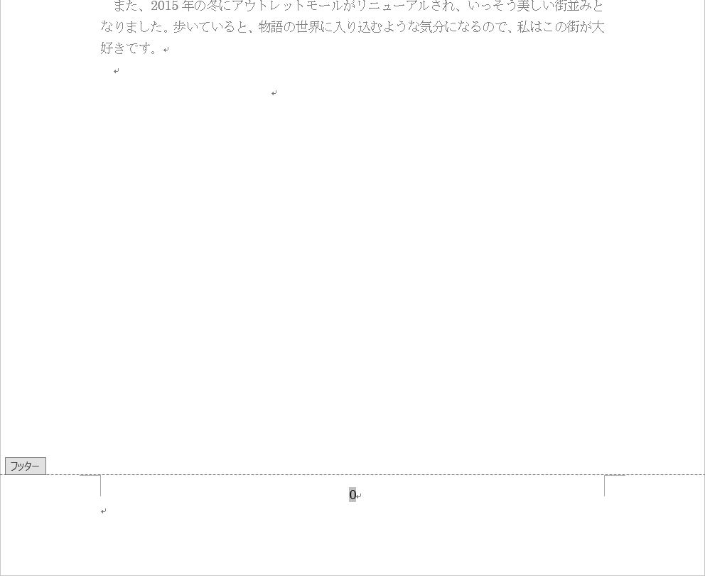

目次となる先頭ページが"0"ページになりました。"0"ページは不要なので、削除します。

&#9316; "先頭ページのみ別指定"にチェックを入れます。

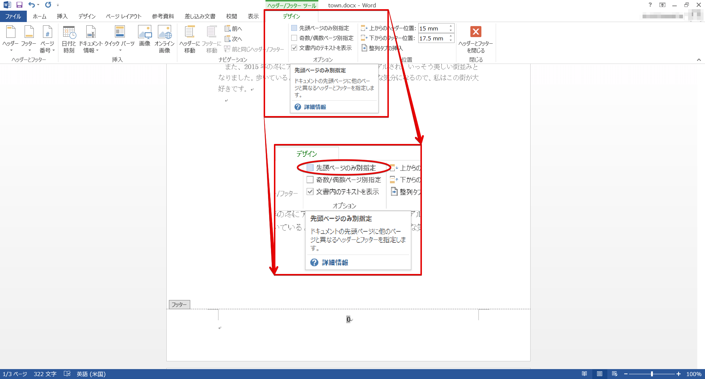

これで、"0"ページは消えました。

最後に[デザイン]リボン - [ヘッダーとフッターを閉じる]をクリックして、元の表示に戻します。

目次の作成
----------

先頭ページに目次を挿入します。

&#9312; "目次"と入れた行の次の行にカーソルを移動させます。

&#9313; [参考資料]リボン -  をクリックします。

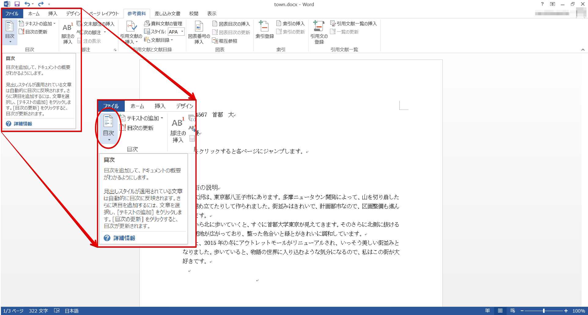

&#9314; [自動生成の目次 2]を選択します。

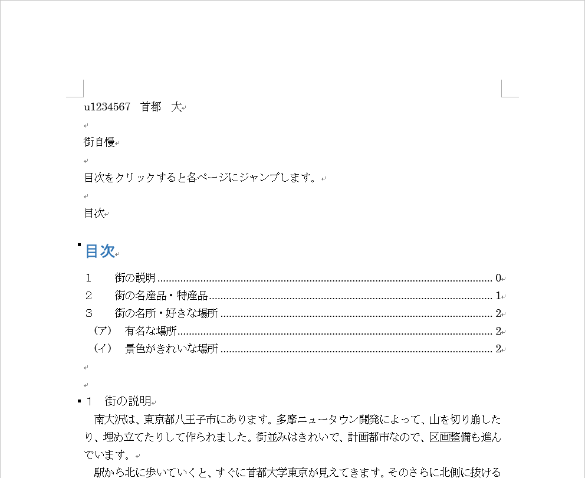

これで目次を入れることができました。

&#9315; "目次"の文字が重複してしまったので、予め書いておいた"目次"の文字を消します。

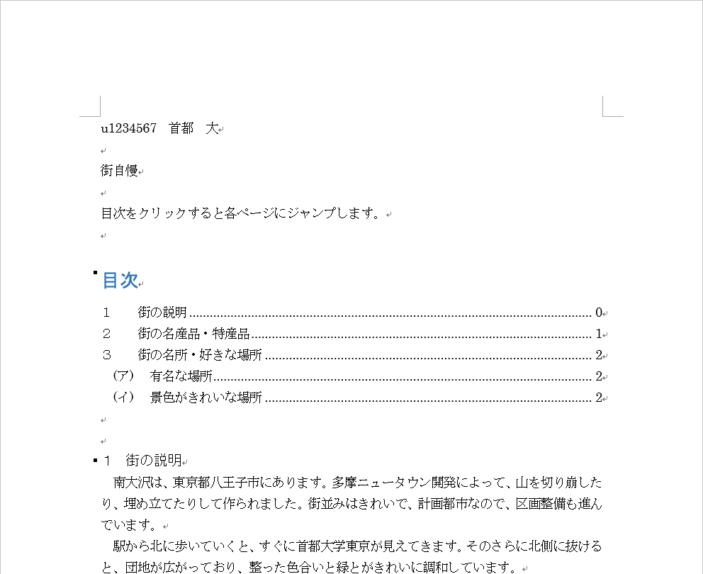

さらに、目次が入ったことによって、各ページがずれてしまうため、調整します。

&#9316; 目次までを先頭のページとして、"1. 街の説明"を次のページになるよう、[ページ区切り]を入れます。

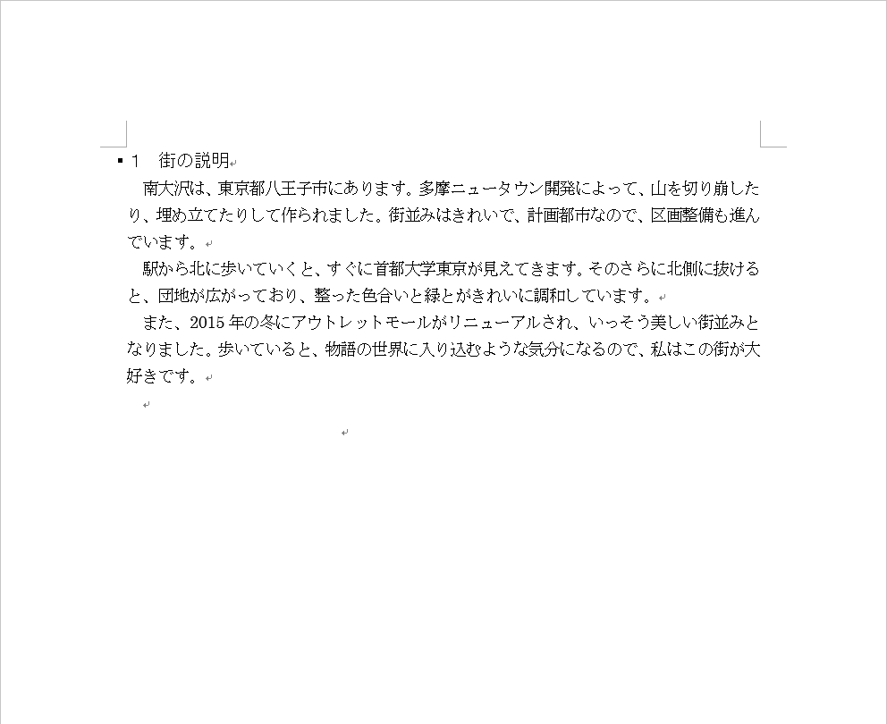

&#9317; すると、目次に表示されるそれぞれの項目のページ数と、実際にその項目が存在するページ数が一致しなくなります。

&#9318; ここで[目次の更新] - "ページ番号だけを更新する" を押すと、目次のページ番号が自動修正され、実際のページ数を反映したものになります。（目次の文章も変更したい場合には"目次をすべて更新する" を選択します。）

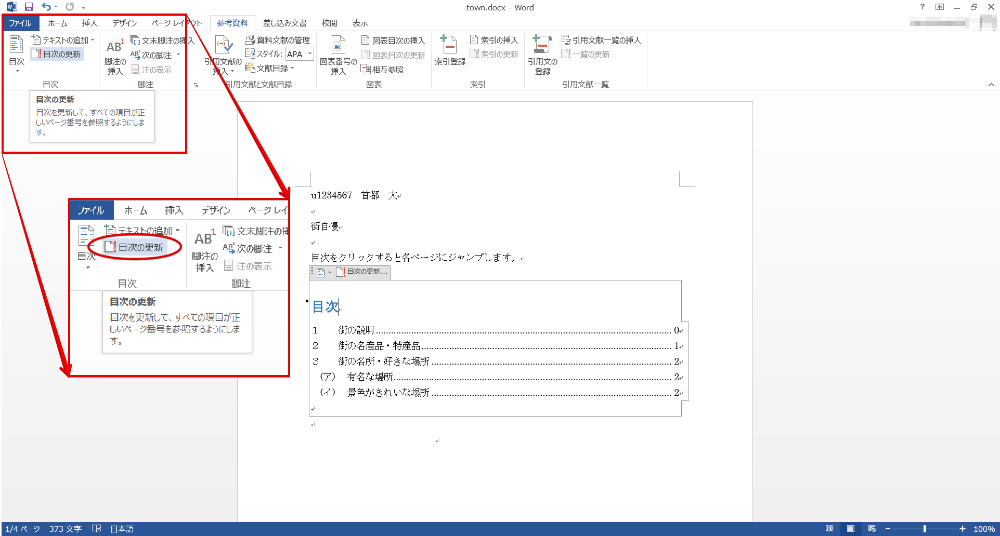

"1. 街の説明"が1ページ目になり、以降のページ数も反映されました。

また、[目次] - [ユーザー設定の目次]を押すと、詳細な設定を行った目次を挿入することができます。

また、[Ctrl]を押しながら、目次をクリックすると、その題の位置までジャンプすることができます。

課題 3
------

上記の街の紹介を完成させてください。どの街を紹介するかは問いません。自由に作成してください。
