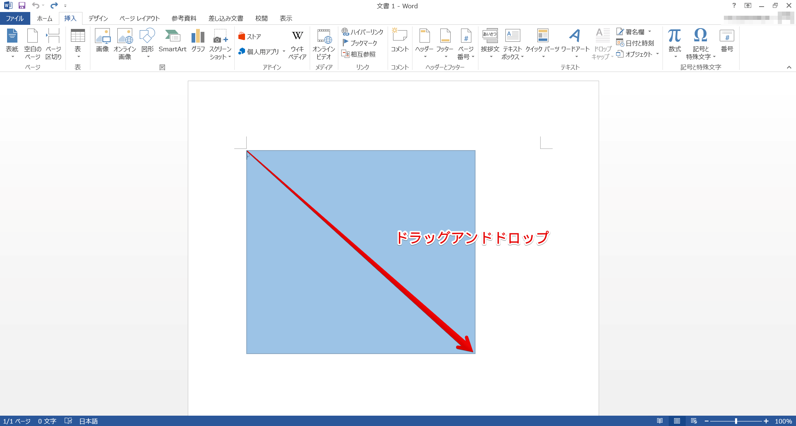
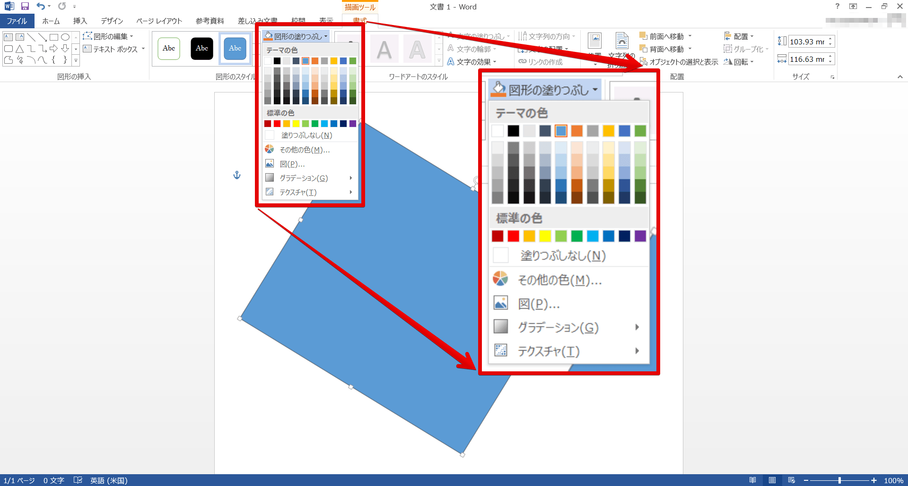
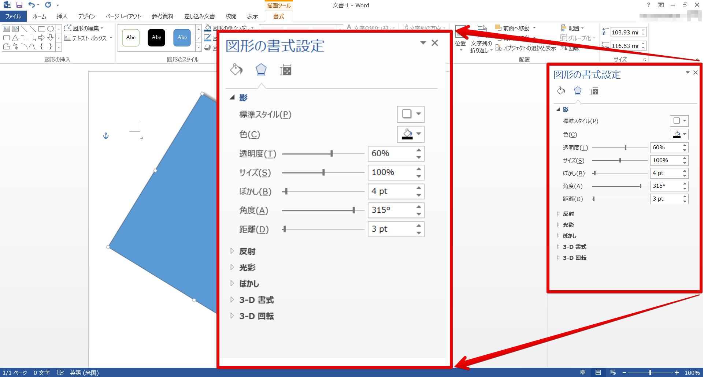
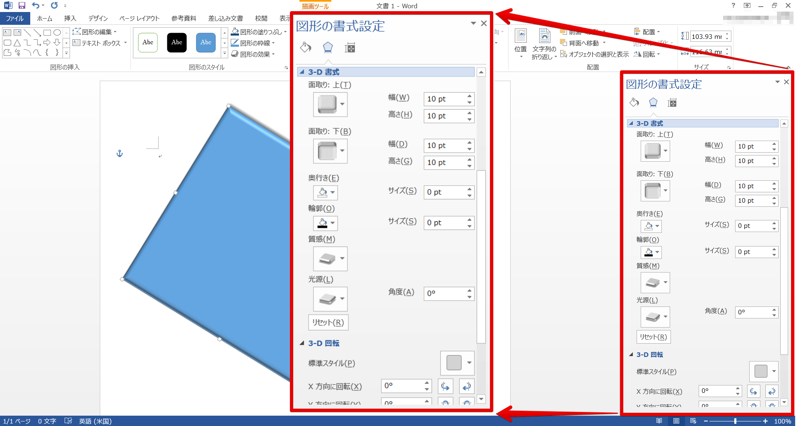
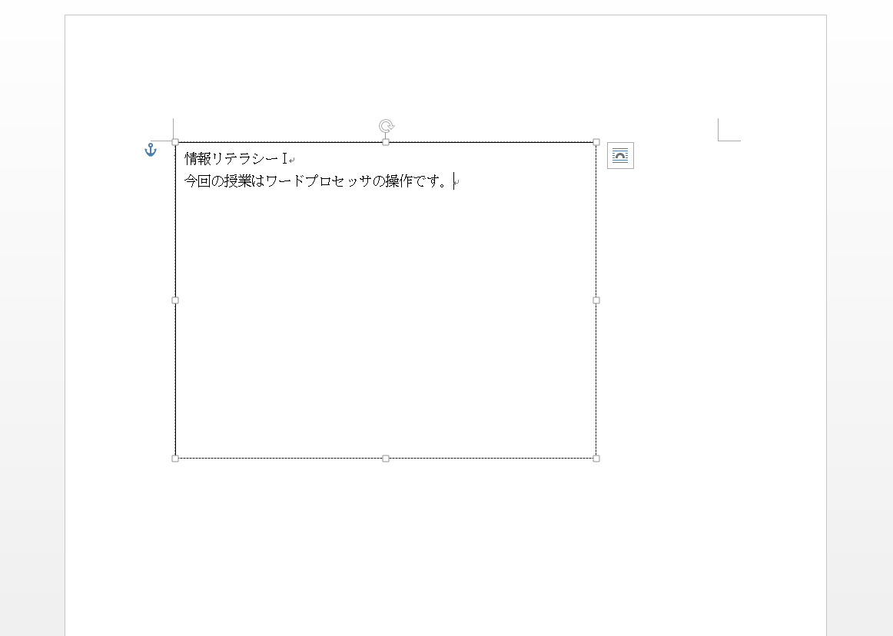
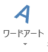
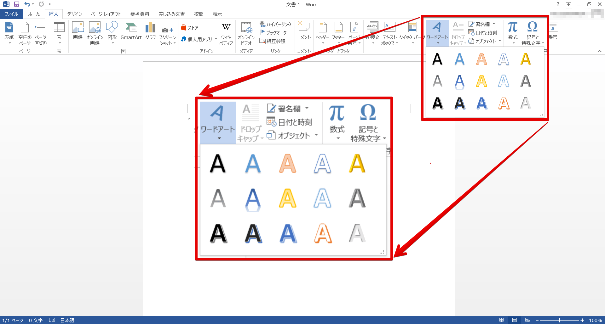
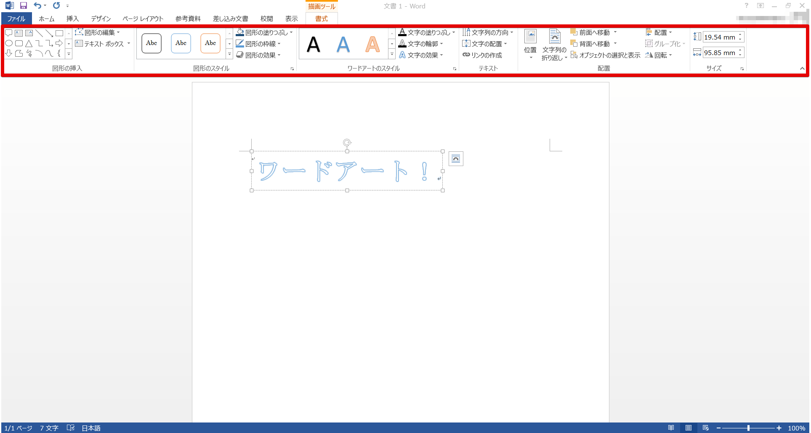

図形（長方形と楕円）の描画
--------------------------

[挿入]リボン -  -  もしくは  をクリックします。

今回は、四角形を用います。始点としたい位置をクリックし、そのままドラッグします。プレビューがでますので、必要な大きさになったところで離します。

図形が確定したと同時に描画ツールの[書式]リボンが表示されます。

四角形の他、楕円や吹き出し、星など様々な図形を同様にして作成することができます。

図形のカスタマイズ
------------------

直線や矢印と同様の方法で、図形の色や線の太さなどを変更することができます。
図形をクリックしてアクティブにします。

### 図形を回転させる

アクティブにした図形の上部にある緑色の点の上にカーソルを置くと、カーソルが円状に変形します。この状態のまま、ドラッグアンドドロップすると図形が回転します。任意の角度で離してください。

### 図形の塗りつぶし

四角形など、線で囲まれている領域がある場合、 で領域を塗りつぶすことができます。

色の上にカーソルを置くと、プレビューされます。クリックするまでは、確定されていないので、じっくりと考えることができます。

単色の塗り潰しの他にも、グラデーションやテクスチャなどもあります。

また、予め用意された図形のスタイルを使うこともできます。

### 影効果

 -   [影]をクリックします。

[図形の効果] - [影] - [影のオプション]、もしくは、[図形のスタイル]右下の矢印  をクリックすると表示される[図形の書式設定]から、影の細かい調整をすることができます。

### 3-D

[図形のスタイル]右下の矢印  から[図形の書式設定]を開き、[3-D書式]と[3-D 回転]で立体の設定をします。

[図形の書式設定]からは、他にも様々な効果をつけることができます。

テキストボックスの挿入
----------------------

[挿入]リボン -  - [横書きテキストボックスの描画]をクリックします。

他の図形と同じように、始点から任意の大きさになるようにドラッグアンドドロップします。

テキストボックスの内部には文字を入れることができます。方法は、テキストボックス内でクリックし、通常の文章入力と同じようにうちます。

図形の  も同じように内部に文字を入れることができます。

ワードアート
------------

[挿入]リボン -  をクリックします。任意のスタイルを選択してください。

`ここに文字を入力` という文字列を、ワードアートにしたい文字列に置き換えます。

ワードアートが表示されると同時に、ワードアート
ツールの[書式]リボンが表示されました。このリボンで詳細な設定をすることができます。

