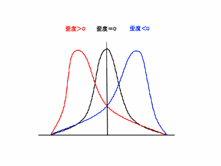
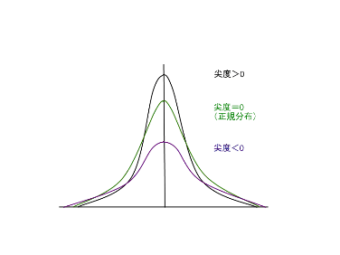

データを数値で表現する方法
--------------------------

### データの種類

#### 質的データ（特定の属性を表すデータ）

<dl>
<dt>名義尺度</dt>
<dd>カテゴリーを表し、データの区分にのみ意味があるものです。大小関係や順序関係は存在しません。データのタイプとしては数字か文字です。例としては、性別や血液型などがあげられます。</dd>
<dt>順序尺度</dt>
<dd>データの大小または、順位のみが意味を持つ尺度です。基本的には平均値や標準偏差は使用せず、中央値のみを主に使用します。データタイプは数値か文字のどちらかで、値が数値であれば大きさで順序が決まり、文字であれば並び替え順序で大きさが決まります。例としては、年代や各種のスケールなどがあげられます。</dd>
</dl>

#### 量的データ（数量として得られるデータ）

量的データのことを基本的に**連続尺度**といいます。連続尺度には下記の二種類があります。

<dl>
<dt>間隔尺度</dt>
<dd>温度（&#8451;）や時刻などの順序情報と等間隔性を有する尺度です。加法減法に意味はありますが、乗除は意味がありません（例： 30 &#8451;は15 &#8451;より 15 &#8451;高いですが、 2 倍の温度ではありません）。</dd>
<dt>比例尺度</dt>
<dd>間隔尺度の性質に加えて、 0 を基点とすることができる尺度です。テストの点数や身長・体重など多くの変数がこの尺度に当てはまります。数値はそのまま計算に用いることができ、乗除にも意味があります。</dd>
</dl>

例えば、統計を使って分析されることの多いデータのひとつにアンケートの回答があります。分析の際に回答を「1：悪い」「2：普通」「3：良い」といった数値を割り当てますが、人によって「普通」という評価が「悪い」に近い場合と「良い」に近い場合がありうるため、等間隔とはいえませんが、順序だけは明確であるため、順序尺度であるといえます。しかし、実際に分析を行う際には、数字を基に平均や分散、偏差などをもとめることがあります。このときは、間隔尺度として扱っているといえます。

基本統計量の意味
----------------

名義・順序尺度の場合に表示される度数には、各水準の度数と全体に占める割合が表示されます。
連続尺度の場合に表示される要約統計量には、分位点、4 分位範囲、平均値、中央値、最頻値、範囲、分散、標準偏差、歪度、尖度などが示されます。

それぞれの基本統計量の意味は下記のとおりです。

#### 平均

列の変数の算術平均を表します。欠損値以外の合計値を値の数で割った値です。

\begin{align}
  \bar{x}=\frac{1}{n}\left ( x_1+x_2+_\cdots +x_n \right )
\end{align}

$n$ は標本の大きさ（サンプルサイズ）、$x_i$ は各標本の値です。  
例えば {1，3，4，6，7} の5個の標本があったとき、平均は $ \left ( 1 + 3 + 4 + 6 + 7 \right ) \div 5 = 4.2 $ です。

#### $N$

欠損値以外の値の数です。

#### 分位点（パーセンタイル）

75%の数字は、75パーセンタイルを意味し、その値以下の割合が75%となる数値を表します。
25および75パーセンタイルは**４分位点**とも言い、どの値までが全体の何パーセントを占めるかの見当をつけるのに用います。

#### 範囲（レンジ）

分布の存在する範囲を示します。範囲R = 最大値 - 最小値 で求めることができます。例えば {1，3，4，6，7} であれば範囲$ R = 7 - 1 = 6 $です。

#### 最大値

欠損値を除く列内の最大値です。例えば {1，3，4，6，7} であれば 7 が最大値です。

#### 最小値

欠損値を除く列内の最小値です。例えば {1，3，4，6，7} であれば 1 が最小値です。

#### 中央値（メディアン）

50パーセンタイルとも言い、データを並べたときに全体の中央に位置する値です。例えば {1，3，4，6，7} であれば 4 が中央値です。

#### 最頻値（モード）

データの中で最大の度数を持つ値です。例えば {1，3，4，4，6，7} であれば 4 の数が最も多いので、 4 が最頻値になります。

#### 分散

JMPでは不偏分散を指し、偏差（各観測値 - 平均）を二乗することで符号を消し、その合計（偏差平方和）を $N - 1$ で割ったものです。
母集団が未知であることを前提としています。
一般的に標本の分散を求める場合、 $N$ で割るよりも $N - 1$ で割ったほうが、母分散をよりよく推定できます。
平均値からのデータの散らばり具合を把握するのに用います。

\begin{align}
  V=\frac{1}{n-1}\sum ^{n}_{i=1}{(x_i-\bar{x})}^2
\end{align}

$n$ は標本の大きさ（サンプルサイズ）、$x_i$ は各標本の値です。  
例えば {1，3，4，6，7} であれば分散は $ \left \\{ (1-4.2)^2 + (3-4.2)^2 + (4-4.2)^2 + (6-4.2)^2 + (7-4.2)^2 \right \\} \div \left ( 5 - 1 \right ) = 5.7 $ となります。

#### 標準偏差

JMPでは分散（不偏分散）の平方根をとった値で、分散同様散らばり具合の尺度になります。偏差の単位と次数が同じです。

\begin{align}
  s=\sqrt{V}=\sqrt{\frac{1}{n-1}\sum ^{n}_{i=1}{(x_i-\bar{x})^2}}
\end{align}

$n$ は標本の大きさ（サンプルサイズ）、$x_i$ は各標本の値です。  
例えば {1，3，4，6，7} であれば標準偏差は分散に平方根をとって、2.387&hellip; になります。

#### 歪度

データの分布の非対称性を測る尺度です。

- 歪度 $= 0$ : 左右対称
- 歪度 $> 0$ : 右に裾がのびる
- 歪度 $< 0$ : 左に裾がのびる

#### 尖度

データの分布の裾の長さを測る尺度です。

- 尖度 $= 0$ : 正規分布
- 尖度 $> 0$ : 正規分布よりも尖っている
- 尖度 $< 0$ : 正規分布よりも平坦である

#### 変動係数

標準偏差を平均で割ったもの。平均を考慮した上で散らばり具合を相対的に比較するのに便利な指標です。

#### 欠損値

データが得られていない項目がある場合、有効でないことが明らかな値を入力します。Excelでは空白のままにしておきます。

基本統計量の算出
----------------

実際に練習問題を通して、それぞれの基本統計量について学んでいきましょう。

### 練習問題 1

Excelを用いて次のデータを入力し、基本統計量を求めてみましょう。

以下の表は、ある学年の国語と算数のテストの結果の一部です。この結果から、学年の結果の推定値を求めます。



### データの入力

&#9312; Excelを開き，以下のようにデータを入力してください。



### 合計の計算

&#9312; 合計を計算します。"C2"セルに `=A2+B2` と半角で入力します。





&#9313; オートフィルを使って、全ての合計を出します。選択したセルの右下にある[■]の上にカーソルを持って行き、一気に"C21"まで引き延ばします。



&#9314; 合計が計算できました。



### 基本統計量の求め方

Excelの関数を利用して基本統計量を求めてみましょう。

&#9312; "F2" に `=AVERAGE(A2:A21)` と入力し，国語の平均点を計算します。



&#9313; 同様に，以下のように入力します。

-   "F3" : `=STDEV(A2:A21)/SQRT(COUNT(A2:A21))` （標準誤差）
-   "F4" : `=MEDIAN(A2:A21)` （中央値）
-   "F5" : `=MODE(A2:A21)` （最頻値）
-   "F6" : `=STDEV(A2:A21)` （標準偏差）
-   "F7" : `=VAR(A2:A21)` （分散）
-   "F8" : `=KURT(A2:A21)` （尖度）
-   "F9" : `=SKEW(A2:A21)` （歪度）
-   "F10" : `=MAX(A2:A21)-MIN(A2:A21)` （範囲）
-   "F11" : `=MIN(A2:A21)` （最小値）
-   "F12" : `=MAX(A2:A21)` （最大値）
-   "F13" : `=SUM(A2:A21)` （合計）
-   "F14" : `=COUNT(A2:A21)` （標本数）



&#9314;  オートフィルを使って、算数と合計についても基本統計量を求めます。"F2" から "F14" まで選択し，右下にある[■]をドラッグして "H14" まで引き延ばします。



&#9315; 算数と合計の基本統計量が求められました。



Excelの分析ツール
-----------------

いままではExcelの関数を利用して基本統計量を求めてきましたが，**分析ツール**というアドインを利用しても基本統計量を求めることができます。

分析ツールは[データ]リボン - [分析]タブ - [データ分析]から利用することができます。



[データ分析]が表示されていない場合は以下のページを参考にしてアドインを追加してください。



分析ツールを利用した基本統計量の算出
------------------------------------

実際に分析ツールを利用して基本統計量を求めてみましょう。

### データ分析の実行

&#9312; [データ]リボン - [分析]タブ - [データ分析]をクリックします。



&#9313; "基本統計量"を選択し，[OK]をクリックします。



&#9314; 入力範囲として，基本統計量を求めたいデータの範囲を選択します。ここでは "A1" から "C21" を選択します。

&#9315; "先頭行をラベルとして使用" にチェックを入れます。

&#9316; 出力オプションで出力先を指定します。今回は "出力先" を選択し， "J1" セルを指定します。

&#9317; "統計情報" にチェックを入れます。



&#9318; [OK]を押すと基本統計量が出力されます。



&#9319; 関数を利用して求めた数値と一致していることを確認しましょう。

度数分布とヒストグラム
----------------------

基本統計量からデータのばらつきや分布などの特徴を数値的に求めることができますが，度数分布を利用することも有効です。

度数分布とは，データをいくつかの階級に分け，それぞれの階級にいくつのデータがあるかを示した分布です。これを表で表したものを**度数分布表**といいます。
また，度数分布を棒グラフで示したものを**ヒストグラム**と呼びます。ヒストグラムはデータの分布を視覚的に理解するのに役立ちます。

### 練習問題 2

東京23区の各区の面積について，度数分布表とヒストグラムを作成してみましょう。

表1:東京23区の各区の面積(平方キロメートル)



表2:階級



[東京都 都内区市町村マップ](http://www.metro.tokyo.jp/tosei/tokyoto/profile/gaiyo/kushichoson.html)

### データの入力

&#9312; 表1のデータと表2の階級をExcelに入力します。



### 度数分布表とヒストグラムを作成する

&#9312; [データ]リボン - [分析]タブ - [データ分析]をクリックします。

&#9313; "ヒストグラム"を選択し，[OK]をクリックします。



&#9314; 入力範囲として，データの範囲を選択します。ここでは "A1" から "A24" を選択します。

&#9315; データ区間として，階級を選択します。ここでは "B1" から "B6" を選択します。

&#9316; 出力オプションで出力先を指定します。今回は "出力先" を選択し， "D1" セルを指定します。

&#9317; "ラベル" と "グラフ作成" にチェックを入れます。



&#9318; [OK]を押すと度数分布表とヒストグラムが出力されます。



10キロ平方メートルまでの区が3つ，11キロ平方メートルから20キロ平方メートルの区が9つ，21キロ平方メートルから30キロ平方メートルの区が2つ，31キロ平方メートルから40キロ平方メートルの区が4つ，41キロ平方メートルから50キロ平方メートルの区が2つ，"次の級" とは51キロ平方メートル以上を指し，3つという結果になりました。

課題 1
-----

練習問題1の表より、国語、算数、合計の点数について、階級（データ区間）を自由に設定し、Excelに入力しましょう。

課題 2
-----

分析ツールを使用して、表1のデータと設定した階級（データ区間）をもとに、度数分布表とヒストグラムを作成してみましょう。

