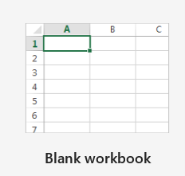
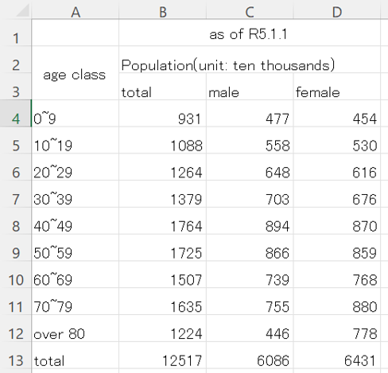
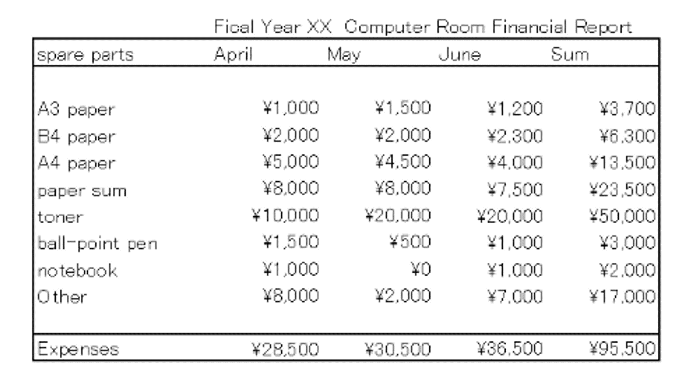
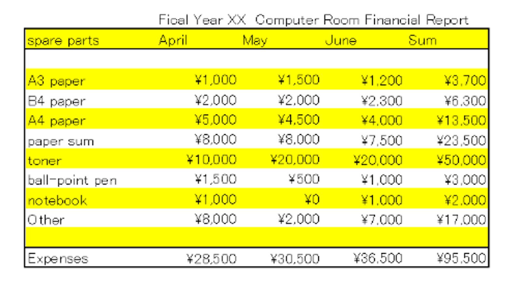

    

    
Explanatory video about the class content of this course. 

        

            
There is one [explanatory video in Japanese] about the class content of this course.

            
Note: The video may not play if multiple people play the video simultaneously . Please watch videos at different times.

<button type="button" class="btn btn-info pull-right" data-toggle="modal" data-target="#overviewModal">
<!--
<button type="button" class="btn btn-info" data-toggle="modal" data-target="#overviewModal">-->
<i class="fa fa-play-circle-o fa-lg"></i>&nbsp;Explanatory video
</button>

<button type="button" class="close" data-dismiss="modal" aria-label="Close">&times;</button>
授業内容

<video>
<source type="video/mp4" src="https://lit.fpark.tmu.ac.jp/mov/xl01_basic1.mp4">
</video>

        

    

Starting Microsoft Excel
---------------------

  1.  Click [Start] （Windows symbol）
  2.  Click [Excel]

Creating and saving a book
------------------

###  Creating a book

####  Create a new book

1.  Click 
1.  Click  - 

#### Open an existing book (revise, re-edit)

1.  Click 
1.   -  - Navigate to the folder using the desired book
1.  Double-click on or select the desired Excel book format file icon  to open.

Alternatively, navigate to the folder containing the desired document and double-click the icon.

### Saving a book

As with any application, production data can be lost because of various issues. To prevent data loss, we attempt to **save your book frequently**.

#### Saving a book for the first time

1.  Click 
1.  Click  - 
1.  Select the desired save format and navigate to the folder where you want to save the file.
1.  Enter a file name and press Enter. Alternatively, click [Save]

You can also select the saving format from [Save As]–[File type].



<dl>
<dt>Excel book (.xlsx) </dt><dd>Saves in the standard format supported by Excel 2007 or later. </dd>
<dt>Excel macro-enabled book </dt><dd>The book with enabled macros is supported by Excel and saved in XLSM format. </dd>
<dt>Excel Binary Book </dt><dd>Saves the book in an optimized format for quick loading and saving. </dd>
<dt>Excel 97-2003 book (.xls) </dt><dd>Saves in the format used as standard from Microsoft Excel 97 to Excel 2003. </dd>
<dt>OpenDocument Spreadsheet (.ods) </dt><dd>Saves in a common office suite format that can also be used by office products other than Microsoft Office. </dd>
<dt>PDF (.pdf) </dt><dd>Saves in PDF format, which can be opened in environments where Excel is not installed if the software supports PDF. </dd>
</dl>

#### Save changes to an existing book

1.  Click 
1.  Click 

Alternatively, click  on the Quick Access Toolbar.

### Closing Excel

1.  Click 
1.  Click [Close]

Overview of Microsoft Excel 2019
--------------------------

### What can this application do?

-   Aggregate calculations of the data entered into  tables and charts through simple operations.
-   Effective visualization of tables through formatting
    -   Improved appearance
-   Extensive calculation functions
    -   Calculations using functions
    -   Simulations are also possible
-   Visualization of data by creating graphs

### Windows configuration



### Quick Access Toolbar

Frequently used commands can be displayed.



The icons displayed by default and their functions are as follows:

-    [Save Overwrite]
-    [Undo]
-    [Repeat]

You can customize the icons displayed by pressing 

### Ribbon

Buttons with assigned commands that are frequently used when creating a book are grouped and arranged based on their function.

One can switch between groups of functions by clicking on grouped [Home], [Insert], [Page Layout], [Formulas], [Data], [Review], and [View] at the top of the ribbon. Alternatively, one can switch between the two by turning the wheel when the cursor is on the ribbon.

#### Home

It contains basic commands, mainly for decorating text and cells and cutting, pasting, and editing.



#### Insert

Insert tables, figures, graphs, headers and footers, etc.



#### Page layout

Set the page layout and legibility.



#### Formulas

Insert functions, such as SUM and AVERAGE, into cells and analyze worksheets.



#### Data

You can work with the data, including converting data formats, sorting, and applying filters.



#### Review

Proofread a finished document by checking spelling, counting characters, inserting comments, and comparing corrections.



#### View

Sets how the document is displayed on the Excel screen.



Press the bottom-right corner of the group  to set each item in more detail.





You can also hold the cursor over the command you want to use to view the command description.

Table creation Basics
----------------

### Table rows and columns

Spreadsheets organize data using rows and columns in tables. It attempts to generate new information by compiling and calculating vertically and horizontally linked data. To achieve this, it is necessary to understand the cell, which is a unit of a spreadsheet, as well as the rows and columns to which the cell is assigned.

In contrast to  word-processing software, such as Word, a new document is a blank table divided horizontally and vertically into small sections. This sheet is called a worksheet. On the leftmost side are the numbers from the row labels and on the top are the letters from the column labels. Each square is referred to as a cell. The cell currently being manipulated is called the current (active) cell. Click on them to activate the cells. A bold line surrounds the active cell, and its name (address) is displayed in the name box at the top left, under the column label row labels.

Multiple worksheets can be created from a single book. By default, there is only one sheet.



Thus, the number of worksheets can be increased or decreased. Numerical processing, which will be described later, allows calculations on two items (rows and columns) and data from other worksheets, so that calculations can be performed on three items.

### Entering data



The row to the right of the name box represents the data input bar. First, a box with the Cancel button “Cancel”  and the Input button “Enter,”  to the right of which the contents of the currently active cell (data) are displayed.

How to enter data:

1.  Select the cell in which the data are to be entered. (click on the cell).
2.  Enter the data in the text box in the data input bar.
3.  To confirm your entry, press the [return], [tab], [Enter], or arrow keys. Alternatively, click another cell, or  .
4.  To cancel an entry, click  .

There are several formats in which data can be entered into cells. Note that the different formats also change the processing in Excel. To change the format of the data, use the “Numbers” group in the “Home” ribbon. The format can be changed using the pull-down menu shown in the following image.



Normally, if the data format is “standard,” it will be automatically recognized in the correct format. If you want to enter a specific format, do the following.

#### Entering numerical values

-   The numerical input for **the source data of the calculation function** must be in **half-width characters** separated by three digits using a comma.
-   Separate the three digits with a comma to automatically recognize the currency style without symbols `12,345`.
-   Entering `\12345` is the currency style with symbols.
-   Enter `%12.345` for a percentage format.



#### Date and time input

-   Date when two or more digits are separated by `/` or `-`.
-   `H15.4.14` (H (or S, T, M) followed by a period separating the digits) for the Japanese calendar.
-   Separate numbers for time by `:`.



#### Entering text data



#### How to distinguish between numbers and strings

Excel automatically determines whether the entry of a cell is a **number** or **string**. 
For the actual display, refer to the image used in the previous section.

-   For numbers： right-aligned
-   For strings： left-aligned

#### Data cursor

There is a way to move from cell to cell in the table and make data entry quicker and less cumbersome.

<table>
<thead>
<tr>
<th>Key operation</th><th>Description</th>
</tr>
</thead>
<tbody>
<tr>
<td>Alphabetic [Enter]</td><td>Move one cell down.</td>
</tr><tr>
<td>[Tab]</td><td>Move one cell to the right.</td>
</tr><tr>
<td>Arrow keys [&rarr;] [&darr;] [&uarr;] [&larr;]</td><td>Move one cell in the direction of the specified arrow.</td>
</tr>
</tbody>
</table>



#### Selecting and editing multiple cells

Do the following in practice.

-   Selecting, copying, and pasting multiple cells
    -   After selecting multiple cells, use [Home] ribbon, [Clipboard] group, [Cut], [Copy], and [Paste].
    -   Or right-click to open the pop-up menu [Cut], [Copy], [Paste].
-   Deleting data in multiple cells
    -   After selecting multiple cells, select [Home] ribbon - [Editing] group - Clear
    -   Or right button click - [Clear formulas and values].
    -   Or After selecting multiple cells, press the delete key
-   Inserting and deleting rows and columns

Creating demographic tables
----------------

We will create what will eventually become the following table: Original data were obtained from [the Statistics Bureau of the Ministry of Internal Affairs and Communications (Japanese)](http://www.stat.go.jp/).

-   [Population Estimates April 2022 (2022) (Japanese)](http://www.stat.go.jp/data/jinsui/pdf/202204.pdf)

Completed form

### Entering data

First, the data are input as shown below, and missing figures are later adjusted. **Half-width characters where** there are only numbers are used and do not  worry if the data exceed the width of the cell. (We corrected this later). 



### Adjusting cells

First, adjust the cell width (height).

&#9312; Click on the column number of the column whose width you want to change.

&#9313; The pointer is positioned to the right of the column number and dragged to adjust the width.



&#9314; Multiple rows can be adjusted simultaneously. Press the Shift key, click on multiple rows, and drag any row to adjust the width.



&#9315; Do the same for the height.



Now, after selecting columns A, B, C, and D, right-click and widen [column width] to approximately 10.

Subsequently , the cells are merged, and the text alignment is changed. Merge cells "B1" to "D1" and "B2" to "D2" into a single cell.

&#9312; Select cells "B1" to "D1" as the active cells.

&#9313; In the [Home] ribbon-[Alignment] group, click on [Merge and Center].



&#9314; Alternatively, advanced settings can be set within the [Home] ribbon – [Alignment] group in the bottom-right corner.



&#9315; This time, center the "Vertical" and "Horizontal" positions and tick the "Merge cells" checkbox.



Merge cells "B2" to "D2" in the same manner. Similarly, the cells can be merged vertically." Let us join "A2" to "A3".

You should now have the following.



### Formula processing

Formula processing begins with a cell with (single bytes) =. This can enter the cell directly or using a formula bar.



The main arithmetic operators used in Excel are as follows:

-   `+` : Addition
-   `-` : Subtraction
-   `*` : Multiply
-   `/` : Division
-   `^` : Raise
-   `%` : Percent

The precedence of the operations is essentially the same as usual; however, the parentheses () can also be used. Additionally, many other operations with functions are possible.



### Automatic repetitive calculations with auto-fill

Let us calculate the gender totals for each age group.
For example, “B4” is `=C4+D4`; therefore, make “B4” the active cell and enter `=C4+D4` in half-width characters. If the data start with `=` in the **half-width characters**, the formula-processing mode is automatically entered.



We performed the same type of calculation for `B5` to `B13`. To do this, the mouse is pointed at a small black square (fill handle) in the bottom right corner of the active cell in `B4`. Hold the left button and drag the square around the cell to `B13`.



In this manner, you can skip typing. This function is called **AutoFill**.

-   [Relative and absolute cell references](../02/index.html)

### Sum calculations

The total sum (Sum) of men and women is then calculated into “C13” and “D13. ” Select “C13” and click the SUM button as shown below.



The sum will automatically be placed in "C13.” The same is true for the female data. It also calculates the total sum of both men and women.





### Saving and closing

Save the file in My Documents with the file name `rensyu`; Excel automatically compensates for the `.xlsx` extension.

Assignments 1
-----

Complete the demographic table.
1.  Enter the title “Gender difference” in “E3,” and fill the data from “E4” to “E13” by calculating the difference between the male and female population in the corresponding age group.
1.  Calculate the female population divided by the male population for each age group, using “F3” as the sex ratio.
    -   The division sign is `/` (slash).
    -   To change the format of the data, you can also use the “Numbers” group in the “Home” ribbon to display the data in percentage.

Preparing tables
----------

Creating tables with similar but slightly different perspectives. Practice four arithmetic operations: sum and autofilling. There is some overlap in creating a demographic table but hone your skills by practicing and checking your work repeatedly.
Enter the following table into `Sheet 2` of the `rensyu.xlsx` file you created previously; however, before you do so, set the display format for the cells.



### Cell display format (currency style)

Before entering the data, let us set the format of cells “B3” to “E12” as currency. The procedure is as follows:

1.  Drag and select cells “B3” to “E12.”
2.  In the [Home] ribbon and [Number] group, change the `Standard` to `Currency`.

After setting this format, enter the data into the image above. However, they did not enter `1,000`, but simply `1000`. As a result of the previous setting, the [display format] is set to `Currency`; therefore. Excel automatically fills in the currency symbols and commas.

When you have finished entering the data, perform a tally calculation. Complete the table with a simple tidy-up.

1.  Enter `Paper Portion of expenditure` in “A6.”
2.  Use formula processing to identify the amount of paper consumed in April and enter it in “B6.”
3.  Calculate the total expenditure for April using the formula and enter it in “B12."
4.  Calculate the paper consumption and total expenditure for May in “C6” and “C12,” respectively, using Autofill and enter them in “C6” and “C12,” respectively.
5.  Enter `June` in “D1.”
6.  Autofill and insert the paper consumption and total expenditure for June into "D6" and "D12," respectively (the expenditure amount for each item of equipment can still be left blank).
7.  Process "E3" to "E10" and "E12" as the sum of April to June for each item.
8.  Enter the appropriate numbers for each item in June and check whether the sum and formula processing cells change according to the values entered.

### Devising table display

By devising the display of tables, the tables created in Excel can be used not only for spreadsheets but also for reports and presentations.

#### Changing the size of rows and columns

Although this can be achieved by adjusting the cells as described above, this is another method.

&#9312; Select the entire row or column to be resized (click the label at the beginning of the row or column).

&#9313; Select [Format]-[Row Height] or [Format]-[Column Width] for the [Cells] group of the [Home] ribbon.



&#9314; The current value is displayed in a dialog box. Enter the value that you wish to adjust.

&#9315; Set text alignment in the [alignment] group of the [Home] ribbon.





#### Inserting ruled lines

Surround the dotted lines of rows and columns with solid (dotted) lines.

&#9312; Click the [Home] ribbon in the [Font] group in the lower right corner.



&#9313; Click the [border] group at the top of the window. The detailed settings can be found here.



&#9314; Some settings can also be set in the [Font] group of the [Home] Ribbon.



#### Changing fonts

&#9312; In the [Home] ribbon and [Font] group, click on the lower right corner.





&#9313; It can also be selected for the [Font] group of the [Home] Ribbon.



#### Cell color scheme





&#9312; In the [Home] ribbon and [Font] group, click on the lower right corner.



&#9313; Select [Fill]. Here you can set the background of the cells.



&#9314; This is also specified in the [Font] group of the [Home] ribbon.



#### Printing Range

First, the area to be printed (cell, row, or column) is selected. For example, in the example above, select "A1" through "E12." Click on [Print Area] – [Set Print Area] in the [Page Setup] group of the [page-layout] ribbon.

#### Print Preview

Before printing check the printout. This is displayed in the  - Print.

#### Print

Prints the image. Click the Print button after checking the preview displayed in  - Print.

<strong>Restrictions in the Computer Room</strong>

Color printing is not available in the Computer Room.

### Examples of actual display devices

The following is a print preview of the table we created: The print range is from “A1” to “E12 ." No display devices are used.



This is sufficient; however, you can make it easier to view by making additional changes.

&#9312; First, insert a title.

-   Click the entire first line to select it.
-   Right-click and select [Insert] to insert a line.
-   In “B1,” type `XX Fiscal Year XX Computer Room Financial Report`.
-   Change the size of the “B1” text to `16 pt`.

&#9313; Add more lines and color the rows, columns, and text.

Assignment 2
-----

Make the above computer room financial report neat and easy to read.
