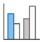
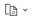
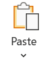

    

        
Study videos related to this course

        

            
There are two [explanatory videos in Japanese] about the class content of this course. In addition, there are certain [operation videos in Japanese] that comprehensively explain the Excel functions required to complete the files created in this course. The operation videos can be viewed within the section wherein the function is explained. 

            
Note: The video may not play if multiple people play the video simultaneously. Please watch videos at different times.

            

            

                <button type="button" class="btn btn-info pull-right" data-toggle="modal" data-target="#overview">
                    <!--
<button type="button" class="btn btn-info" data-toggle="modal" data-target="#autosumModal">-->
                    1. Explanatory videos on operators, expressions, references, and functions
                </button>
                

                    

                        

                            

                                <button type="button" class="close" data-dismiss="modal" aria-label="Close">&times;</button>
                                Explanatory videos on operators, expressions, references, and functions
                            

                            

                                

                                    <video>
                                        <source type="video/mp4" src="https://lit.fpark.tmu.ac.jp/mov/xl01_basic2.mp4">
                                    </video>
                                

                            

                        

                    

                

            

              
            

                <button type="button" class="btn btn-info pull-right" data-toggle="modal" data-target="#graph">
                    <!--
<button type="button" class="btn btn-info" data-toggle="modal" data-target="#autosumModal">-->
                    2. Explanatory videos on graph creation
                </button>
                

                    

                        

                            

                                <button type="button" class="close" data-dismiss="modal" aria-label="Close">&times;</button>
                                Explanatory videos on graph creation
                            

                            

                                

                                    <video>
                                        <source type="video/mp4" src="https://lit.fpark.tmu.ac.jp/mov/xl02_graph.mp4">
                                    </video>
                                

                            

                        

                    

                

            

        

        

Functions and Absolute and Relative References
------------------------

**Functions and absolute and relative references** are the most important functions in Excel and other spreadsheet software. Functions enable various complex calculations in seconds. Further, absolute and relative references also facilitate calculations without the need to type a seemingly endless string of numbers.

Download the following file and open it in Excel. Subsequently, complete the table.

-   [ichigo.xlsx](./ichigo_en.xlsx)


   


### SUM Function

    =SUM(number1,[number2],...) 

This function sums the numbers inserted in parentheses `()`.

First, we determine the "sum (g)" of the strawberries for each person. As this was explained in the previous section, we consider it a review.

&#9312; Select "F3."

&#9313; Next, click on the [Home] ribbon - [Edit] group - [Auto SUM].



&#9314; Thereafter, the selection is automatically entered into the function. Press [Enter] and the sum will be entered in "F3."



### Relative Reference

Use AutoFill to obtain all totals.

&#9312; Move the cursor to the [■] at the lower right corner of the selected cell and stretch it all the way till "F12" at once.



&#9313; Observe the Excel formula section.



&#9314; Next, select "F12." Consequently, the formula changes.





AutoFill performs the same function as that of copy and paste. However, a formula with a different cell number is pasted. Thus, in the copied cell, the cell position is recorded and not the cell number. This is referred to as a **relative reference**.

Relative referencing is a reference method that maintains a track of the position of each cell based on the cell wherein it is entered. Thus, owing to copying and pasting, a reference is made to a cell located at the same distance from the pasted cell.



### AVERAGE Function

    =AVERAGE(number1,[number2],...) 

This function produces the average of the numbers present in parentheses `()`.

Let us find out how many strawberries each person picked on average.

&#9312; Select "E13" and type `average`.

&#9313; Select "F13," on the [Home] ribbon - [Edit] group - [Auto SUM], click [▼] - [Average].





&#9314; Press [Enter]. Consequently, the average is obtained.





### RANK Function

    =RANK(number,range,order) 

This function derives the rank of the number in a range. The order can be `0` (descending/higher rank) or `1` (ascending/lower rank).

This function can be used to find who ate the most.

&#9312; Select "A3."

&#9313; Click [▼] - [More Functions] in the [Home] ribbon - [Edit] group - [Auto SUM]. Else, click [Formula] ribbon - [Function Library] group - [Insert Function].



&#9314; Rank function can be determined by searching for the function; however, in this case, click [Classification of Functions] - [Statistics] - [`RANK.EQ`] - [OK].





&#9315; Insert the number you wish to check the rank for into the number in the function's argument window. Here, select "F3.”

&#9316; Next, select the entire range of values for comparison. Here, "F3" to "F12" are selected. To set them in a descending order, enter `0`.





&#9317; Press [Enter]. Consequently, Uesugi's food quantity is ranked.



### Absolute Reference

Use auto-fill to rank each person.

&#9312; Stretch from "A3" to "A12."

&#9313;  Please observe the cells "A5," "A6," and "A11." Three instances of the number `2` (in the green boxes) are observed. This is incorrect in terms of ranking; thus, it must be fixed. Select cell "A12" and focus on the formula. As evident, because it uses relative references, the range in the RANK function has shifted (the red box represents the range in A3, and the blue box represents the range in A12).



&#9314; Now, let us use absolute references to derive the correct rank. First, select "A4" through "A12" - Right click - Clear with [Clear Formulas and Values].

&#9315; Select "A3" - move the cursor to "F3" in the range part of the formula bar – press the [F4] key.



&#9316; “F3" changes to "$\$$F$\$$3." The columns and rows marked with an asterisk `$` are fixed. This is the absolute reference state. In a similar manner, press the [F4] key to make "F12" an absolute reference.

&#9317; Similar to that done earlier, use AutoFill to extend from "A3" to "A12."

&#9318; The result is different from the previous case: select "A12" and confirm that the range has not changed.



This is referred to as an **absolute reference**. An absolute reference is a method of referencing wherein the cell's position is recorded in the spreadsheet software. Regardless of your position, you can always refer to the same cell. By appropriately utilizing absolute and relative references, Excel can be used in a more convenient manner.

### ROUNDUP Function

    =ROUNDUP(number,number of digits) 

This function rounds up a number to the specified number of digits.

Let us produce the fee for each person.

&#9312; Select column "G" and right-click - [Insert]. Enter `Amaou (yen)` in "G2."

&#9313; Next, select "G3" - click on [▼] - [More Functions] in the [Home] ribbon - [Edit] group - [Auto SUM]. Else, click [Formula] ribbon - [Function Library] group - [Insert Function].

&#9314; Search for "round up" in the "Search Functions." Select `ROUNDUP` from the candidates and click "OK."



&#9315; In this case, as the price of Amaou is in units of 100 g, enter `C3/100` in the numerical value.

&#9316; Next, enter `0` for the number of digits. In case of a number lower than the specified number of digits, it is rounded up to the specified number of digits - Click "OK".

The number is `0.98`; however, after it is rounded up, it becomes `1`. If the cell display format is set to "Currency" here, the value will be displayed as '$¥$,' which appears similar to a fee.

&#9317; This alone is not a fee. Next, move the cursor to the formula bar and complete the formula. `=ROUNDUP(C3/100,0)`. Thereafter, type `*` and select "J3." Do not forget to press the [F4] key to make it an absolute reference. Finally, type `=ROUNDUP(C3/100,0)*$J$3`.



Now, the price for Uesugi's Amaou has been calculated. Consequently, functions can be included within formulas.

&#9318; Use the Autofill feature to extend from "G3" to "G12" and calculate all the prices. If performed correctly, it should appear as follows:



&#9319; Thus far, only the price of Amaou has been calculated. In case of more available time, attempt to calculate the prices for the other varieties as well.

In addition to rounding up, there exists a function for rounding down, referred to as `=ROUNDDOWN(number,digits)`, and a function for rounding up, referred to as `=ROUND(number,digits)`.

Creating Basic Graphs
----------------

Previously, we have worked with data in numerical form. However, we will now learn how to convert the data from a numerical to graphical form for better visual clarity. The data file used is a demographic table data file created in the previous session.



### Creating a Graph



Let us create a graph.

&#9312; Select the area where you wish to create the graph.

&#9313; Select [Insert] ribbon - [Chart] group - [Vertical Bars] -  Set Vertical Bars.



Thus, a graph has been created. Using it as is does not result in significant interference; however, the item names are difficult to read. Thus, let us change them.





&#9312; Click on the graph you wish to edit to make it active. "Graph Tools" appears on the Ribbon.

&#9313; Click on "Graph Tools" - [Design] ribbon - [Data] group - [Select Data].



&#9314; Then, the "Select Data Source" window appears.



&#9315; Subsequently, let us change the item name. "Population (Unit: 10,000) Gender Total" and click "Legend Item (Series)" - "Edit" to make it active. Consequently, the "Edit Series" window appears.



&#9316; Change the "Series Name" from `=Sheet1!$B$2:$B$3` to `=Sheet1!$B$3`. Now, "`Population (unit: ten thousand) sexes total`" is changed to "`sexes total`."

&#9317; Similarly, let us change the series of "Population (Unit: ten thousand) Male" and "Population (Unit: ten thousand) Female."

&#9318; Subsequently, examine the range of the horizontal axis labels. To edit the horizontal axis, click "Horizontal (Item) Axis Labels" - "Edit."



&#9319; The "range of axis labels" is `=Sheet1!$A$4:$A$12`. It need not be changed at this time.





This completes the setup of the graph. Further, as Excel automatically sets up the graph for you, it can be finished even more easily by creating a table accordingly.

You may wish to consider the appropriate charting type.

### Editing Graphs

Thus far, we have focused on simply creating graphs from data. In practice, further processing is required to make the graph more readable.

#### Using Preset Visual Styles

Excel offers various visual styles that can be used as presets.

&#9312; Click on "Graph Tools" - "Design" ribbon - "  Others" in the "Graph Styles" group.



&#9313; Choose the visual style you prefer and click on it. The graph will then change to the preset visual style.



#### Inserting Graph Titles and Axis Labels

To make the contents of a graph understandable through simple observation, descriptions such as titles and axis labels are essential. Herein, we will add these aspects.

&#9312; Add a graph title. "Graph Tools" - [Design] ribbon - [Add Graph Elements] group - [Graph Title]. In this material, [Above Graph] is selected.



&#9313; The graph title has been inserted. Click on the graph title to edit it.



&#9314; Subsequently, let us enter the axis labels. Click on "Graph Tools" - [Design] ribbon - [Add Graph Elements] group - [Axis Labels]. Each axis label can be set here.

&#9315; First, click [1st Horizontal Axis Label] to label the horizontal axis.



&#9316; A label has been inserted into the horizontal axis. You can edit the label by clicking on it or the graph title.



&#9317; Subsequently, click on "First Vertical Axis Label" to label the vertical axis.



&#9318; A label has been inserted on the vertical axis. Click here to edit the label as well.



#### Setting the Error Range

Data always have an error margin, which can be displayed on the graph.

Click on "Graph Tools" - "Design" ribbon - "Add Graph Elements" group - "Error Range."



&#9313; Thereafter, click on the error range of the method you want to apply to display the error range.



#### Graph Formatting

The graph format can be changed by selecting the "Graph Tools" - "Format" ribbon - "Current Selection" group - "Format Selection."

&#9312; Change the pull-down menu of the "Graph Tools" - "Format" ribbon - "Current Selection" group to the one you wish to change. (You can also change it by clicking on the area you wish to change.)



&#9313; Click on "Graph Tools" - "Format" ribbon - "Current Selection" group - "Format Selection."



&#9314; In the "Format" menu, a list of formatting options for the selection is available.



The primary examples are as follows:

<dl>
<dt>Series options</dt>
<dd>You can set the overlap between series, spacing between elements, and use a second axis.</dd>
<dt>Legend Options</dt>
<dd>You can set the position of the legend, etc.</dd>
<dt>Axis Options</dt>
<dd>You can configure settings for axes, such as scale spacing, intersection processing, and label positions.</dd>
<dt>Display format</dt>
<dd>You can set the display format for scales and labels. The same settings can be made for the cell display format.</dd>
<dt>Alignment</dt>
<dd>You can set the placement of axis labels, etc.</dd>
<dt>Vertical (horizontal) axis error range</dt>
<dd>You can set the display method for the error range of the vertical (horizontal) axis.</dd>
<dt>Fill</dt>
<dd>This allows the setting of the background color, etc., of the selected target.</dd>
<dt>Border Color</dt>
<dd>You can set the color of the border of the selection.</dd>
<dt>Border Style</dt>
<dd>You can set the line type, rounded corners, etc., of the selection's border.</dd>
<dt>Shadow</dt>
<dd>You can add a shadow to the selection. This facilitates better visual separation from the background.</dd>
<dt>3-D Format</dt>
<dd>You can create visual effects by tilting the selection in a three-dimensional manner or changing the light source or texture.</dd>
</dl>

You can create various graphs by combining and utilizing these formatting options. Try different formats to make your graphs more readable.



#### Changing Graph Types

Select a graph and use the [Insert] ribbon - [Graph] group to change the graph type.

#### Delete a graph

Select a graph and delete it by pressing the [Delete] key or by clicking [Clear All] under Clear in the [Home] Ribbon - [Edit] group 

### Types of Graphs

In addition to bar charts (histograms), several other types of graphs can be created in Excel. They can be used depending on the data being handled.

First, let us create a table similar to the one below. We will attempt to find the total quantity and total amount by entering the formulas. If you have difficulty understanding, please review the previous section on [formula processing](../01/index_en.html).



#### Line Graph

These graphs are useful for comparing data from multiple series. Here, we show the change in sales by the day of the week.



#### Pie Chart

These charts are often used to show the percentage of total sales. In this case, we show the percentage of total sales.



#### Radar Graph

These charts are useful for viewing the bias of components, etc.



Creating a composite graph with a second axis
---------------------------------

The graphs we have created until now had one x-axis and one y-axis scale; however, it is possible to create a graph with two different y-axis.

In this example, we will create a graph of precipitation and temperature (rainfall–temperature diagram).

&#9312; We will create the following table.



&#9313; Select the area you wish to form a graph for and create a bar graph.

&#9314; Select the temperature item in the graph (click on the bar element of the temperature series in the graph) and choose any line in the [Insert] ribbon - [Graph] group - [Line].



&#9315; In addition, with the temperature item selected, click on the “Chart Tools” - [Format]  ribbon – [Current Selection] group – [Format Selection].

Select the series `“Average Temperature”`.



&#9316; Under [Series Options], set “Axis to use” to [Axis 2].



Now you can set up a second axis.



Once the graph is created, it can be edited as discussed earlier.



Pasting Excel tables and figures into a Word document
---------------------------------------------

We expect that you will often wish to copy figures and tables created in Excel into Word, such as when submitting reports in the future. Thus, let us briefly review the procedure for copying and pasting Excel figures and tables into Word.

### Copying and Pasting Tables

&#9312; Open or create a new Word file to which you wish to paste a figure or table.

&#9313; Start Excel and create a table. It is advisable to include ruled lines and create the table in its final form. However, ruled lines and data placement can also be edited in Word.

&#9314; In Excel, select the table by dragging it, then select Copy from the [Home] ribbon - [Clipboard] group  . Alternatively, use the shortcut key ([Ctrl]+[C] in Windows).



&#9315; Display the Word screen. Position the cursor at where you wish to insert it and click on the [Home] ribbon - [Clipboard] group  . Alternatively, use the shortcut keys ([Ctrl]+[V] in Windows).



&#9316; The Excel table has been pasted. If necessary, click  to change the format of the pasted table.



### Copy and Paste Diagrams

&#9312; Create graphs and figures in Excel. It is preferable to finish all figures in Excel till the end.

&#9313; Select and copy the diagrams following the method used for the previous table.

&#9314; Move to Word. Paste in the same way as that in the case of the previous table.

&#9315; The Excel graph has been pasted. If necessary, change the pasting format by clicking on  , which appears when pasting.



Other Functions
------------

There are many other functions in Excel in addition to those introduced here. If you have time, try them. 

