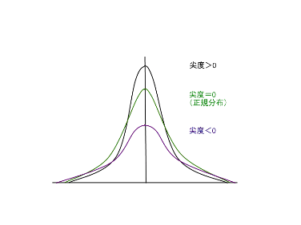

    

    
本講に関する学習動画

        

            
本講の授業内容に関する【説明動画】が1つあります。

            
注意：大人数が一斉に動画を再生すると動画が再生されないことがあります。時間をずらして視聴してください。

<button type="button" class="btn btn-info pull-right" data-toggle="modal" data-target="#overviewModal">
<!--
<button type="button" class="btn btn-info" data-toggle="modal" data-target="#overviewModal">-->
<i class="fa fa-play-circle-o fa-lg"></i>&nbsp;説明動画
</button>

<button type="button" class="close" data-dismiss="modal" aria-label="Close">&times;</button>
授業内容

<video>
<source type="video/mp4" src="../../../../../lit/video/st01_statistics.mp4">
</video>

        

    

データを数値で表現する方法
--------------------------

数値化されたデータを得るためには、対象（universe）がもつ特性である事象に数値（数字や記号）を割り当てる処理、すなわち、測定（measurement）が必要になります。例えば、全世界の人間（対象）の性別（特性）を数値で表す場合、性別を測定していることになります。測定は尺度（scale of measurement）と呼ばれる規則に基づいて実施しますが、測定したい事象に応じて4つの尺度を適切に使う必要があります。

### 尺度の種類

#### 質的データ（qualitative data、特定の属性を表すデータ）

<dl>
  <dt id="nominal_scale">名義尺度（nominal scale）</dt>
  <dd>特性はカテゴリー（category、水準）に分類され、データの区分にのみ意味があるものです。大小関係や順序関係は存在しません。データのタイプは数字か文字です。例として、性別や血液型などがあげられます。</dd>
  <dt id="ordinal_scale">順序尺度（ordinal scale）</dt>
  <dd>データの大小または、順位のみが意味を持つ尺度です。基本的には<a href="#mean">平均</a>や<a href="#standard_deviation">標準偏差</a>は使用せず、<a href="#median">中央値</a>を主に使用します。データタイプは数値か文字のどちらかで、数値であれば大きさで順序が決まり、文字であれば50音順やアルファベット順などで順序が決まります。例として、年代や各種のスケールなどがあげられます。</dd>
</dl>

#### 量的データ（quantitative data、数量として得られるデータ）

量的データの尺度を基本的に連続尺度（continuous scale）といいます。連続尺度には以下の二種類があります。

<dl>
  <dt id="interval_scale">間隔尺度（interval scale）</dt>
  <dd>順序情報と等間隔性を有する尺度です。加減に意味はありますが、乗除は意味がありません。例として、摂氏の温度（℃）や時刻などがあげられます。</dd>
  <dt id="ratio_scale">比例尺度（ratio scale）</dt>
  <dd>間隔尺度の性質に加えて、0を基点とすることができる尺度です。テストの点数や身長・体重など多くの事象にこの尺度を用います。数値はそのまま計算に用いることができ、乗除にも意味があります。</dd>
</dl>

なお、絶対温度（K）は原子の動いていない状態を0（基点）としているため比例尺度ですが、摂氏の温度（℃）は水の凝固点に便宜上0を割り当てたものであり、その0は"温度がない=無の値"を表している基点**ではない**ため、間隔尺度となります。

また、統計を使って分析されることの多いデータのひとつにアンケートの回答があります。分析の際に回答へ「1：悪い」「2：普通」「3：良い」といった数値を割り当てることがありますが、人によって「普通」という評価が「悪い」に近い場合と「良い」に近い場合とがありえます。このことから、等間隔とはいえませんが、順序だけは明確であるため、順序尺度であるといえます。しかし、実際に分析を行う際には、割り当てた数値を基に<a href="#mean">平均</a>や<a href="#variance">分散</a>、<a href="#deviation">偏差</a>などを求めることがあります。このときは、間隔尺度として扱っているといえます。

基本統計量の意味
----------------

<a href="#nominal_scale">名義尺度</a>・<a href="#ordinal_scale">順序尺度</a>の場合に求められる統計量には、各<a href="#category">カテゴリー</a>あるいは階級（class）のデータ数（度数、frequency）とその度数が全体のデータ数（総度数）に占める割合（相対度数、relative frequency）とがあります。<a href="#continuous_scale">連続尺度</a>の場合に求められる主要な<a href="#summary_statistics">要約統計量</a>には、<a href="#quantile">分位数</a>、<a href="#mean">平均値</a>、<a href="#median">中央値</a>、<a href="#mode">最頻値</a>、<a href="#range">範囲</a>、<a href="#variance">分散</a>、<a href="#standard_deviation">標準偏差</a>、<a href="#skewness">歪度</a>、<a href="#kurtosis">尖度</a>などがあります。

それぞれの統計量の意味は以下のとおりです。

#### 欠損値（missing value）

測定値が得られていない項目がある場合、有効でないことが明らかな値を入力します。Excelでは空白のままにしたり、マイナス記号（-）を入力したりすることが多いようです。

#### 標本の大きさ（sample size）$N$

欠損値以外の測定値の数です。<a href="https://support.office.com/ja-jp/article/COUNTA-関数-7dc98875-d5c1-46f1-9a82-53f3219e2509"><code>COUNTA</code>関数</a>を用いることで、求められます。

#### 合計（summation）

欠損値以外の測定値の合計値です。

$\displaystyle \left( x_1 + x_2 + \dots + x_N \right) = \sum_{i = 1}^N x_i$

$x_i$は標本の$i$番目の測定値、$N$は<a href="#sample_size">標本の大きさ</a>です。例えば標本に1，3，4，6，7の5個の測定値があったとき、合計は1 + 3 + 4 + 6 + 7 = 21です。

<a href="https://support.office.com/ja-jp/article/SUM-関数-043e1c7d-7726-4e80-8f32-07b23e057f89"><code>SUM</code>関数</a>を用いることで、求められます。

#### 平均（mean）

測定値の算術平均を表します。<a href="#summation">合計</a>を<a href="#sample_size">標本の大きさ</a>$N$で割った値です。

$\displaystyle \bar{x}=\frac{1}{N}\left ( x_1+x_2+_\cdots+x_N \right )$

$N$は<a href="#sample_size">標本の大きさ</a>、$x_i$は標本の$i$番目の測定値です。例えば1，3，4，6，7であれば、平均は21 ÷ 5 = 4.2です。

<a href="https://support.office.com/ja-jp/article/AVERAGE-関数-047bac88-d466-426c-a32b-8f33eb960cf6"><code>AVERAGE</code>関数</a>を用いることで、求められます。

#### 最大値（maximum）

欠損値を除く測定値の最大値です。例えば1，3，4，6，7であれば7が最大値です。

<a href="https://support.office.com/ja-jp/article/MAX-関数-e0012414-9ac8-4b34-9a47-73e662c08098"><code>MAX</code>関数</a>を用いることで、求められます。

#### 最小値（minimum）

欠損値を除く測定値の最小値です。例えば1，3，4，6，7であれば1が最小値です。

<a href="https://support.office.com/ja-jp/article/MIN-関数-61635d12-920f-4ce2-a70f-96f202dcc152"><code>MIN</code>関数</a>を用いることで、求められます。

#### 範囲（レンジ、range）

測定値が分布する範囲を示します。範囲R = <a href="#maximum">最大値</a> - <a href="#minimum">最小値</a>で求めることができます。例えば1，3，4，6，7であれば範囲R = 7 - 1 = 6です。

#### 分位数（quantile）</spam>

分位点とも呼びます。測定値を大きさの順に並べ、測定値の個数が等しくなるように複数のグループに分割した時のグループ間の境界値のことを言います。どの値までが全体のどれくらいの割合を占めるかの見当をつけるのに用います。特に、100グループに分割する場合は百分位数（パーセンタイル、percentile）、4グループに分割する場合は四分位数（quartile）と呼びます。第1四分位数（first quartile）は小さいほうから25%に当たる値、第3四分位数（third quartile）は大きいほうから25%に当たる値になります。四分位数は<a href="https://support.office.com/ja-jp/article/QUARTILE-EXC-関数-5a355b7a-840b-4a01-b0f1-f538c2864cad"><code>QUARTILE.EXC</code>関数</a>を用いることで、求められます。

#### 中央値（メディアン、median）

50パーセンタイル、第2四分位数とも言い、測定値を大きさの順に並べたときに全体の中央に位置する値です。例えば1，3，4，6，7であれば4が中央値です。

<a href="https://support.office.com/ja-jp/article/MEDIAN-関数-d0916313-4753-414c-8537-ce85bdd967d2"><code>MEDIAN</code>関数</a>を用いることで、求められます。

#### 最頻値（モード、mode）

測定値の中で最大の<a href="#frequency">度数</a>を持つ値です。例えば1，3，4，4，6，7であれば4の数が最も多いので、4が最頻値になります。

<a href="https://support.office.com/ja-jp/article/MODE-SNGL-関数-f1267c16-66c6-4386-959f-8fba5f8bb7f8"><code>MODE.SNGL</code>関数</a>を用いることで、求められます。

#### 分散（variance）

Excelでは不偏分散（unbiaded variance）を指し、各測定値と<a href="#mean">平均</a>との差である偏差（deviation）を2乗することで符号を消し、その合計（偏差平方和（sum of squared deviations）$S$）を$N - 1$で割ったものです。平均値からのデータの散らばり具合を把握するのに用います。

$\displaystyle V = \frac{S}{N - 1}$

$\displaystyle S = {\left( x_1 - \bar{x} \right)}^2 + {\left( x_2 - \bar{x} \right)}^2 + \dots + {\left( x_N - \bar{x} \right)}^2 = \sum_{i = 1}^N {\left( x_i - \bar{x} \right)}^2$

$V$は分散、$N$は<a href="#sample_size">標本の大きさ</a>、$x_i$は標本の$i$番目の測定値、$\bar{x}$は<a href="#mean">平均</a>です。例えば1，3，4，6，7であれば分散は{(1 - 4.2)2 + (3 - 4.2)2 + (4 - 4.2)2 + (6 - 4.2)2 + (7 - 4.2)2} ÷ (5 - 1) = 5.7となります。<a href="../02/#population">母集団</a>（対象全体に対して測定したデータ、例えば日本人全員の身長など）の平均（母平均）が未知であることを前提としていて、（<a href="../02/#sample">標本</a>）平均$\bar{x}$を用いて母分散を求めるため、自由度$N - 1$で割ります。

<a href="https://support.office.com/ja-jp/article/VAR-S-関数-913633de-136b-449d-813e-65a00b2b990b"><code>VAR.S</code>関数</a>を用いることで、求められます。

#### 標準偏差（standard deviation）

Excelでは<a href="#variance">分散</a>（不偏分散）$V$の平方根をとった値で、分散同様散らばり具合の尺度になります。単位と次数とが<a href="#deviation">偏差</a>と同じです。

$s = \sqrt{V} = \sqrt{\frac{1}{n-1}\sum ^{N}_{i=1}{(x_i-\bar{x})^2}}$

$s$は標準偏差です。例えば1，3，4，6，7であれば標準偏差は分散の平方根をとって、2.387467...になります。

<a href="https://support.office.com/ja-jp/article/STDEV-S-関数-7d69cf97-0c1f-4acf-be27-f3e83904cc23"><code>STDEV.S</code>関数</a>を用いることで、求められます。

#### 歪度（skewness）

測定値の分布の非対称性を測る尺度です。

* 歪度 = 0 : 左右対称
* 歪度 &gt; 0 : 右に裾がのびる
* 歪度 &lt; 0 : 左に裾がのびる

<a href="https://support.office.com/ja-jp/article/SKEW-関数-bdf49d86-b1ef-4804-a046-28eaea69c9fa"><code>SKEW</code>関数</a>を用いることで、求められます。

#### 尖度（kurtosis）

測定値の分布の裾の長さを測る尺度です。

* 尖度 = 0 : 正規分布
* 尖度 &gt; 0 : 正規分布よりも尖っている
* 尖度 &lt; 0 : 正規分布よりも平坦である

<a href="https://support.office.com/ja-jp/article/KURT-関数-bc3a265c-5da4-4dcb-b7fd-c237789095ab"><code>KURT</code>関数</a>を用いることで、求められます。

#### 変動係数（coefficient of variation）

<a href="#standard_deviation">標準偏差</a>を<a href="#mean">平均</a>で割った値で、平均を考慮した上で散らばり具合を相対的に比較するのに便利な指標です。

$s / \bar{x}$

$s$は標準偏差、$\bar{x}$は平均です。

#### 標準誤差（standard error）

<a href="#standard_deviation">標準偏差</a>を<a href="#sample_size">標本の大きさ</a>$N$の平方根で割った値で、平均に関する検定や推定で用いられます。<a href="#mean">平均</a>の標準誤差とも呼ばれます。

$s / \sqrt{N}$

$s$は標準偏差、$N$は標本の大きさです。

基本統計量の算出
----------------

実際に練習問題を通して、それぞれの基本統計量について学んでいきましょう。

### 練習問題 1

Excelを用いて次のデータを入力し、基本統計量を求めてみましょう。

以下の表は、ある学年の国語と算数のテストの結果の一部です。この結果から、学年の結果の推定値を求めます。



### データの入力

&#9312; Excelを開き，以下のようにデータを入力してください。



### 合計の計算

&#9312; 合計を計算します。"C2"セルに `=A2+B2` と半角で入力します。





&#9313; オートフィルを使って、全ての合計を出します。選択したセルの右下にある[■]の上にカーソルを持って行き、一気に"C21"まで引き延ばします。



&#9314; 合計が計算できました。



### 基本統計量の求め方

Excelの関数を利用して基本統計量を求めてみましょう。

&#9312; "F2" に `=AVERAGE(A2:A21)` と入力し，国語の平均点を計算します。



&#9313; 同様に，以下のように入力します。

-   "F3" : `=STDEV(A2:A21)/SQRT(COUNT(A2:A21))` （標準誤差）
-   "F4" : `=MEDIAN(A2:A21)` （中央値）
-   "F5" : `=MODE(A2:A21)` （最頻値）
-   "F6" : `=STDEV(A2:A21)` （標準偏差）
-   "F7" : `=VAR(A2:A21)` （分散）
-   "F8" : `=KURT(A2:A21)` （尖度）
-   "F9" : `=SKEW(A2:A21)` （歪度）
-   "F10" : `=MAX(A2:A21)-MIN(A2:A21)` （範囲）
-   "F11" : `=MIN(A2:A21)` （最小値）
-   "F12" : `=MAX(A2:A21)` （最大値）
-   "F13" : `=SUM(A2:A21)` （合計）
-   "F14" : `=COUNT(A2:A21)` （標本数）



&#9314;  オートフィルを使って、算数と合計についても基本統計量を求めます。"F2" から "F14" まで選択し，右下にある[■]をドラッグして "H14" まで引き延ばします。



&#9315; 算数と合計の基本統計量が求められました。



Excelの分析ツール
-----------------

いままではExcelの関数を利用して基本統計量を求めてきましたが，**分析ツール**というアドインを利用しても基本統計量を求めることができます。

分析ツールは[データ]リボン - [分析]タブ - [データ分析]から利用することができます。



[データ分析]が表示されていない場合は以下のページを参考にしてアドインを追加してください。



分析ツールを利用した基本統計量の算出
------------------------------------

実際に分析ツールを利用して基本統計量を求めてみましょう。

### データ分析の実行

&#9312; [データ]リボン - [分析]タブ - [データ分析]をクリックします。



&#9313; "基本統計量"を選択し，[OK]をクリックします。



&#9314; 入力範囲として，基本統計量を求めたいデータの範囲を選択します。ここでは "A1" から "C21" を選択します。

&#9315; "先頭行をラベルとして使用" にチェックを入れます。

&#9316; 出力オプションで出力先を指定します。今回は "出力先" を選択し， "J1" セルを指定します。

&#9317; "統計情報" にチェックを入れます。



&#9318; [OK]を押すと基本統計量が出力されます。



&#9319; 関数を利用して求めた数値と一致していることを確認しましょう。

度数分布とヒストグラム
----------------------

基本統計量からデータのばらつきや分布などの特徴を数値的に求めることができますが，度数分布を利用することも有効です。

度数分布とは，データをいくつかの階級に分け，それぞれの階級にいくつのデータがあるかを示した分布です。これを表で表したものを**度数分布表**といいます。
また，度数分布を棒グラフで示したものを**ヒストグラム**と呼びます。ヒストグラムはデータの分布を視覚的に理解するのに役立ちます。

### 練習問題 2

東京23区の各区の面積について，度数分布表とヒストグラムを作成してみましょう。

表1:東京23区の各区の面積(平方キロメートル)



表2:階級



[東京都 都内区市町村マップ](http://www.metro.tokyo.jp/tosei/tokyoto/profile/gaiyo/kushichoson.html)

### データの入力

&#9312; 表1のデータと表2の階級をExcelに入力します。



### 度数分布表とヒストグラムを作成する

&#9312; [データ]リボン - [分析]タブ - [データ分析]をクリックします。

&#9313; "ヒストグラム"を選択し，[OK]をクリックします。



&#9314; 入力範囲として，データの範囲を選択します。ここでは "A1" から "A24" を選択します。

&#9315; データ区間として，階級を選択します。ここでは "B1" から "B6" を選択します。

&#9316; 出力オプションで出力先を指定します。今回は "出力先" を選択し， "D1" セルを指定します。

&#9317; "ラベル" と "グラフ作成" にチェックを入れます。



&#9318; [OK]を押すと度数分布表とヒストグラムが出力されます。



10キロ平方メートルまでの区が3つ，11キロ平方メートルから20キロ平方メートルの区が9つ，21キロ平方メートルから30キロ平方メートルの区が2つ，31キロ平方メートルから40キロ平方メートルの区が4つ，41キロ平方メートルから50キロ平方メートルの区が2つ，"次の級" とは51キロ平方メートル以上を指し，3つという結果になりました。

課題 1
-----

練習問題1の表より、国語、算数、合計の点数について、階級（データ区間）を自由に設定し、Excelに入力しましょう。

課題 2
-----

分析ツールを使用して、表1のデータと設定した階級（データ区間）をもとに、度数分布表とヒストグラムを作成してみましょう。

