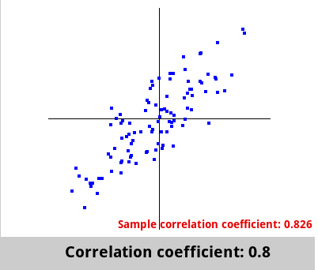
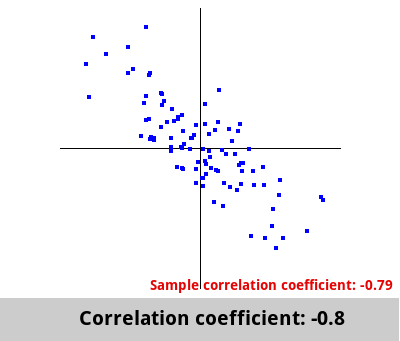
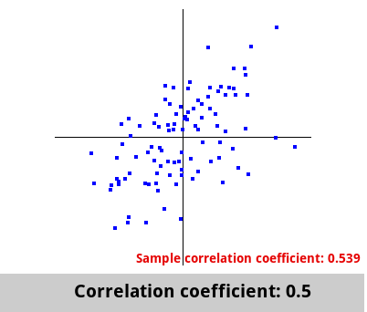
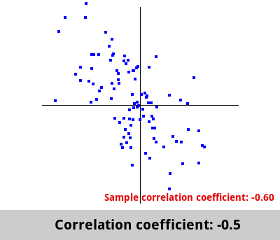
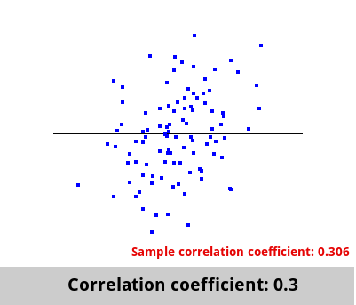
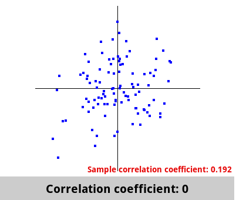
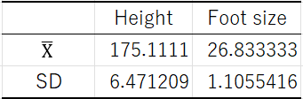
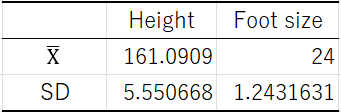
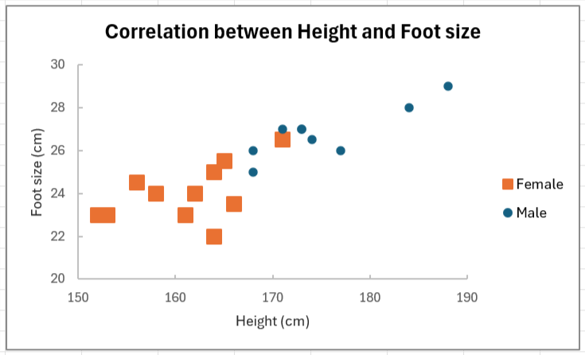

Correlation analysis
--------

### Correlation

For two variables $x$ and $y$, a **correlation** is a relationship in which $y$ changes with $x$.
Scatter plots and correlation coefficients are used to examine correlations.

Correlations can be classified into positive, negative, and no correlations.
Positive and negative correlations depend on the correlation coefficient, which will be discussed later.

-   Positive correlation : when $x$ increases, $y$ increases. $x$ and $y$ are proportional.
-   Negative correlation : when $x$ increases, $y$ decreases. $x$ and $y$ are proportional (negative slope).
-   Non-correlation : no relationship is observed between $x$ and $y$.

Scatter plots
------

Scatter plots are diagrams representing the presence or absence of a correlation visually.
A variable is plotted on the horizontal axis, whereas the other on the vertical axis, and the corresponding data are plotted one point at a time.



### Analysis of scatter plots

The analysis of scatter plots focuses on the following:

-   Are there any outliers?
-   What is the relationship between the two variables $x$ and $y$? $\rightarrow$ Straight line/Curved line/Unrelated
-   Is a group formed?

The diagram above shows that certain points form a group in the height and weight ranges of 145–170 and 40–70, respectively.
The groups are from the lower left to upper right, and a proportional relationship is indicated between height and weight.
Some outliers are observed in the 80+ weight group; however, they are not distant from the line.

Based on the distribution, we can observe the direction of the relationship between the two variables $x$ and $y$.
The directionality can be determined via calculation to assess whether it represents the data well.

### Exercise 1

The following data are based on the measured height ($x$) and foot size ($y$) of 20 pupils in a class. This set of data is represented graphically to illustrate the relationship between height $x$ and foot size $y$.

Table 1 : Height and foot size of 20 persons (0: male 1: female)



### Excel operations

First, enter the data into Excel.

-   In row 1 of column A, enter "Height" and then enter the heights of the 20 persons.
-   In row 1 of column B, enter "foot size" and then enter the foot sizes of the 20 persons.
-   In row 1 of column C, enter "gender" and then enter the gender of the 20 persons, with 0 for males and 1 for females.

Enter the data as below.



### Sorting

&#9312; Select three columns of data as follows and click on the [Home] ribbon – [Sort and filter] – [Sort by user settings].



&#9313; Select the most preferred key as [Gender] and perform sorting using the following settings.



Output Result.

Both height and foot size are sorted based on gender.



### Scatter plots

&#9312; First, select the height and foot size for 9 men (0) only and then click on [Scatterplot] in the graph on the [Insert] ribbon - click on [Scatterplot (markers only)] to insert a scatterplot.



&#9313; A graph as shown below is generated.



&#9314; Scatter plots are generated via the same method as for women.



&#9315; With the male graph selected, click on [Select Data] in the [Design] ribbon of the Graph Tool.



&#9316; Ensure that the foot size is selected in the legend item and then click [Edit (E)].



&#9317; Enter “male” in the series name to confirm.



&#9318; Copy and paste the male graph onto the female graph.



Thus, scatter plots with different markers for men and women are generated.

To provide the meaning of the markers, include a legend.
With the graph selected, click [Add Graph Element] in [Graph Layout] on the Graph Tools [Design] ribbon, hover over [Legend], and select the position to be displayed.



&#9319; Prepare the graph.
As displaying foot sizes in the range of 20–30 cm is sufficient, right-click after selecting the vertical axis and set the minimum and maximum values from [Format Axis].
Set the minimum value to 20, the maximum value to 30, the scale in [Units] to 2, and the scale type to inward.





Select the horizontal axis via the same method. From [Format Axis], set the minimum value to 150, the maximum value to 190, and the scale type to inward.



&#9320; To create a more readable graph, perform the following for the graph:

-   Write "Correlation between height and foot size" as the graph title.
-   Remove the tick lines.
-   Create axis labels, with the horizontal axis labeled as "Height (cm)" and the vertical axis labeled as "Foot size (cm)."

If you require assistance/more information, please refer to [Data processing using spreadsheet software (2)](../../excel/02/index_en.html).

Output results.



The scatterplot shows that the points appear to be distributed from the bottom left to the top right.
A positive correlation may be indicated between height and foot size.
To confirm this, the correlation coefficient is calculated in the next section.

You can change the size of the letters in the graph and the border settings such that they are clearer.



Correlation coefficients
--------

Correlation coefficients are used to quantitatively examine the existence of correlations.

-   Correlation coefficient range of $r$ :  $-1 \leq r \leq 1$
    -   When the value is +, a positive correlation is indicated.
    -   When the value is－, a negative correlation is indicated.
    -   When the value is approximately, no correlation is indicated.

The correlation coefficient $r$ can be calculated using the following formula:

\begin{align}
  r=\frac{S(xy)}{\sqrt{S(xx)S(yy)}}
\end{align}

$S$($xx$) is the standard deviation of $x$, $S$($yy$) is the standard deviation of $y$, and $S$($xy$) is the covariance between $x$ and $y$.

The absolute value of the correlation coefficient reflects the strength of the correlation.

-   $0.7 \leq |r|$　　Strongly correlated

-   $0.4 \leq |r| < 0.7$　　Moderately correlated.

-   $0.2 \leq |r| < 0.4$　　Weakly correlated

-   $|r| < 0.2$　　Little or no correlation

### Exercise 2

Obtain the correlation coefficient using the data from Exercise 1.

### Excel operations

Exercise 2 Continued from Exercise 1.

Let us determine if a correlation exists between height and foot size for men and women.

Start with males (0).

&#9312; Select the appropriate cell and enter "Correlation between male height and foot size."

&#9313; Click on the [Data] ribbon - [Data analysis].



&#9314; Select [Correlation] and click [OK].



&#9315; Enter the following and click [OK] to perform a correlation analysis.

-   In [Input range], select the range in which the male height and foot size are entered. (It is OK if the first line contains text)
-   Check [Use the first row as a label].
-   Select a suitable cell for the output destination.



Output result



The value in cell F5 shown as the correlation between height and foot size is the correlation coefficient to be determined at this time.

The correlation coefficient $r$ = 0.840923.
This indicates that for men, a strong positive correlation exists between height and foot size.

We can conclude that as height increases, foot size increases as well.

&#9316; Obtain the correlation coefficient for women in the same manner.
Select and copy row 1, which is the label, and [Insert copied cell] in row 11, to obtain the same for men.



Output result



A correlation coefficient of $r$ = 0.52698 is obtained.
The correlation does not appear to be as high as for men but is moderate.

### In the paper

The paper shows the following:

>   In Table 1, the correlation coefficient was determined for males, and a strong positive correlation was indicated ($r = 0.840923$).
>   Therefore, we can conclude that the foot size of men increases with their height.
>
>   A moderate positive correlation was indicated for women ($r = 0.52698$).
>   Therefore, we can conclude that the foot size of women increases with their height.

**The fact that a correlation is indicated does not imply a causal relationship, i.e., that one is the cause of the other.**

**Additionally, if the sample size is small, the correlation coefficient obtained may not be reliable. Hence, the correlation coefficient must be tested, as will be described in the next section.**

Tests of correlation coefficients
--------------

### Exercise 3

Test of no correlation for the data in Exercise 1.

### Tests of no correlation

When several samples are obtained, their correlation coefficients are determined.
In addition to the correlation coefficient $r$ obtained from the sample, a population correlation coefficient $\rho$ exists.

-   Correlation coefficient of the population : population correlation coefficient $\rho$
-   Correlation coefficient for a sample : (sample) correlation coefficient $r$

As the sample does not represent the entire population, the population correlation coefficient $\rho$ = correlation coefficient $r$ does not represent the population as an entirety.
The mother correlation coefficient $\rho$ = 0; however, a correlated sample can still be extracted.

Therefore, we first test whether the mother correlation coefficient $\rho$ = 0.
This is known as **the test of no correlation**.

### Establishing Hypothesis

-   Null hypothesis$H_0$ : $\rho = 0$, i.e., mother correlation coefficient is 0 (no correlation coefficient exists)
-   Alternative hypothesis$H_1$ : $\rho \neq 0$, mother correlation coefficient is not 0 (correlation coefficient exists)

### Establishing significance level $\alpha$

Set significance level $\alpha$ = 0.05.

### Calculating test statistic $t$-value

The following formula is used to obtain the test statistic $t$-value:

\begin{align}
  t=\frac{r\sqrt{n-2}}{\sqrt{1-r^2}}
\end{align}

### Calculating $p$-values

Calculate the probability $p$-value and then compare it with the significance level.
The $p$-value is the probability that a value greater than or equal to $|t|$ occurs in the t-distribution.

### Decision

$p$-value $\leq$ significance level $\alpha \rightarrow$ reject the null hypothesis $H_0$

$p$-value $>$ significance level $\alpha \rightarrow$ do not reject the null hypothesis $H_0$

### Excel operations

Continue to perform Exercise 1.

Can the correlation coefficients obtained for height and foot size be considered significant?

&#9312; Continuing from where you left off, obtain the correlation coefficients and t-values.
Perform the following:

-   In cell I2, enter "test of no correlation (male)."
-   Beginning from the cell below, enter “Correlation coefficient". 
-   Enter "number of samples n."
-   Enter "t-value."
-   Enter "degrees of freedom."
-   Enter "p-value."

The result is as follows:



&#9313; In cell "J3" next to the "Correlation coefficient" cell, enter the correlation coefficient between male height and foot size that you have calculated.



&#9314; Next to "Sample size $n$," enter the sample size (= number of males in this case) in "J4."
In this case, the sample size (sample size) is small and you can count it manually; however, if the sample is large, you can use the `COUNT` function.

Select the `COUNT` function from the [Formulas] ribbon - [Insert Function] and count the number of men with all data pertaining to male height as the selection.



Output result



&#9315; Next, enter the formula for determining the $t$-value above and obtain the $t$-value.
Enter `= ABS(J3*SQRT(J4-2)/SQRT(1-J3^2))` in "J5" next to "$t$-value."。

Output result



&#9316; Obtain the degree of freedom.
Enter `=J4-2` for "J6" such that the number of persons is - 2.

Output result



Obtain the $p$-value based on the values obtained thus far.
Select the `TDIST` function from the [Formulas] ribbon - [Insert function].

Specify $t$-value `J5` for X, `J6` for the degrees of freedom, and `2` for the distribution as a two-tailed test, and then click OK.



Output result



The $p$-value obtained is 0.003786.
Because the $p$-value is 0.003786, which is less than the significance level $\alpha$ = 0.05, the null hypothesis $H_0$ is rejected.
This implies that a significant correlation exists between male height and foot size.
The correlation coefficient is 0.849023, which indicates a strong correlation. Therefore, we can be conclude that foot size increases with height.

The same test of no correlation is performed for females.

Output result



The $p$-value is 0.095784.
Because the $p$-value is 0.095784, which is less than the significance level $\alpha$ = 0.05, the null hypothesis $H_0$ is not rejected.
Hence, the correlation coefficient between height and foot size for women obtained earlier is not significant.

Thus, we can assume that in the present data, some women were tall but had small feet, or that the result was not significant because of data variations.
In general, the smaller the sample size, the less likely is the indication of a significant correlation.

### In academic paper

The paper shows the following:

>   Correlation between male height and foot size($n = 9$)
>
>   
>
>   Correlation between female height and foot size($n = 11$)
>
>   
>
>   The table above shows the mean and standard deviation for height and foot size for both men and women.
>
>   
>
>   Additionally, scatter plots are shown in the figure above.
>
>   For males, the correlation coefficient $r = 0.840923$ was significant when a t-test was conducted ($p < 0.05$).
>   Therefore, we can conclude that foot size increases with height in men.
>
>   For women, the correlation coefficient $r = 0.52698$ was not significant when a t-test was conducted ($p > 0.05$).
>   Therefore, we cannot conclude that foot size increases with height in women.

Task
------

The following table summarizes a survey of the number of CDs(Conpact Discs) in the home and music exam results (scores) for 10 pupils in one class.
Does a correlation exist between the number of CDs and music scores?

Obtain the correlation coefficient, perform the test of no correlation, and discuss the correlation.

Table 3: Number of CDs (discs) and music scores (points)



