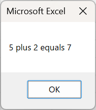
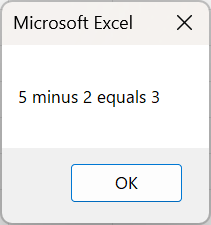
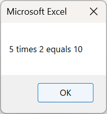
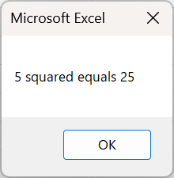

How to Write Easy-to-Read Source Code
--------------

In programming, source code becomes more difficult to read as the number of lines increases. Source code that is difficult to read causes difficulty in understanding the content and increases the number of errors. Therefore, source code must be written in a manner that is easy to read. Refer the following pages to learn ways to write easy-to-read source code.



Basic Arithmetic Operations
--------------

### PerformanceTable2

Calculate and enter the total and average scores in the previously created performance table. Let us create a macro using the following PerformanceTable2 source code.



*PerformanceTable2 source code*

    Sub PerformanceTable2()
        
        Range(“E3”) = Range(“B3”) + Range(“C3”) + Range(“D3”)
        Range(“F3”) = (Range(“B3”) + Range(“C3”) + Range(“D3”)) / 3
        
    End Sub

When PerformanceTable2 is run, the total score of all the subjects for Mr. A is entered in cell “E3” and the average score of all the subjects for Mr. A is entered in cell “F3.” In this macro, the calculations were performed by referring to the cells in which Mr. A’s scores for each subject were recorded. Calculations can also be performed directly using score values without referencing the cells. However, in VBA programming with Excel, generally, data is entered into a cell of an Excel table, as in the source code of “PerformanceTable2,” and calculations are performed by referencing that cell.



### Arithmetic Operations

In programming, symbols used for basic arithmetic operations are called **arithmetic operators**. In VBA, the following arithmetic operators are available.



In VBA, arithmetic operators are used to construct formulas. Note that the arithmetic operators used in VBA differ from those used in Excel spreadsheets.

Variables and Data Types 
--------------

### PerformanceTable3

To make PerformanceTable2 a more efficient source code, we modify it with variables, as in the following PerformanceTable3 source code.

*PerformanceTable3 source code*

    Sub PerformanceTable3()
        
        'Variable Declaration
        Dim x As Integer
        Dim y As Double
        
        x = Range(“B3”) + Range(“C3”) + Range(“D3”)
        Range(“E3”) = x
        y = x / 3
        Range(“F3”) = y
        
    End Sub

Rather than performing calculations using Range(“cell name”), a more efficient and easier method is to enter repeatedly used numbers and letters into a variable and use that variable to calculate, as in the PerformanceTable3 source code.

When PerformanceTable3 is run, the results are the same as those of PerformanceTable2 as shown below.



### Variable 

A **variable** is a box-like function in a programming language that temporarily holds a value such as a number or character. If all the values used in a program are fixed, the program will be monotonous and will only work according to those values. By including variables whose values can be changed depending on the circumstances of the program execution, a program can have a wide range of variations in the results for a single source code.

As a box-like function that can change values depending on the situation, Excel VBA contains cells in addition to variables. In the cell function, a value is stored in the cell, and if it does not change after the program is completed, the value remains in that cell. In the variable function, values are temporarily stored in memory; therefore, the values entered in the cells disappear after the program is completed. Thus, a variable becomes a function that temporarily stores a value in memory only for executing a program.

### Variable Declaration

Creating a variable is called a **variable declaration**. Variables are declared as follows:

    Dim variable name As data type

Declare variables by specifying the variable name after “Dim.” Variables can be named according to the following rules:

* Numbers are allowed, but not at the beginning of variable names.
* Underbars are allowed, but not at the beginning of variable names.
* Symbols other than underbars are not allowed.
* Spaces are not allowed.
* Terms that are already used in the system are called reserved words, and they cannot be used.
* Variable names that are already in use within the same scope of application cannot be used.

A character limit exists on variable names. Therefore, variables cannot be created with variable names that are extremely long.

The variables must be set to a data type. Use “As” after the variable name to connect it with the data type. For more information on the data types, see Section 3.5. Data Types.

### Assignment 

Assigning a value to a variable is called **assignment**.
To assign a value to a variable, write the name of the variable on the left-hand side, connect it with “=,” and write the value to be assigned on the right-hand side. With a few exceptions, such as conditional expressions, “=” does not mean an equal sign in VBA but means assignment.
For example, x=3 would look like the following figure.



When a new value is assigned to a variable that already contains a value, the new value overwrites the previous value. The nature of this variable allows one variable in a program to change its value depending on the situation, thus allowing for a wide range of variations in the program.
Furthermore, values can be assigned to cells using Cells() or Range() to specify the cell on the left-hand side and the value to be assigned on the right-hand side.

### Data Types

The **main data types** in VBA include the following.



Notably, the content and range of the values that can be handled differ depending on the data type. For variable declarations, the best data type is selected and written.

First, we must consider whether the value being handled as a variable is a number. Two types of data types deal with numbers: integer and floating-point. Integer types cannot be assigned decimal numbers.

Various data types exist in addition to numerical data types. A good practice is to be mindful of the data type of the values being handled when programming.

In PerformanceTable3, variable x for assigning the total score is an integer type (Integer) variable because it only involves an addition of integers. Then, variable y for assigning the average score is a variable of the floating-point number type (Double) because digits can appear after the decimal point.

Please check the following reference for more explanation with sample programs, if required.



### Type Conversion

As indicated in 3.5. Data Types, programming languages include data types and can only handle values based on these data types. However, in certain cases, values must be exchanged among different data types. In these cases, type conversion is performed.

In VBA, type conversion is performed automatically to a certain extent. For example, if a value has to be passed from an integer type to a floating-point number type, type conversion is automatically performed, and the value can be easily passed. Conversely, if a value has to be passed from a floating-point number type to an integer type, the integer type cannot handle digits after the decimal point. Therefore, the value will be rounded to the nearest integer and passed as an integer value. Note that other programming languages may not automatically perform type conversions. Therefore, care should be taken when dealing with other programming languages.

Exercise
--------------

### Exercise 1

Let us create a macro that performs the following calculations and displays the results in a dialog box, as shown in the following image.
* 5 ＋ 2 × (15 － 5) － 9 ÷ 3



### Exercise 2

Let us create a macro that performs the following calculations and displays the results in order in a dialog box, as shown in the following image.

* 5 plus 2
* 5 minus 2
* 5 times 2
* 5 divided by 2 (result of real number)
* 5 divided by 2 (quotient and remainder result)
* 5 squared

.png).png)

### Exercise 3

Let us create a macro that inputs the following table, calculates each answer using the cell values, and then enters the results, as shown in the execution result image.





### Exercise 4

Let us create a macro that satisfies the following conditions:

* Declare variables x, y, and z of type Integer.
* Assign 100 to variable x.
* Assign 5 to variable y.
* Assign the value of variable x squared divided by variable y to variable z.
* Display variable z in a dialog box.

### Exercise 5

Let us create a macro that satisfies the following conditions. For the variables to be used, please use the data type that you consider as the best.
* Declare variables a, b, c, and d.
* Assign 10 to variable a.
* Assign 2 to variable b.
* Assign 1 to variable c.
* Assign the result of dividing variable a by the sum of variables b and c to variable d.
* Display variable d in a dialog box.

### Exercise 6

Using the table below as a reference, let us create a macro that calculates the circumference and area of a circle based on the entered radius and enter the results after running the macro, as shown in the following image. Please use 3.14 for pi.





