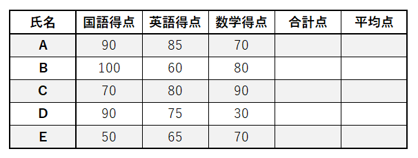
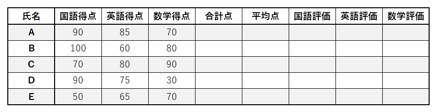
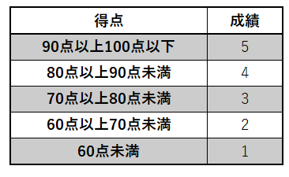

繰り返し
--------------

### 繰り返し
プログラミングをしていると、同じような処理を何度も行う場合が出てきます。そのような際に、順番に全て命令文を書いているとプログラム自体が長くなって、あまり効率的なプログラムとは言えなくなる場合があります。何度も行う同じような処理のそれぞれについて、法則性を見いだせる場合は、同じ命令文を使い回せるようにすると、効率的なプログラムを作ることができます。同じ命令文を使い回す方法の1つとして、繰り返しがあります。

繰り返しは、指定された処理内容を条件が満たされている限り何度でも繰り返すという方法となります。

フローチャートで示すと、以下のようになります。



フローチャートでは、変数iが5以下である限り、「iは{iの値}です。」(※{iの値}は変数iに格納されている値となります)とメッセージ表示する処理と、iに1を足す処理を繰り返します。iに1を足す処理が繰り返しの処理内容に含まれているため、繰り返し処理を5回繰り返すと、iは5以下という条件を満たさなくなりますので、繰り返し処理は終わります。

このようにプログラムに記述された処理を上から順番に行っていき、再び上に戻るように流れを制御するのが繰り返しになります。

### For ～ Next文

繰り返しの代表的なやり方として、For ～ Next文が挙げられます。

For ～ Next文は以下のように用いて、繰り返しを行います。

For カウンターとなる変数 = 初期値 To 終了値 Step 加算値  
繰り返す処理内容  
Next カウンターとなる変数  

For ～ Next文の特徴は、カウンターとなる変数を用いて、その値に応じて、繰り返しを行うところが特徴である。繰り返し処理内容を実行し終わった後、カウンターとなる変数に加算値を足します。その値が終了値を超えるまで、繰り返します。

フローチャートの内容をFor ～ Next文で記述するとSub ForTestのようになります。

Sub ForTest()  
    Dim i As Integer  
    For i = 1 To 5 Step 1  
        MsgBox ("iは" & i & "です。")  
    Next i  
End Sub  

Sub ForTestを実行すると以下のようになります。

![iは1です。]](pic/vba04_i1.png) ![iは2です。]](pic/vba04_i2.png) ![iは3です。]](pic/vba04_i3.png) ![iは4です。]](pic/vba04_i4.png) ![iは5です。]](pic/vba04_i5.png)

以上のようにカウンターとなる変数としたiに加算値である1を足しながら、繰り返し処理内容を行っていきました。iが終了値である5を超えたことによって、繰り返しの条件を満たさなくなり、繰り返しは終了しました。

この繰り返し処理を繰り返しを用いずに記述するとSub ForTest2のようになります。

Sub ForTest2()  
    Dim i As Integer  
    i = 1  
    MsgBox ("iは" & i & "です。")  
    i = i + 1  
    MsgBox ("iは" & i & "です。")  
    i = i + 1  
    MsgBox ("iは" & i & "です。")  
    i = i + 1  
    MsgBox ("iは" & i & "です。")   
    i = i + 1  
    MsgBox ("iは" & i & "です。")  
End Sub  

※「i = i + 1」は変数iに前の変数i+1を代入するという意味になり、1ずつ増えていく数式となります。

Sub ForTestとSub ForTest2は全く同じ結果になります。しかし、繰り返しを用いたSub ForTestでは、6行で済んでいるのに対して、繰り返しを用いなかったSub ForTest2では、13行と倍以上の行数を必要としています。このように繰り返しをうまく使うことができると、効率的なプログラムを作成することができます。

ただし、同じような処理を複数行っているからと言って、全ての場合で繰り返しを用いることができるわけではありません。繰り返しを用いることができる処理は、法則性がある処理内容となります。法則性を見つけるために、フローチャートを書き、アルゴリズムを整理しながら考えていくのも重要な作業となります。

### 無限ループ

繰り返しを行う際に最も注意しなければならないのが無限ループです。

繰り返しは条件を満たしている限り繰り返し処理内容を繰り返します。しかし、場合によっては、繰り返しの条件を満たし続けてしまい、繰り返しが終了しない場合があります。そのような場合を無限ループと呼びます。

For ～ Next文の場合は、例えば、加算値に負の値を指定することもできます。例えば、以下のような書き方をした場合です。

For i = 1 To 5 Step -1  
繰り返し処理内容  
Next i  

この場合、1は繰り返し処理内容が終わる度に、-1が加算され、iの値は繰り返す度に小さくなっていき、終了値の5を超えることはできません。よって、常に条件を満たし続けて、無限ループしてしまいます。

加算値に負の値を指定する場合は、終了値も初期値よりも小さくならなければ、無限ループしてしまいます。加算値に負の値を指定する場合でも、以下のような場合であれば、無限ループさせずに済みます。

For i = 1 To -5 Step -1  
繰り返し処理内容  
Next i  

繰り返しの方法は、今回扱ったもの以外にも多くのパターンがあります。条件をどのように満たさなくするか、繰り返しを用いる際は必ず無限ループさせないように設計することが非常に重要となります。

### 練習問題1

Excelを用いたVBAプログラミングにおいて、繰り返しが最もよく使われるのは、セルの操作においてです。

以下の成績表を例として、セルを用いた繰り返し処理を行ってみましょう。

 

成績表の成績が1人であれば、処理をするのは手作業でも簡単ですが、人数が増えてくると、処理は大変になります。しかし、人数が増えたからと言っても、人によって処理内容を変えてしまうと、公平性が保てません。必ず同じ処理をする必要があります。このように同じ処理を行う際は、繰り返しが有効です。

ここでは、Sub PerformanceTable7を用いて、Aさん～Eさんの得点の合計点と平均点をFor ～ Next文を用いて計算してみましょう。

    Sub PerformanceTable7()

        '変数宣言  
        Dim i As Integer  
        Dim j As Integer  
        Dim sum As Integer    
        Dim ave As Single  

        'ワークシートの設定  
        Dim ws As Object  
        Set ws = Worksheets("Sheet1")  

        'タイトル  
        ws.Cells(1, 1) = "成績表"  

        '成績表ラベル  
        ws.Cells(2, 1) = "氏名"  
        ws.Cells(2, 2) = "国語得点"  
        ws.Cells(2, 3) = "英語得点"  
        ws.Cells(2, 4) = "数学得点"  
        ws.Cells(2, 5) = "合計点"  
        ws.Cells(2, 6) = "平均点"  

        'Aさんの成績  
        ws.Cells(3, 1) = "A"  
        ws.Cells(3, 2) = 90  
        ws.Cells(3, 3) = 85  
        ws.Cells(3, 4) = 70  

        'Bさんの成績  
        ws.Cells(4, 1) = "B"  
        ws.Cells(4, 2) = 100  
        ws.Cells(4, 3) = 60  
        ws.Cells(4, 4) = 80  

        'Cさんの成績  
        ws.Cells(5, 1) = "C"  
        ws.Cells(5, 2) = 70  
        ws.Cells(5, 3) = 80  
        ws.Cells(5, 4) = 90  

        'Dさんの成績  
        ws.Cells(6, 1) = "D"  
        ws.Cells(6, 2) = 90  
        ws.Cells(6, 3) = 75  
        ws.Cells(6, 4) = 30  

        'Eさんの成績  
        ws.Cells(7, 1) = "E"  
        ws.Cells(7, 2) = 50  
        ws.Cells(7, 3) = 65  
        ws.Cells(7, 4) = 70  

        '合計点・平均点算出(四則演算・変数・繰り返し)  
        For i = 3 To 7 Step 1  
            sum = 0  
            sum = sum + ws.Cells(i, 2) + ws.Cells(i, 3) + ws.Cells(i, 4)  
            ws.Cells(i, 5) = sum  
            ws.Cells(i, 6) = sum / 3  
        Next i  
    End Sub  

ここで注目すべき点は、For ～ Next文のカウンターとなる変数iをCellsの行番号に入れているところです。成績表において、Aさん～Eさんの国語得点は2列目、英語得点は3列目、数学得点は4列目、合計点は5列目、平均点は6列目と決まっています。Aさん～Eさんで異なるところは、Aさんは3行目、Bさんは4行目、Cさんは5行目、Dさんは6行目、Eさんは7行目となっています。

3行目から7行目について、同じ処理を繰り返すことによって、Aさん～Eさんの合計点と平均点を計算することができるわけです。つまり、繰り返しを考えた場合、カウンターとなる変数の初期値は3であり、終了値は7、1行ずつ処理を行うので、加算値は1となります。

繰り返し内容としては、Aさんのみの合計点と平均点を計算する場合は、以下のようになります。

sum = sum + ws.Cells(3, 2) + ws.Cells(3, 3) + ws.Cells(3, 4)  
ws.Cells(3, 5) = sum  
ws.Cells(3, 6) = sum / 3  

Bさんの合計点と平均点を計算する場合は、以下のようになります。

sum = sum + ws.Cells(4, 2) + ws.Cells(4, 3) + ws.Cells(4, 4)  
ws.Cells(4, 5) = sum  
ws.Cells(4, 6) = sum / 3  

Aさんの処理内容とBさんの処理内容で異なっているところは、Cellsの行番号がAさんの場合は3、Bさんの場合は4であるという点です。Cさん、Dさん、Eさんについても確認しても良いですが、やはり、Cellsの行番号が異なっていることになります。

つまり、繰り返しとして、Cellsの行番号をカウンターとなる変数で変わるようにして繰り返すことによって、繰り返し処理によってAさん～Eさんの合計点と平均点を以下のように計算することができるようになります。

For i = 3 To 7 Step 1  
    sum = sum + ws.Cells(i, 2) + ws.Cells(i, 3) + ws.Cells(i, 4)  
    ws.Cells(i, 5) = sum  
    ws.Cells(i, 6) = sum / 3  
Next i  

Sub PerformanceTable7を実行すると以下のようになります。



### 二重の繰り返し

1.4では、行番号にカウンターとなる変数を用いた繰り返しの練習問題を行いました。表の各セルを順番に読んで、処理を行っていくという手法は、Excelを用いたVBAの繰り返しでよく行われることであり、この方法は、行番号だけではなく、列番号にカウンターとなる変数を用いて行われることもあります。

やや複雑になりますが、繰り返しは、別の繰り返しの中に入れることもできます。つまり、二重の繰り返しです。この二重の繰り返しを応用して、行番号と列番号について、別のカウンターとなる変数を用いた繰り返しで処理することによって、行番号も列番号も異なるセルを順番に読み込んで処理を行うことができます。その例を次のフローチャートに示します。



このフローチャートをプログラムに直すとSub DoubleForTestのようになります。

Sub DoubleForTest()  
    '変数宣言  
    Dim i As Integer  
    Dim j As Integer  
    
    '行の繰り返し(i)  
    For i = 3 To 7 Step 1  
        '列の繰り返し(j)  
        For j = 1 To 6 Step 1  
            MsgBox (i & "行目の左から" & j & "番目のセルの値は" & Worksheets("Sheet1").Cells(i, j) & "です。")  
        Next j  
        
    Next i  
End Sub  

なお、このプログラムでは、行の繰り返しと列の繰り返しがわかりやすいようにインデントを変え、コメントで補足しています。

Sub DoubleForTestを実行すると以下のようになります。



![3行目の左から2番目のセルの値は90です。]](pic/vba04_3290.png) ![3行目の左から3番目のセルの値は85です。]](pic/vba04_3385.png)

全ての結果は省略しますが、このように行番号と列番号に相当する変数の値に応じて、そのセルの値を順番に読み込んで表示することができます。

### 練習問題2

以下の成績表について、1.4では、行についての繰り返しのみを用いて、合計点と平均点を求めるプログラムを作りました。

 

しかし、この表を用いて、合計点と平均点を求めるために考えられる法則性は、行に関してのみではありません。列についても国語得点、英語得点、数学得点と同一行の3つの列の値を順番に読み込んで計算を行っています。Sub PerformanceTable7の以下の部分です。

        sum = sum + ws.Cells(i, 2) + ws.Cells(i, 3) + ws.Cells(i, 4)  

この部分について法則性を考えると、列番号の初期値2終了値4加算値1としてsumにセルの値を加えているという法則性を見出すことができます。そう考えると、カウンターとなる変数jを用いて、以下のような書き換えをすることもできます。

※変数iはすでに利用しているので、jとしました。

        For j = 2 To 4 Step 1  
            sum = sum + ws.Cells(i, j)  
        Next j  

Sub PerformanceTable7について、この部分の書き換えを行い、二重の繰り返しを採用したプログラムがSub PerformanceTable8です。

Sub PerformanceTable8()  
    
    '変数宣言  
    Dim i As Integer  
    Dim j As Integer   
    Dim sum As Integer  
    Dim ave As Single  
    
    'ワークシートの設定  
    Dim ws As Object  
    Set ws = Worksheets("Sheet1")  
    
    'タイトル  
    ws.Cells(1, 1) = "成績表"  
    
    '成績表ラベル  
    ws.Cells(2, 1) = "氏名"  
    ws.Cells(2, 2) = "国語得点"  
    ws.Cells(2, 3) = "英語得点"  
    ws.Cells(2, 4) = "数学得点"  
    ws.Cells(2, 5) = "合計点"  
    ws.Cells(2, 6) = "平均点"  
    
    'Aさんの成績  
    ws.Cells(3, 1) = "A"  
    ws.Cells(3, 2) = 90  
    ws.Cells(3, 3) = 85  
    ws.Cells(3, 4) = 70  
    
    'Bさんの成績  
    ws.Cells(4, 1) = "B"  
    ws.Cells(4, 2) = 100  
    ws.Cells(4, 3) = 60  
    ws.Cells(4, 4) = 80  
    
    'Cさんの成績  
    ws.Cells(5, 1) = "C"  
    ws.Cells(5, 2) = 70  
    ws.Cells(5, 3) = 80  
    ws.Cells(5, 4) = 90  
    
    'Dさんの成績  
    ws.Cells(6, 1) = "D"  
    ws.Cells(6, 2) = 90  
    ws.Cells(6, 3) = 75  
    ws.Cells(6, 4) = 30  
    
    'Eさんの成績  
    ws.Cells(7, 1) = "E"  
    ws.Cells(7, 2) = 50  
    ws.Cells(7, 3) = 65  
    ws.Cells(7, 4) = 70  
    
    '合計点・平均点算出(四則演算・変数・繰り返し)  
    For i = 3 To 7 Step 1  
        sum = 0  
        For j = 2 To 4 Step 1  
            sum = sum + ws.Cells(i, j)  
        Next j  
        ws.Cells(i, 5) = sum  
        ws.Cells(i, 6) = sum / 3  
    Next i  
End Sub  

Sub PerformanceTable8を実行すると、Sub PerformanceTable7と同じく以下のようになります。



今回のように繰り返す回数が3回程度で、処理内容が複雑でないのであれば、繰り返しを用いてもあまり効率化されたとは言えないでしょう。しかし、もっと多量のデータを処理しようとした場合、このように行方向、列方向に二重の繰り返しを行い、順番にセルの値を読み込んで処理を行うことは、効率的なデータ処理を行うためには重要な手がかりとなります。

課題
--------------

以下の成績表について、Sub PerformanceTable8を改良して、合計点と平均点に加えて、国語と英語と数学の評価を判定するプログラムSub PerformanceTable9を作成してみましょう。各人の評価については、繰り返しを用いて、自動で同じように評価を算出できるようにしましょう。

 

その際に、評価は得点に対して、以下のようにします。

 
