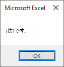
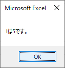

繰り返し
--------------

### 繰り返し
プログラミングをしていると、同じような処理を何度も行う場合が出てきます。そのような際に、順番に全て命令文を書いているとプログラム自体が長くなって、あまり効率的なプログラムとは言えなくなる場合があります。何度も行う同じような処理のそれぞれについて、法則性を見いだせる場合は、同じ命令文を使い回せるようにすると、効率的なプログラムを作ることができます。同じ命令文を使い回す方法の1つとして、**繰り返し**があります。

**繰り返し**は、指定された処理内容を条件が満たされている限り何度でも繰り返すという方法となります。

フローチャートで示すと、以下のようになります。



フローチャートでは、変数iが5以下である限り、「iは{iの値}です。」(※{iの値}は変数iに格納されている値となります)とメッセージ表示する処理と、iに1を足す処理を繰り返します。iに1を足す処理が繰り返しの処理内容に含まれているため、繰り返し処理を5回繰り返すと、iは5以下という条件を満たさなくなりますので、繰り返し処理は終わります。

このようにプログラムに記述された処理を上から順番に行っていき、再び上に戻るように流れを制御するのが繰り返しになります。

### For ～ Next文

繰り返しの代表的なやり方として、**For ～ Next文**が挙げられます。

**For ～ Next文**は以下のように用いて、繰り返しを行います。

*For ～ Next文の使い方*

    For カウンターとなる変数 = 初期値 To 終了値 Step 加算値  
    繰り返す処理内容  
    Next カウンターとなる変数  

**For ～ Next文**の特徴は、**カウンターとなる変数**を用いて、その値に応じて、繰り返しを行うところである。繰り返し処理内容を実行し終わった後、**カウンターとなる変数**に**加算値**を足します。その値が**終了値**を超えるまで、繰り返します。

これらの処理を次のように指定します。

まず、「For」を記述し、続いて、**カウンターとなる変数**に**初期値**を代入します。この際に、**カウンターとなる変数**は、事前に宣言されていなければなりません。
**初期値**の次に「To **終了値**」を指定します。そして、「Step **加算値**」で繰り返しに必要な諸条件を設定し終えます。

次の行から繰り返す処理内容を記述し、最後に「Next **カウンターとなる変数**」の形で、For ～ Next文を終了します。繰り返す処理内容は、カウンターとなる変数が終了値を超えるまで繰り返し行われます。

フローチャートの内容をFor ～ Next文で記述するとForTestのソースコードのようになります。

*ForTestのソースコード*

    Sub ForTest()  
        Dim i As Integer  
        For i = 1 To 5 Step 1  
            MsgBox ("iは" & i & "です。")  
        Next i  
    End Sub  

ForTestを実行すると以下のようになります。

    

以上のようにカウンターとなる変数としたiに加算値である1を足しながら、繰り返し処理内容を行っていきました。iが終了値である5を超えたことによって、繰り返しの条件を満たさなくなり、繰り返しは終了しました。

この繰り返し処理を繰り返しを用いずに記述するとForTest2のようになります。

*ForTest2()のソースコード*

    Sub ForTest2()
        Dim i As Integer
        i = 1
        MsgBox ("iは" & i & "です。")
        i = 2
        MsgBox ("iは" & i & "です。")
        i = 3
        MsgBox ("iは" & i & "です。")
        i = 4
        MsgBox ("iは" & i & "です。")
        i = 5
        MsgBox ("iは" & i & "です。")
    End Sub

ForTestとForTest2は全く同じ結果になります。しかし、繰り返しを用いたForTestでは、6行で済んでいるのに対して、繰り返しを用いなかったForTest2では、13行と倍以上の行数を必要としています。このように繰り返しをうまく使うことができると、効率的なプログラムを作成することができます。

ただし、同じような処理を複数行っているからと言って、全ての場合で繰り返しを用いることができるわけではありません。繰り返しを用いることができる処理は、法則性がある処理内容となります。法則性を見つけるために、フローチャートを書き、アルゴリズムを整理しながら考えていくのも重要な作業となります。

### 無限ループ

繰り返しを行う際に最も注意しなければならないのが**無限ループ**です。

繰り返しは条件を満たしている限り繰り返し処理内容を繰り返します。しかし、場合によっては、繰り返しの条件を満たし続けてしまい、繰り返しが終了しない場合があります。そのような場合を**無限ループ**と呼びます。

For ～ Next文の場合は、例えば、加算値に負の値を指定することもできます。例えば、以下のような書き方をした場合です。

*無限ループするソースコードの例*

    For i = 1 To 5 Step -1  
    繰り返し処理内容  
    Next i  

この場合、1は繰り返し処理内容が終わる度に、-1が加算され、iの値は繰り返す度に小さくなっていき、終了値の5を超えることはできません。よって、常に条件を満たし続けて、無限ループしてしまいます。

加算値に負の値を指定する場合は、終了値も初期値よりも小さくならなければ、無限ループしてしまいます。加算値に負の値を指定する場合でも、以下のような場合であれば、無限ループさせずに済みます。

*加算値が負の数でも無限ループしないソースコードの例*

    For i = 1 To -5 Step -1  
    繰り返し処理内容  
    Next i  

繰り返しの方法は、今回扱ったもの以外にも多くのパターンがあります。条件をどのように満たさなくするか、繰り返しを用いる際は必ず無限ループさせないように設計することが非常に重要となります。

### 練習問題1

Excelを用いたVBAプログラミングにおいて、繰り返しが最もよく使われるのは、セルの操作においてです。

以下の成績表を例として、セルを用いた繰り返し処理を行ってみましょう。



Aさん～Eさんの合計点と平均点を計算させるには、それぞれの人について、合計点と平均点を計算すれば良いため、PerformanceTable7_Rangeのようになります。

*PerformanceTable7_Rangeのソースコード*

    Sub PerformanceTable7_Range()
        
        '変数宣言
        Dim x As Integer
        
        ' Aさんの合計点・平均点算出
        x = Range("B3") + Range("C3") + Range("D3")
        Range("E3") = x
        Range("F3") = x / 3
        
        ' Bさんの合計点・平均点算出
        x = Range("B4") + Range("C4") + Range("D4")
        Range("E4") = x
        Range("F4") = x / 3
        
        ' Cさんの合計点・平均点算出
        x = Range("B5") + Range("C5") + Range("D5")
        Range("E5") = x
        Range("F5") = x / 3
        
        ' Dさんの合計点・平均点算出
        x = Range("B6") + Range("C6") + Range("D6")
        Range("E6") = x
        Range("F6") = x / 3
        
        ' Eさんの合計点・平均点算出
        x = Range("B7") + Range("C7") + Range("D7")
        Range("E7") = x
        Range("F7") = x / 3
        
    End Sub

PerformanceTable7_Rangeを実行すると、以下のようになります。



このように成績表では、公平に同じことを人数分行うことになります。今回のように5人程度であれば、それほど長いソースコードにはなりませんが、人数が増えれば増えるほど、このソースコードは長くなっていきます。このように同じことを何度も行わなければならないときは、繰り返しを利用するのが有効です。

しかし、どのような形で繰り返しをすれば良いのか、このままでは難しいです。

ここで、各セルをマクロで扱う方法として、Range(“セル名”)ともう一つあったCells(行番号, 列番号)を思い出して、Cellsで書くとどのようになるかを考えてみましょう。Cellsを用いると、PerformanceTable7_Cellsのようになります。Cellsでは、列番号がアルファベットではなく、数字になっているので注意が必要です。すなわち、列番号1=A、列番号2=B、列番号3=C、列番号4=D、列番号5=E、列番号6=Fといった形です。

*PerformanceTable7_Cellsのソースコード*

    Sub PerformanceTable7_Cells()
        
        '変数宣言
        Dim x As Integer
        
        ' Aさんの合計点・平均点算出
        x = Cells(3, 2) + Cells(3, 3) + Cells(3, 4)
        Cells(3, 5) = x
        Cells(3, 6) = x / 3
        
        ' Bさんの合計点・平均点算出
        x = Cells(4, 2) + Cells(4, 3) + Cells(4, 4)
        Cells(4, 5) = x
        Cells(4, 6) = x / 3
        
        ' Cさんの合計点・平均点算出
        x = Cells(5, 2) + Cells(5, 3) + Cells(5, 4)
        Cells(5, 5) = x
        Cells(5, 6) = x / 3
        
        ' Dさんの合計点・平均点算出
        x = Cells(6, 2) + Cells(6, 3) + Cells(6, 4)
        Cells(6, 5) = x
        Cells(6, 6) = x / 3
        
        ' Eさんの合計点・平均点算出
        x = Cells(7, 2) + Cells(7, 3) + Cells(7, 4)
        Cells(7, 5) = x
        Cells(7, 6) = x / 3
        
    End Sub



今回用いている成績表では、Aさん～Eさんの国語得点は2列目、英語得点は3列目、数学得点は4列目、合計点は5列目、平均点は6列目と決まっています。Aさん～Eさんで異なるところは、Aさんは3行目、Bさんは4行目、Cさんは5行目、Dさんは6行目、Eさんは7行目となっています。

Aさんの合計点と平均点を計算する場合は、以下のようになります。

*Aさんの合計点と平均点の計算方法*

    x = Cells(3, 2) + Cells(3, 3) + Cells(3, 4)
    Cells(3, 5) = x
    Cells(3, 6) = x / 3

Bさんの合計点と平均点を計算する場合は、以下のようになります。

*Bさんの合計点と平均点の計算方法*

Aさんの処理内容とBさんの処理内容で異なっているところは、Cellsの行番号がAさんの場合は3、Bさんの場合は4であるという点です。Cさん、Dさん、Eさんについても確認してみましょう。やはり、Cellsの行番号が異なっていることになります。つまり、この成績表では、合計点と平均点を計算する方法には、Cellsの行番号以外は同じであるという法則性を見出すことができるわけです。

### 練習問題2

1.4.練習問題1では、以下の成績表の合計点と平均点を計算するための方法では、Cellsの行番号以外は同じであるという法則性を見出すことができました。



この法則性を用いて、繰り返しをすると、PerformanceTable8のようになります。

*PerformanceTable8のソースコード*

    Sub PerformanceTable8()
        
        '変数宣言
        Dim i As Integer
        Dim x As Integer
        
        '合計点・平均点算出
        For i = 3 To 7 Step 1
            x = Cells(i, 2) + Cells(i, 3) + Cells(i, 4)
            Cells(i, 5) = x
            Cells(i, 6) = x / 3
        Next i
    End Sub

For ～ Next文を用いて繰り返しをするためには、初期値と終了値、加算値が必要となります。

法則性を考えて、Aさん～Eさんの処理を行うことを考えると、行番号が変わっていく繰り返しをすることになるため、初期値はAさんの行番号である1、終了値はEさんの行番号である7となります。1行ごとにそれぞれの人の成績が入力されているため、加算値を1にすることによって、1行ごとに計算をしていく繰り返しができます。

PerformanceTable8を実行すると、以下のようになります。



このようにVBAにおける繰り返しは、Excelの表の構造を踏まえて、各セルを使いながら効率的に処理を行うために非常に重要な項目となります。

課題
--------------

本文
