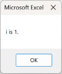
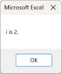
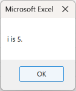

Loop
--------------

### Loop
Some algorithms may repeat the same process multiple times. In such cases, writing all statements in sequence may cause the program to become too long and inefficient. If there is a rule of thumb for the same type of processing that is done repeatedly, you can create an efficient program using that rule of thumb instruction. One method to use a legal imperative is to **Loop** it.

A **loop** is a method of repeating a specified process as long as certain conditions are satisfied.

The flow of Loop is shown in the following flowchart.



In this flowchart, the process of displaying the message “i is {value of i}.” and adding 1 to i is repeated as long as the variable i is less than or equal to 5 (*{value of i} represents the value stored in the variable i). Since adding 1 to i is part of the loop, after 5 iterations, the condition that i is less than or equal to 5 is no longer met, and the loop ends.

In this manner, the process described in the program is repeated from top to bottom, with the flow controlled to return to the top.

### For-Next Statement

A typical method of looping is the **For-Next statement**.

**For-Next statements** are used for repetition in the following manner.

*How to Use For-Next Statement*

    For counter variable = initial value To end value Step addition value  
    ' repetitive process code  
    Next counter variable  

The characteristic of the **For-Next statement** is that it uses a **counter variable** to perform repetition based on its value. After executing the loop content, the **counter variable** is updated with the **addition value**. The process repeats until the value exceeds the **end value**.

These processes are described below.

First, type “For,” and then assign the **initial value** to the **counter variable**. At this point, the **counter variable** must be declared beforehand.
Next to the **initial value**, "To **end value**" is specified. Subsequently, “Step **addition value**” completes the setup of the various conditions needed for the loop.

The repetitive process code begins on the next line, and the For-Next statement is terminated with “Next **counter variable**.” The repetitive process code is executed repeatedly until the counter variable exceeds the end value.

The contents of the flowchart are described using For-Next statements, as shown in the ForTest source code below.

*ForTest source code*

    Sub ForTest()  
        Dim i As Integer  
        For i = 1 To 5 Step 1  
            MsgBox ("i is" & i & ".")  
        Next i  
    End Sub  

When ForTest is executed, the following is shown.

    

As described above, the content of looped processing was executed while adding 1, an addition value, to i, which was set as a variable to serve as a counter. The loop ended because i exceeded the end value of 5, which no longer satisfied the loop condition.

If this loop process is described without a loop, it will resemble ForTest2.

*ForTest2 source code*

    Sub ForTest2()
        Dim i As Integer
        i = 1
        MsgBox ("i is" & i & ".")
        i = 2
        MsgBox ("i is" & i & ".")
        i = 3
        MsgBox ("i is" & i & ".")
        i = 4
        MsgBox ("i is" & i & ".")
        i = 5
        MsgBox ("i is" & i & ".")
    End Sub

ForTest and ForTest2 produce identical results. However, ForTest with repetition requires only 6 lines, whereas ForTest2 without repetition requires 13 lines, which is more than twice as many. Thus, if you can use the loop effectively, you can write an efficient program.

However, even if multiple similar processes are performed, it does not imply that the loop can be used in all cases. Processes that can be used in the loop follow a consistent pattern. It is important to draw a flowchart and organize the algorithm to identify the rules.

### Infinite Loop

The most important aspect to remember when using the loop is the **infinite loop**.

The loop repeats the content of the repetitive process until the condition is satisfied. However, in some cases, the condition for repetition may be met indefinitely, and the loop will never end. Such a case is called an **infinite loop**.

If you get an infinite loop in an Excel macro, try the following keystrokes.

* Press the [Ctrl] key and the [Break] key simultaneously.
* Hold down the [Alt] key and the [Esc] key simultaneously.

If none of the above work, try pressing the [Ctrl], [Alt], and [Del] keys simultaneously to launch the Task Manager and force close Excel.

If you are working in the information processing classroom, you may want to seek assistance from your instructor or tutor.

Please check the following references for the causes of infinite loops.



### Practice Problem1

In VBA programming with Excel, the loop is most frequently used for cell manipulation.

Let us use the following report cards as an example and loop through the cells.



To calculate the total and average scores for A to E, we only require to calculate them for each individual, as shown in PerformanceTable7_Range.

*PerformanceTable7_Range source code*

    Sub PerformanceTable7_Range()
        
        ' Variable Declaration
        Dim x As Integer
        
        ' Calculation of total and average score for A
        x = Range("B3") + Range("C3") + Range("D3")
        Range("E3") = x
        Range("F3") = x / 3
        
        ' Calculation of total and average score for B
        x = Range("B4") + Range("C4") + Range("D4")
        Range("E4") = x
        Range("F4") = x / 3
        
        ' Calculation of total and average score for C
        x = Range("B5") + Range("C5") + Range("D5")
        Range("E5") = x
        Range("F5") = x / 3
        
        ' Calculation of total and average score for D
        x = Range("B6") + Range("C6") + Range("D6")
        Range("E6") = x
        Range("F6") = x / 3
        
        ' Calculation of total and average score for E
        x = Range("B7") + Range("C7") + Range("D7")
        Range("E7") = x
        Range("F7") = x / 3
        
    End Sub

When PerformanceTable7_Range is executed, the following is shown.



In this manner, the report cards will effectively accomplish the same thing for some people. If there are only five people, as in this case, the source code will be short; however, as the number of people increases, the source code will grow longer. The loop is useful when the same task must be performed repeatedly.

However, it is difficult to determine how to repeat this process.

Now, let us recall Range (“cell name”) and Cells (row number, column number), as methods for handling each cell in a macro, and consider what it would appear if we wrote it in Cells. Using cells, it would appear as PerformanceTable7_Cells. Note that in Cells, the column numbers are numeric, not alphabetic. In other words, column number 1=A, column number 2=B, column number 3=C, column number 4=D, column number 5=E, column number 6=F, and so on.

In addition, to make the column numbers in Cells easier to understand, you can switch the worksheet appearance to the R1C1 reference style. 

The following reference material shows this process, allowing you to switch it if required.



*PerformanceTable7_Cells source code*

    Sub PerformanceTable7_Cells()
        
        ' Variable Declaration
        Dim x As Integer
        
        ' Calculation of total and average score for A
        x = Cells(3, 2) + Cells(3, 3) + Cells(3, 4)
        Cells(3, 5) = x
        Cells(3, 6) = x / 3
        
        ' Calculation of total and average score for B
        x = Cells(4, 2) + Cells(4, 3) + Cells(4, 4)
        Cells(4, 5) = x
        Cells(4, 6) = x / 3
        
        ' Calculation of total and average score for C
        x = Cells(5, 2) + Cells(5, 3) + Cells(5, 4)
        Cells(5, 5) = x
        Cells(5, 6) = x / 3
        
        ' Calculation of total and average score for D
        x = Cells(6, 2) + Cells(6, 3) + Cells(6, 4)
        Cells(6, 5) = x
        Cells(6, 6) = x / 3
        
        ' Calculation of total and average score for E
        x = Cells(7, 2) + Cells(7, 3) + Cells(7, 4)
        Cells(7, 5) = x
        Cells(7, 6) = x / 3
        
    End Sub



The score sheets used in this study show Japanese scores for students A through E in the second row, English scores in the third row, math scores in the fourth row, total scores in the fifth row, and the average score in the sixth row. What differs between A and E is that A corresponds to line 3, B to line 4, C to line 5, D to line 6, and E to line 7.

To calculate A's total and average score, the following code is used:

*How to calculate A's total and average score*

    x = Cells(3, 2) + Cells(3, 3) + Cells(3, 4)
    Cells(3, 5) = x
    Cells(3, 6) = x / 3

To calculate B's total and average score the following code is used.

*How to calculate B's total and average score*

    x = Cells(4, 2) + Cells(4, 3) + Cells(4, 4)
    Cells(4, 5) = x
    Cells(4, 6) = x / 3

The difference between the processing of A and B is that the row number of Cells is 3 for A and 4 for B. Let us check C, D, and E as well. Again, the row numbers in Cells are different. In other words, the method of calculating the total and average scores in these report cards is identical, with the exception of the row number in Cells.

### Practice Problem2

In 1.4.Practice Problem1, we discovered a pattern in which the methods used to calculate the total and average scores for the following report cards are identical, with the exception of the row numbers in Cells. 。



Using this pattern, the loop would appear as PerformanceTable8.

*PerformanceTable8 source code*

    Sub PerformanceTable8()
        
        ' Variable Declaration
        Dim i As Integer
        Dim x As Integer
        
        ' Calculation of total and average score
        For i = 3 To 7 Step 1
            x = Cells(i, 2) + Cells(i, 3) + Cells(i, 4)
            Cells(i, 5) = x
            Cells(i, 6) = x / 3
        Next i
    End Sub

To loop using For-Next statements, an initial value, an end value, and an addition value are required.

Considering the process’s pattern and considering that we are processing from A to E, the initial value is 3, which is the line number of A, and the end value is 7, which is the line number of E, because we are going to loop the process with a changing line number. Because each person’s grade is entered on a separate line, the calculation can be repeated line by line by setting the addition value to 1.

When PerformanceTable8 is run, you will realize the following:



Thus, repetition in VBA is a crucial step to process efficiently while using each cell based on the structure of an Excel table.

### Double Loop

In 1.5.Practice Problem2, we solved a looping practice problem using a variable that serves as a counter for the row number. The method of sequentially reading and processing each cell in a table is commonly used in Excel’s VBA loops. This method can be used not only for row numbers but also for column numbers, using a counter variable.

Moreover, loops can also be stacked as double or triple. Excel tables can be processed more efficiently by repeating the row and column numbers. Stacking loops can be difficult without an accurate understanding of loops, table structure, variables, and algorithms, but eventually you should be able to loop both row and column numbers using a double loop.

Once you have a sufficient understanding of the loop, you may want to study the following reference materials.



Exercise
--------------

### Exercise1

For the following report cards, let us improve PerformanceTable8 to write a program that determines the ratings for Japanese, English, and Math in addition to total and average scores. For each person's evaluation, use a single loop so that it is automatically calculated consistently.



In doing so, the evaluation is made against scores as follows



### Exercise2

Let us create a macro that satisfies the following steps and conditions.

* Enter an integer of your choice in cell A1.
* When the macro is executed, it will input the factorial of the integer in cell A1 into cell B1.

### Exercise3

Let us create a macro that satisfies the following steps and conditions.

* Enter an integer of your choice in cell A1. 。
* When the macro is executed, the following processing is performed.
    * Input an integer in cell B1 minus 1 from cell A1.
    * Input an integer in cell B2 minus 1 from cell B1.
    * Input integers in cell B3, cell B4... and so on in the row direction, following the above rule, until the integer to be input is 1.

### Exercise4

Let us create a macro that satisfies the following steps and conditions:

* Enter an integer of your choice in cell A1.
* When the created macro is executed, it will determine if the integer entered in cell A1 is a prime number.
    * If the integer entered in cell A1 is a prime number, a dialog box will display “{Cell A1} is a prime number.”
    * If the integer entered in cell A1 is not a prime number, a dialog box will display “{Cell A1} is not a prime number.”

※{Cell A1} is replaced by the value entered in the respective cell.

### Exercise5

For the following report cards, let us improve PerformanceTable8 by writing a program to determine ratings for Japanese, English, and Math, in addition to the total and average scores. For each person's evaluation, use a double loop with row and column numbers so that it can be automatically calculated consistently.



In doing so, the evaluation is made against scores as follows



