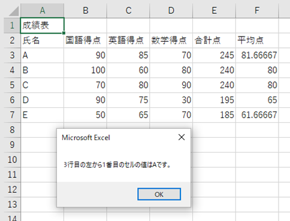
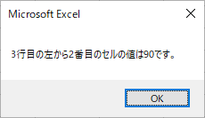
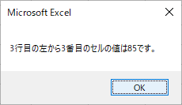

ここでは、二重の繰り返しについて確認します。

繰り返しは、二重・三重と重ねることができます。行番号と列番号の両方を繰り返しすることによって、Excelの表をより効率的に処理することができるようになります。繰り返しを重ねることは、繰り返しや表の構造、変数を正確に理解し、アルゴリズムをなければ難しいことですが、最終的には二重の繰り返しを用いて、行番号と列番号の両方を繰り返すことができるようになりましょう。

二重の繰り返し
----------------

VBAプログラミング（４）の1.5.練習問題2では、行番号にカウンターとなる変数を用いた繰り返しの練習問題を行いました。表の各セルを順番に読んで、処理を行っていくという手法は、Excelを用いたVBAの繰り返しでよく行われることであり、この方法は、行番号だけではなく、列番号にカウンターとなる変数を用いて行われることもあります。

複雑な処理になりますが、繰り返しは、別の繰り返しの中に入れることもできます。つまり、二重の繰り返しです。この二重の繰り返しを応用して、行番号と列番号について、別のカウンターとなる変数を用いた繰り返しで処理することによって、行番号も列番号も異なるセルを順番に読み込んで処理を行うことができます。その例を次のフローチャートに示します。



このフローチャートをプログラムに直すとDoubleForTestのようになります。

*DoubleForTestのソースコード*

    Sub DoubleForTest()
        '変数宣言
        Dim i As Integer
        Dim j As Integer
        
        '行の繰り返し(i)
        For i = 3 To 7 Step 1
            '列の繰り返し(j)
            For j = 1 To 6 Step 1
                MsgBox (i & "行目の左から" & j & "番目のセルの値は" & Cells(i, j) & "です。")
            Next j
            
        Next i
    End Sub

なお、このプログラムでは、行の繰り返しと列の繰り返しがわかりやすいようにインデントを変え、コメントで補足しています。

DoubleForTestを実行すると以下のようになります。

  …(以下省略)

全ての結果は省略しますが、このように行番号と列番号に相当する変数の値に応じて、そのセルの値を順番に読み込んで表示することができます。

練習問題
----------------

以下の成績表について、VBAプログラミング（４）の1.5.練習問題2では、行についての繰り返しのみを用いて、合計点と平均点を求めるプログラムを作りました。



しかし、この表を用いて、合計点と平均点を求めるために考えられる法則性は、行に関してのみではありません。列についても国語得点、英語得点、数学得点と同一行の3つの列の値を順番に読み込んで計算を行っています。PerformanceTable8の以下の部分です。

*合計点の計算の法則*

    x = Cells(i, 2) + Cells(i, 3) + Cells(i, 4)

この部分について法則性を考えると、列番号の初期値2終了値4加算値1としてxにセルの値を加えているという法則性を見出すことができます。そう考えると、カウンターとなる変数jを用いて、以下のような書き換えをすることもできます。
※変数iはすでに利用しているので、jとしました。

*行番号(i)、列番号(j)とした計算の法則*

    For j = 2 To 4 Step 1
        x = x + Cells(i, j)
    Next j

x = x + 1は、前のxに1を足したものを次のxに代入するという方法となります。つまり、x = x + Cells(i, j)は、前のxにCells(i, j)の値を足したものを次のxに代入するという意味になり、合計を求めるために、順番に各教科の点数を足し合わせていくことができます。

PerformanceTable8のソースコードについて、この部分の書き換えを行い、二重の繰り返しを採用したプログラムがPerformanceTable9のソースコードです。

*PerformanceTable9のソースコード*

    Sub PerformanceTable9()
        
        '変数宣言
        Dim i As Integer
        Dim j As Integer
        Dim x As Integer
        
        '合計点・平均点算出
        For i = 3 To 7 Step 1
            x = 0
            For j = 2 To 4 Step 1
                x = x + Cells(i, j)
            Next j
            Cells(i, 5) = x
            Cells(i, 6) = x / 3
        Next i
    End Sub

PerformanceTable9のポイントは、行の繰り返し(iの繰り返し)の最初にxに0を代入しているところです。行が切り替わったら、xに0を代入しないと、前の行の人の点数に足し合わせてしまうことになりますので、点数がおかしくなります。このような使い方は、繰り返しではよく行われることになりますので、練習しながら慣れていくと良いでしょう。

PerformanceTable9を実行すると、PerformanceTable8と同じく以下のようになります。



今回のように列方向では、繰り返す回数が3回程度で、処理内容が複雑でないのであれば、繰り返しを用いてもあまり効率化されたとは言えないでしょう。しかし、もっと多量のデータを処理しようとした場合、このように行方向、列方向に二重の繰り返しを行い、順番にセルの値を読み込んで処理を行うことは、効率的なデータ処理を行うためには重要な手がかりとなります。

