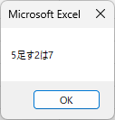
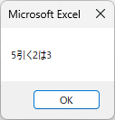
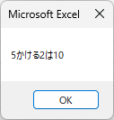
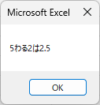
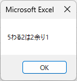
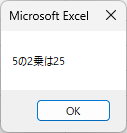

見やすいソースコードの書き方
--------------

プログラミングでは、行数が増えて行くにつれてソースコードは見にくくなっていきます。見にくいソースコードは、内容の理解が難しくなり、ミスも増えますので、見やすいソースコードを書くことが必要となってきます。必要に応じて、以下の内容を確認して、見やすいソースコードをかけるようになりましょう。



四則演算
--------------

### PerformanceTable2

前回作成した成績表に対して、セル"E2"に"合計点"とセル"F2"に"平均点"を追加して以下の画像のようにします。PerformanceTable2を作成して、Aさんの合計点と平均点を計算してみましょう。



*PerformanceTable2のソースコード*

    Sub PerformanceTable2()
        
        Range(“E3”) = Range(“B3”) + Range(“C3”) + Range(“D3”)
        Range(“F3”) = (Range(“B3”) + Range(“C3”) + Range(“D3”)) / 3
        
    End Sub

セル”E3”とセル”F3”には、Aさんの各教科の得点を踏まえて、合計点と平均点が計算されました。もちろん、数字を直接入れて計算することもできますが、Excelを用いたVBAのプログラミングでは、PerformanceTable2のように表にデータを入れておき、その値を用いて計算することがよく行われます。



### 算術演算子

プログラミングにおいて、四則演算に用いる記号を**算術演算子**と呼びます。VBAでは、以下のような算術演算子があります。



VBAでは、これらの算術演算子を利用して、数式を組み立てていきます。Excelの計算で利用する算術演算子とは違いますので、注意が必要です。

変数と基本データ型
--------------

### PerformanceTable3

PerformanceTable2をより効率的なソースコードにするため、変数を用いて、PerformanceTable3のように修正してみましょう。

*PerformanceTable3のソースコード*

    Sub PerformanceTable3()
        
        '変数宣言
        Dim x As Integer
        Dim y As Double
        
        x = Range(“B3”) + Range(“C3”) + Range(“D3”)
        Range(“E3”) = x
        y = x / 3
        Range(“F3”) = y
        
    End Sub

Range(“セル名”)を用いて計算を行うよりも、PerformanceTable3のように繰り返し使う数値や文字は、変数を用いてあらかじめ求めておくと効率的で見やすいソースコードを記述することができます。

PerformanceTable3を実行すると、以下のようにPerformanceTable2と同じ結果となります。



### 変数

**変数**とは、プログラミング言語において数値や文字などの値を一時的に格納しておく箱のようなものです。ソースコードに全ての値を明記できるようであれば、プログラムは常に書かれた値の通りにしか動かない単調なものになってしまいます。その都度、状況に応じて値を変更できる変数があると、プログラムは一つのソースコードでも幅広いバリエーションを持ったものにできます。

状況に応じて値を変更できる箱のようなものとして、ExcelのVBAの場合は、変数以外にセルも挙げられます。セルの場合は、値はセルに保存され、プログラムが完了した後も変更しなければ、そのセルに値が残ります。一方で、変数の場合は、値はメモリに保存されるため、プログラムが完了した後は消滅します。このようにプログラムを実行するためだけに一時的に値をメモリに格納しておくものが変数となります。

### 変数宣言

変数を作成することを**変数宣言**と呼んでいます。変数宣言は以下のように行います。

    Dim 変数名 As データ型

「Dim」の後に変数名を指定し、変数を宣言します。変数名は、以下のルールに従って自由に命名することができます。

* アルファベット、日本語の両方が利用できます。
* 数字は利用できますが、変数名の先頭には利用できません。
* アンダーバーは利用できますが、変数名の先頭には利用できません。
* アンダーバー以外の記号は利用できません。
* スペースは利用できません。
* すでにシステムで利用されている用語を予約語と呼び、それらは利用できません。
* 同じ適用範囲内ですでに利用している変数名は利用できません。

変数名には文字数の制限もありますので、あまり長すぎる変数名の変数を作ることはできません。

変数には、データ型の設定が必要になります。変数名の後に「As」を用いて、データ型とつなぎます。データ型については、3.5.基本データ型を参照してください。

### 代入

変数に値を入れることを値の**代入**と呼びます。

変数に値を代入しようとする場合、左辺に変数名を書き、「=」(半角イコール)で繋いで、右辺に代入したい値を書きます。条件式などの一部の例外を除いて、「=」は、VBAでは等号の意味ではなく、代入を意味します。

例えば、x=3は以下の図のようなイメージとなります。



すでに値が入っている変数に新たに値を代入した場合、前の値に新しい値が上書きされます。この変数の性質を利用して、プログラム内で1つの変数に対して、状況に応じて値を変更しながら利用することができ、プログラムに幅広いバリエーションを持たせることができます。

なお、Cells()やRange()を用いてセルを左辺に指定して、右辺に代入したい値を入れることによって、セルへの値の代入を行うこともできます。

### 基本データ型

VBAの主な**基本データ型**には以下のようなものがあります。



注意をしなければならないのは、データ型によって扱える値の内容と値の範囲が異なるという点です。変数の宣言は、最適なデータ型を選んで宣言することになります。

まず、変数として扱う値は、数値なのか、その他なのかを考える必要があります。同じ数値を扱うデータ型であっても、整数型と浮動小数点数型の区別があり、整数型には小数点以下が含まれている数値を格納することはできません。

数値以外にもさまざまなデータ型が存在します。扱っている値のデータ型が何であるのかを意識しながらプログラミングを行うと良いでしょう。

PerformanceTable3では、合計点を格納するためのxは、単なる整数の足し算になりますので、整数型(Integer型)の変数としています。その後に平均点を格納するためのyは、小数点以下が出てくる可能性がありますので、浮動小数点数型(Double)の変数となっています。

以下の参考資料にサンプルプログラムとともにもう少し説明が加えてありますので、必要に応じて確認してください。



### 型変換

3.5.基本データ型で示した通り、プログラミング言語にはデータ型があり、そのデータ型に従った値しか扱うことができません。しかし、場合によっては、異なるデータ型間で値のやりとりをしたい場合もあります。そのような際に行う作業が型変換です。

VBAでは、ある程度の型変換は自動で行ってくれます。例えば、整数型から浮動小数点数型へ値を渡したい場合、自動で型変換を行い、簡単に渡すことができます。逆に、浮動小数点数型から整数型に値を渡したい場合、整数型では小数点以下を扱うことができませんので、値に小数点以下が含まれていた場合は、四捨五入されて整数の値が受け渡されることになりますので、注意が必要です。なお、他のプログラミング言語では、自動で型変換をしてくれない場合もありますので、他のプログラミング言語を扱う際には、注意が必要です。

課題
--------------

### 課題1

以下の計算を行い、その結果を画像のようにダイアログ表示するマクロを作成してみましょう。

* 5 ＋ 2 × (15 － 5) － 9 ÷ 3



### 課題2

以下の計算を行い、その結果を順番に画像のようにダイアログ表示するマクロを作成してみましょう。

* 5足す2
* 5引く2
* 5かける2
* 5わる2(実数の結果)
* 5わる2(商と余りの結果)
* 5の2乗

### 課題3

以下の表を入力し、それぞれの答えをセルの値を利用して計算し、その結果を実行結果の画像のように入力するマクロを作成してみましょう。





### 課題4

以下の条件を満たすマクロを作成してみましょう。

* Integer型変数x、y、zを宣言する。
* 変数xに100を代入する。
* 変数yに5を代入する。
* 変数zに変数xの2乗わる変数yを代入する。
* 変数zをダイアログ表示する。

### 課題5

以下の条件を満たすマクロを作成してみましょう。なお、利用する変数に関しては、データ型は何が良いかを考えて、最も良いと考えられるデータ型にしてください。

* 変数a、b、c、dを宣言する。
* 変数aに10を代入する。
* 変数bに2を代入する。
* 変数cに1を代入する。
* 変数dに変数aを変数bと変数cを足した値で割った結果を代入する。
* 変数dをダイアログ表示する。

### 課題6

以下の表を参考に、入力した半径に基づいて、その半径の円の円周と面積を計算して、実行結果の画像のように入力するマクロを作成してみましょう。円周率は3.14を用いてください。





