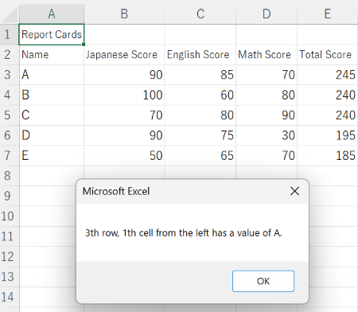
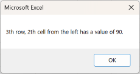

In this page, we review double loops.

Loops can be stacked into double or triple structures. For instance, looping through both rows and columns allows for efficient processing of Excel tables. Stacking loops can be difficult without an accurate understanding of loops, table structures, variables, and algorithms, but eventually you should be able to loop through both row and column using double loops.

Double Loop
----------------

In 1.5 Practice Problem 2 of VBA Programming (4), we practiced a loop using a counter variable for the row numbers. Reading each table cell in turn and processing it is common in VBA loops using Excel. This can be achieved using a variable that counts the row and column numbers.

Although it is a complicated process initially, a loop can be placed inside another loop. In other words, a double loop can be formed. By applying a double loop and using separate variables as counters for the rows and columns, cells with different row and column numbers can be read and processed sequentially.

An example is shown in the following flowchart.



This flowchart can be converted into a program like *DoubleForTest*.

*DoubleForTest Source Code*

    Sub DoubleForTest()
        ' Variable Declaration
        Dim i As Integer
        Dim j As Integer
        
        ' Row loop(i)
        For i = 3 To 7 Step 1
            ' Column loop(j)
            For j = 1 To 6 Step 1
                MsgBox (i & "th row, " & j & "th cell from the left has a value of " & Cells(i, j) & ".")
            Next j
            
        Next i
    End Sub

In this program, the indentation is changed and supplemented with comments to facilitate understanding of the looping through rows and columns.

When *DoubleForTest* is executed, the results below are obtained.

  …(Further details are omitted.)

Although some results are omitted, the figure shows that depending on the values of the variables corresponding to the rows and columns, the values of the cells can be read and displayed in sequence.

Practice Problem
----------------

For the following report cards, in 1.5 Practice Problem 2 of VBA Programming (4), we created a program to calculate the total and average scores using a single loop for the rows.



However, the possible pattern for using this table to calculate the total and average scores does not only traverse the rows. For the columns, the calculation should read the values of the three columns in every row in the order of Japanese, English, and Math scores. The following part of *PerformanceTable8* corresponds to this calculation.

*Pattern of Calculation of Total Score*

    x = Cells(i, 2) + Cells(i, 3) + Cells(i, 4)

If we consider the pattern for this part, we can observe that the cell value is added to x with the initial value of 2 and end value of 4 for an increment value of 1 in the column number. Accordingly, we can rewrite the program using variable j as a counter. 
(We already use variable i for the rows, so we need to use another variable name, j, for the column counter.)

*Calculation Loop Considering Row Number (i) and Column Number (j)*

    For j = 2 To 4 Step 1
        x = x + Cells(i, j)
    Next j

x = x + 1 allows to assign the current value of x plus 1 to the next value of x. In other words, code x = x + Cells(i, j) indicates that the current value of x plus the value of Cells(i, j) is assigned to the next value of x. The scores for each subject in turn can be added to obtain the total.

The program that incorporates a double loop and includes the corresponding modifications to the source code in *PerformanceTable8* is shown in the source code of *PerformanceTable9*.

*PerformanceTable9 Source Code*

    Sub PerformanceTable9()
        
        ' Variable Declaration
        Dim i As Integer
        Dim j As Integer
        Dim x As Integer
        
        ' Total and average score calculation
        For i = 3 To 7 Step 1
            x = 0
            For j = 2 To 4 Step 1
                x = x + Cells(i, j)
            Next j
            Cells(i, 5) = x
            Cells(i, 6) = x / 3
        Next i
    End Sub

*PerformanceTable9* assigns 0 to x at the beginning of each row iteration (iteration i). If you do not assign 0 to x when the row switches, the scores will be incorrect because they will add up to the scores of the people in the previous row. This kind of structure is common in repetition, and practice is required to get used to it.

When *PerformanceTable9* is executed, the results are like those obtained from *PerformanceTable8*.



If the number of iterations across columns is limited to only three, like in this case, and the processing is not complex, then using a loop might not be efficient. However, if you are trying to process large amounts of data, a double loop traversing the rows and columns to sequentially read and process cell values is important for efficient data processing. 

