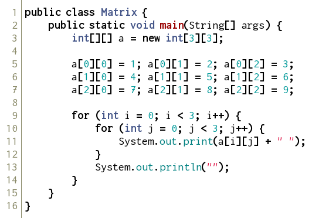

２次元配列
----------

以下のソースコードを入力し、コンパイルして実行してみましょう。

*Matrix.java*

実行すると、以下のようになります。

実行結果

    1 2 3
    4 5 6
    7 8 9

このようにして、２次元配列を使うことができます。
普通の配列の時と同様に、以下のようにして宣言します。

この例の場合には、どれを使っても同じになります。

### ２次元配列の宣言と生成（１）

    変数型 [][] 変数名;
    変数名 = new 変数型[要素数１][要素数２];
    
    // 例
    int[][] a;
    a = new int[3][3];

### ２次元配列の宣言と生成（２）

    変数型 [][] 変数名 = new 変数型[要素数１][要素数２];
    
    // 例
    int[][] a = new int[3][3];

### ２次元配列の宣言と生成（３）

    変数型 [][] 変数名 = ｛｛値のリスト｝,・・・,｛値のリスト｝｝;
    
    // 例
    int[][] a = ｛｛1,2,3｝,｛4,5,6｝,｛7,8,9｝｝;

上の３つの宣言方法には、違いがあります。興味がある人は調べてみましょう。

多次元配列
----------

多次元配列の場合も、２次元の場合と同様にして使えます。基本的には、`[]` を増やせばいいだけです。

### 多次元配列の宣言と生成（１）

    変数型 [][]・・・[] 変数名;
    変数名 = new 変数型[要素数１][要素数２]・・・[要素数n];
    
    // 例
    int[][][] a;
    a = new int[2][2][3];

### 多次元配列の宣言と生成（２）

    変数型 [][]・・・[] 変数名 = new 変数型[要素数１][要素数２]・・・[要素数n];
    
    // 例
    int[][][] a = new int[2][2][3];

### 多次元配列の宣言と生成（３）

    変数型 [][]・・・[] 変数名 = ｛｛値のリスト｝,・・・,｛値のリスト｝｝;
    
    // 例
    int[][][] a = ｛｛｛1,2｝,｛3,4｝｝,｛｛5,6｝,｛7,8｝｝,｛｛9,0｝,｛1,2｝｝｝;
