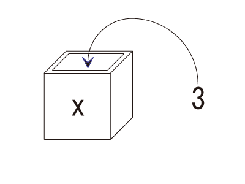

四則演算
--------

### 簡単な四則演算

まず、前回利用したインタラクティブシェルを利用して簡単にpythonプログラムを実行できるようにしましょう。

[インタラクティブシェル](../01/index.html#chapter11)

<!--
コンパイルの方法は、以下を参考にしましょう。

参考資料 [コンパイルと実行（Windows コマンドプロンプト）](../../appendix/win_javac.html)

参考資料 [コンパイルと実行（Mac ターミナル）](../../appendix/mac_javac.html)

参考資料 [コンパイルと実行（Eclipse）](../../appendix/eclipse.html)
-->

    

準備が出来たら以下のように入力し実行してみましょう。

    >>> 1 + 2

*実行結果*

    3
<!-- 画像にしたい　-->

### 算術演算子

プログラムでは， 算術演算子 を利用して，変数や値に対する四則演算やそのほかの計算をすることができます。 
Python で利用できる主な算術演算子をまとめます。

演算子 | 意味 | 使い方の例 | 結果
--- | --- | --- | ---
+ | 和(足し算) | 5 + 2 | 7
- | 差(引き算) | 5 - 2 | 3
* | 積(かけ算) | 5 * 2 | 10
/ | 商(割り算) | 5 / 2 | 2.5
// | 商(整数部分) | 5 // 2 | 2
% | 剰余(割り算のあまり) | 5 % 2 | 1
** | 累乗 | 5 ** 2 | 25

演算子には優先順位があります。基本的には、数学の優先順位と同じです。
（）を用いて順序を指定することもできます

    >>> 2 + 3 * 5
    30
    >>> (2 + 3) * 5
    25

参考資料 [演算子の優先順位](../../appendix/priority_order.html)

変数と基本データ型
------------------

### 変数を用いた計算
次に以下のソースコードを作成し、名前を付け保存しましょう。

*calc_sample_1.py*

    x = 1
    y = 2
    
    print(x + y)    

*exit()* コマンドでインタラクティブシェルを抜け、このソースコードを実行しましょう。

    >>>exit() 
    >calc_sample_1.py
    3
    
ここでのｘやｙは**変数**と呼ばれます。    

### 変数とは

プログラムで扱う値を入れておくための **箱** だと考えればよいでしょう。
変数をプログラム中で計算の対象とすると、実際の計算には箱の中に入っている値を使用します。

### 代入

`x=１` の `=` は、**値の代入**をせよという意味です。記号は同じでも、数学でいう **等号** とは意味が少し違います。
きちんと言い換えるならば、**左辺の変数に右辺の値を代入** せよ、という意味です。
これにより、メモリに値が書き込まれます。

### 基本データ型

変数は箱の中に入っている値によって`型`が定められます。
上の例では、整数型 `int` を使いました。
pythonではこの他にも様々なデータ型を扱うことができます。

型 | 内容 | データ例 | デフォルト値
--- | --- | --- | ---
bool | 真偽 | True, False | False
int | 整数 | 123   0   -65535 | 0
float | 浮動小数点数 | 3.1415   -1.4142   3e+8| 0.0
complex | 複素数，虚数 | 1j   -2.3-4.1J | 0j
list | リスト。複数の要素を順番に並べて格納し，利用するためのデータ型（要素の追加・削除や変更が可能） | [1, 2, 3]   ['Python', 'Java', 'C'] | []
tuple | タプル。複数の要素を順番に並べて格納し，利用するためのデータ型（要素の追加・削除や変更は不可能） | (1, 2, 3   ('Python', 'Java', 'C') | ()
str | 文字列（日本語などのマルチバイト文字も含む）。文字を順番に並べたテキストデータ型 | "abc"   'Hello'   "こんにちは" | ''
dict | 辞書。複数の要素を格納し，キー（索引）で呼び出して利用するためのデータ型 | {'name':'いちご', 'type':'fruit', 'price':380} | {}

浮動小数点型の `e` は、**（e以前の数）×10の（e以降の数）乗** という意味です。

様々な変数の使い方
------------------

### 数式の代入

次に、以下のソースコードを作成し、実行しましょう。

*calc_sample_2.py*

    x = 1 + 2
    
    print(x)
    
このように、代入するものは **数式** でも使えます。
正確には、変数xに **数式の計算結果の値** を代入することになります。

### 複数の変数の使用

さらに、以下のようなソースコードを作成しましょう。

*calc_sample_3.py*

    x = 1
    y = 2
    a = x + y
    
    print(a)

このように、変数には **別の変数** もしくは **変数の入った数式** でも代入できます。
ただし、変数にその変数自体を代入することはできません。

練習問題
--------

上の `calc_sample_3.py` を参考にして、他の演算を行うプログラムを作成してみましょう。
その際、値もいろいろ変えて試してみましょう。
