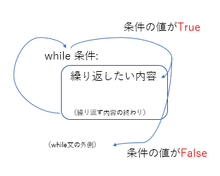

繰り返し - while
--------------------

### 文字列の入力

まず、以下のソースコードを打ち込み、コンパイルして実行してみましょう。

実行すると、以下のように表示されます。

*WhileLoopSample.py* 

実行すると、以下のように表示されます。

*実行結果*

    x=0
    x=1
    x=2

while文を使うと、繰り返しを行うことができます。

*while文*

    while 条件:
        繰り返したい内容

    例：

    while x<3:
        x=x+1

[比較演算子](../04/index.html)

### break文

では、次のように改良してみましょう。

*WhileLoopSample2.py* 

実行すると、以下のようになります。

*実行結果*

    x=0
    x=1
    x=2

前のプログラムと実行結果は同じですが、少し動作が違います。とくに、while文を見てみましょう。
while文の反復条件が「True」となっており、常に正しい条件となっています。そのため、永遠に反復し続けます。いわゆる無限ループと呼ばれる状態です。しかし、結果を見れば明らかなように、きちんと3回で止まっています。これは、break文によるものです。

*break文*

    break

break文を実行すると、**ループから抜け出す**ことができます。
また、同じ行のif文を見てみましょう。

    if x==3: break

これは、以下のようなソースコードと同じになります。

    if x==3:
        break

if文で実行したい命令が1行の場合、{}をつけずに書くことができます。
これは、while文や下のfor文でも同じことが可能です

### プログラムの改良

では、次のようにプログラムを改良してみましょう。

*WhileLoopSample3.pyt* 

インクリメント演算子というものもあります。

*インクリメント演算子*

    変数 += 1

これは、「１増やす」という意味です。つまり、「i=i+1;」と書くことと同じです。
また、同様に「１減らす」つまり、「i=i-1;」という意味のデクリメント演算子というものもあります。

*デクリメント演算子*

    変数 -= 1

繰り返し - for文
--------------------

### for文の基本

決まった回数の反復を行う場合、より分かりやすい方法があります。
まず、以下のソースコードを打ち込み、コンパイルしてみましょう。

*ForLoopSample.py* 

実行すると、以下のようになります。

*実行結果*

    1回目
    2回目
    3回目

for文を使うと、繰り返しを行うことができます。

*for文*

    for 変数 in オブジェクト:
        繰り返したい内容
    
    例：

    for i in [1, 2, 3, 4, 5]:
        print(i)

練習問題
--------------------

<ol>
<li>for文もしくはwhile文を用いて、１から入力された値までの和を出力するプログラムを書きましょう。

<em>実行結果</em>

<pre><code class="language-" data-lang="">値を入力してください。
10
1から10までの和は、55です。
</code></pre>

</li>
<li>値を入力すると、その値が素数かどうかを判定するプログラムを書きましょう。
ここで素数とは、「1と自分自身以外で割り切れない数」のことです。

<em>実行結果（１）</em>

<pre><code class="language-" data-lang="">値を入力してください。
7
7は素数です。
</code></pre>

<em>実行結果（２）</em>

<pre><code class="language-" data-lang="">値を入力してください。
8
8は素数ではありません。
</code></pre>

</li>
<li>
“******”を繰り返し標準出力して，高さが7，横が6の長方形を描画しましょう．ただし，while文, for文，do while文のいずれかを必ず使い，その中で標準出力をする命令は一回のみ使うこと．
 回答： 
　 ****** 
　 ****** 
　 ****** 
　 ****** 
　 ****** 
　 ****** 
　 ******
</li>
<li>
九九の表を表示するプログラムを作成しましょう．
</li>
<li>
ある整数xに対して，1+2+ …+ xを出力するプログラムを書きましょう．ただし，xの値が1未満のときは注意文を出力しましょう．
</li>
<li>
ある整数xに対して，1*2* …* xを計算するプログラムを書きましょう．ただし，xの値が1未満のときは注意文を出力しましょう．
</li>
<li>
変数nに任意の0でない自然数を入力し，nが偶数なら，nを2で割り，奇数ならnに3をかけて1を足す操作を繰り返すプログラムを作成し，その結果を観察しましょう．
</li>
<li>
n個の中からm個を選ぶ組み合わせを求めてください．ただし，n, mは共に正の整数とし，n &gt; mとする．
</li>
<li>
“*”を繰り返し標準出力して，高さが7，横が6の長方形を描画しましょう．ただし，while文, for文，do while文のいずれかを必ず使い，その中で標準出力をする命令は一回のみ使うこと．
 回答： 
　 ****** 
　 ****** 
　 ****** 
　 ****** 
　 ****** 
　 ****** 
　 ******
</li>
<li>
文字「 * 」を並べて，縦 10 文字, 横 10 文字の三角形を描くプログラムを作成しなさい.
 回答： 
　 * 
　 ** 
　 *** 
　 **** 
　 ***** 
　 ****** 
　 ******* 
　 ******** 
　 ********* 
　 **********
</li>
<li>
11 という 10 進数の数値を 2 進数で表示するプログラムを作成しましょう．
</li>
<li>
入力された数字の次の月のカレンダーを表示するプログラムを作成しなさい．なお，うるう年や曜日による表示場所の変更を考慮する必要はない．
</li>
<li>
1 から 100 までの整数のうち，平方数でも立方数でもないものを，すべて表示するプログラムをつくりなさい．
</li>
</ol>
