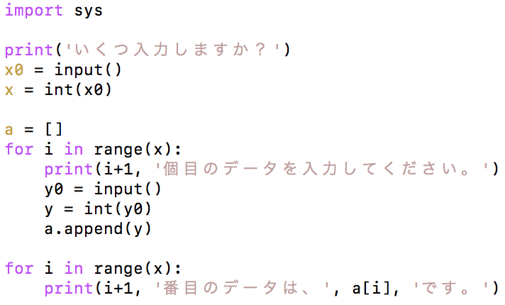

リスト
--------------

### リストの基本的な使い方

まず、以下のソースコードを打ち込み、コンパイルして実行してみましょう。

*Arrangement.py* 

実行すると、以下のようになります。

*実行結果*

    0番目のデータは、10です。
    1番目のデータは、25です。
    2番目のデータは、30です。
    3番目のデータは、55です。
    4番目のデータは、85です。

変数をたくさん使いたい場合、リストを使うと便利です。

リストの宣言と生成（１）

    変数名 = []
    
    // 例
    a = []
    a.append(1)
    a.append(2)
    a.append(3)

注意
リストの添え字は**0**から始まります。
例えば、リストa[]を５つ宣言した場合は、a[0]からa[4]までの５つが使えます。

いろいろなリストの使い方
----------------------

### for文との組み合わせ

では、以下のようなソースコードを入力し、実行してみましょう。

*Arrangement2.py* 

実行すると、例えば以下のようになります。

*実行結果*

    いくつ入力しますか？
    3
    1個目のデータを入力してください。
    15
    2個目のデータを入力してください。
    23
    3個目のデータを入力してください。
    47
    1個目のデータは、15です。
    2個目のデータは、23です。
    3個目のデータは、47です。

`for` 文とリストを組み合わせると、複数個の入力にも対応できるようになります。
また、リストの数を変数で与えることもできます。

練習問題
--------
1. 要素数が5個のリスト<code>Array</code>を4, 6, -3, 5, 2の順で初期化した後、2番目の要素を4番目の要素で除算するプログラムを作成しましょう。

2.  要素が2つ以上あるリストを宣言し、リストのi番目の要素とj番目の要素を入れ替えるプログラムを作成しましょう。
例えば、<code>i=3</code>, <code>j=2</code>, <code>a[2]=6</code>, <code>a[3]=7</code>とすると, <code>a[2]=7</code>, <code>a[3]=6</code>となる。

3.  次のように、自分の点数と人数、他の人の点数を入力すると、順位を出力するプログラムを書きましょう。

<em>実行例</em>

<pre><code class="language-" data-lang="">あなた以外は何人ですか。
      4
    あなたの得点を入力してください。
      56
    他の人の得点を入力してください。
      32
      44
      67
      38
      あなたは第2位です。
</code></pre>

4.  人数とそれぞれの点数を入力し、平均点を出力するプログラムを書きましょう。さらに、平均点以上の点数と人数を表示させましょう。

<em>実行例</em>

<pre><code class="language-" data-lang="">テストの受験者数を入力してください。
      3
   点数を入力してください。
      67
      89
      34
      平均は63.333333336点です。
      平均点以上は、67点、89点の2人です。
</code></pre>

5.  0から９までの自然数が重複せずに格納されている要素数10のリストに対して、各要素を昇順に並べからえるプログラムを作成しましょう。

6.  2×2行列A, Bをリストを用いて定義し、A+Bを行うプログラムを作成しましょう。

7.  フィボナッチ数列をリストに格納し、出力するプログラムを書きましょう。

