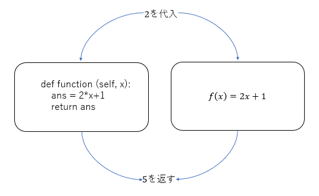

オブジェクト指向プログラミング
------------------------------

Pythonはスクリプト言語でありながら **オブジェクト指向プログラミング** の特徴もあります。今回はオブジェクト指向プログラミングの基礎に少し触れてみましょう。

まず、これから出てくる言葉の説明をしておきます。

<dl>
<dt>オブジェクト</dt>
<dd>プログラムで扱う情報と、それを実行できる機能を１つのまとまりにしたものです。</dd>
<dt>クラス</dt>
<dd>いわば「設計図」のようなものです。</dd>
<dt>インスタンス</dt>
<dd>クラスを元にして作成された実態のこと。
設計図から実際に製造された「製品」のようなものです。</dd>
</dl>

これだけ読んだだけではよく分からないかもしれませんが、実は既にこれらのものを使っています。
その例が、`string` といったクラスです。

`string` は厳密には基本データ型ではなく、`string` クラスで定義されたオブジェクトです。

クラス
------

クラスには、大きく分けて2つの要素があります。それが **フィールド** と **メソッド** です。
フィールドとメソッドをあわせて、**メンバ** と呼ぶこともあります。

### フィールド

はじめに、フィールドについて説明します。
まずは、以下のソースコードを入力し、コンパイルして実行してみましょう。

*Hito.py* 

    class Person:
        def main(self):
            self.name = '都立大'
            self.age = 20
            print('名前は、', self.name, 'です。')
            print('年齢は、', str(self.age), '歳です。')

    p1 = Person()
    p1.main()

実行すると、以下のようになります。

*実行結果*

    名前は、都立大です。
    年齢は、20歳です。



さて、8行目を見てみましょう。

    p1 = Person()

ここで、`Person` クラスを用いてインスタンスを生成しています。
分かりやすく言えば、**設計図（クラス）** から、実態となる **製品（インスタンス）** を作る、というような作業です。

クラスに基づきインスタンスを生成する処理を **コンストラクタ** と呼びます。

    オブジェクト変数名 = コンストラクタ名(パラメータ)
    
    // 例
    p1 = Person()

コンストラクタは、初期化専用のメソッドのことです。
正確ではありませんが、*コンストラクタ名* には *クラス名* を書く、と覚えておきましょう。

ここまでの作業で、クラスを実際に使えるようになります。

次に、5,6行目を見てみましょう。

    p1.name = '都立大'
    p1.age = 20

`Person` クラスの変数 `name` と `age` に値を代入したりするには、**オブジェクト変数名.フィールド名** というかたちを用います。

ここで **フィールド** とは、クラスの持つデータのことです。
つまり、クラスの持つ変数だと理解すればよいでしょう。

### メソッド

では、上のプログラムを少し改良してみましょう。

*Hito.py* 

    class Person:
        def main(self):
            self.name = '都立大'
            self.age = 20

        def show(self):
            print('名前は、', self.name, 'です。')
            print('年齢は、', str(self.age), '歳です。')

    p1 = Person()
    p1.main()
    p1.show()

実行すると、以下のようになります。

*実行結果*

    名前は、都立大です。
    年齢は、20歳です。



8行目を見てみましょう。

    p1.show()

これで、`Person` クラスのインスタンスである `p1` のメソッド `show()` を実行することができます。
そのメソッドの処理内容は、16-19行目に書かれています。

    def show(self): 
    	print('名前は、' + self.name + 'です。')
    	print('年齢は、' + str(self.age) + '歳です。')
    

中の2行を見れば分かると思いますが、`name` と `age` の値を出力しています。`self.`と書くとそのクラスの中で定義された変数を参照することができます。

メソッドは、以下のようにして呼び出します。

    オブジェクト名.メソッド名(引数1,引数2,・・・)
    
    // 例
    p1.show()

呼び出すためには、その内容をあらかじめ書いておくことが必要です。
メソッドは次のように定義します。

    def メソッド名(self, 引数の型1 引数名1,・・・):
    	メソッドの内容
    	return 戻り値
    
    
    // 例
    def show(self):
    	System.out.println('名前は、' + self.name + 'です。')

ここで少し言葉の説明をしておきましょう。

<dl>
<dt>引数</dt>
<dd>メソッド実行時に、メソッドに与える値のことです。
メソッド内での変数名を指定します。
呼び出し時等に与える実際の値を <strong>実引数</strong>、メソッド定義部で実引数に名前をつけたものを <strong>仮引数</strong> と呼ぶこともあります。
必要ない場合は、上の例のように、`self`のみを記載します。`self`とはクラスの中で定義されているメソッドであることを明示するために記載する必要があります。</dd>
<dt>戻り値</dt>
<dd>メソッドの実行結果として戻す値のことです。
通常、 <code>return 戻り値</code> という形で値を返します。
戻り値が必要ない場合は、上の例のように書かなくても良いです。
</dl>

いろいろな形のメソッド
----------------------

### 戻り値をもつメソッド

では、前のプログラムを以下のように直してみましょう。

*Hito.py* 

    class Person:
        def main(self):
            self.name = '都立大'
            self.age = 20

        def show(self):
            print('名前は、', self.name, 'です。')
            print('年齢は、', str(self.age), '歳です。')

        def getage(self):
            return self.age

    p1 = Person()
    p1.main()
    temp = p1.getage()
    print('年齢は、', temp, '歳です。')

*実行結果*

    年齢は20歳です。

<!---->

8行目では、23-25行目のメソッドを呼び出しています。
そして、そのメソッドでの戻り値 `age` を、`temp` に代入しています。

### 引数をもつメソッド

さらに、以下のように修正してみましょう。

*Hito.py* 

    class Person:
        def main(self):
            self.name = '都立大'
            self.age = 20

        def show(self):
            print('名前は、', self.name, 'です。')
            print('年齢は、', str(self.age), '歳です。')

        def getage(self):
            return self.age

        def future_age(self, year):
            print(year, '年後の年齢は、', self.age+year, '歳です。')

    p1 = Person()
    p1.main()
    p1.show()
    p1.future_age(5)

*実行結果*

    名前は、都立大です。
    年齢は、20歳です。
    5年後の年齢は、25歳です。



このようにして、引数を与えることができます。

練習問題
--------

### 問題１

上の `Hito.py` に、引数2つを持ち、その和を返すメソッド `add` を作成し、実行してみましょう。

### 問題２

次のようなクラスを作成しましょう。
メインメソッドのあるクラス名を、`Zukei` とします。

-   クラス名は `Circle`
-   半径を保持する変数 `r` を持つ
-   `r` から面積を計算し、その値を返すメソッド `area`
-   `r` から円周を計算し、その値を返すメソッド `circuit`
-   引数を1つ持ち、`r` にその値を代入するメソッド `inputRadius`

そしてこのそれぞれのメソッドを使い、以下のような結果を表示させましょう。
円周率は、`3.14` とします。

*実行結果*

    半径の値を入力してください。
    3
    面積は、28.26です。
    円周は、18.84です。
