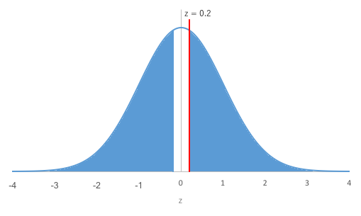
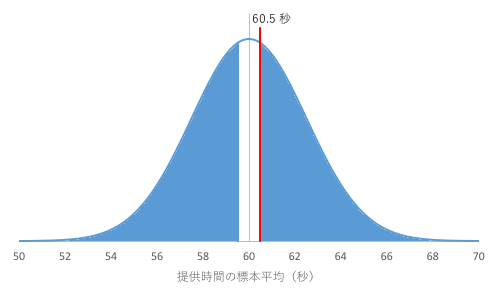
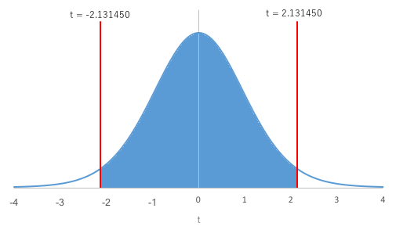
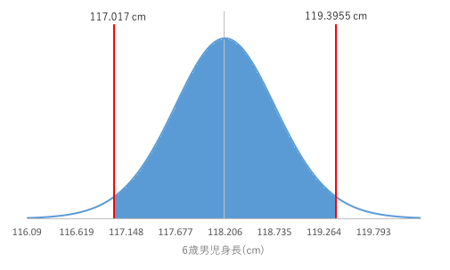

母平均に関する検定と推定
------------------------

日頃私たちが得られるデータは、<a href="../01/#universe">対象</a>の特性を**もれなく**<a href="../01/#measurement">測定</a>したデータである母集団（population）そのものではなくて、母集団の中からいくつか抜き出してきたデータである標本（sample）であることが一般的です。私たちが実際にできることは、その標本をもとに母集団を推測することです。



本講では、標本に基づいて算出した<a href="../01/#mean">平均</a>（標本平均、sample mean）から母集団の平均（母平均）を検定したり、推定したりする方法を学んでいきましょう。

1つの母平均に関する検定（母標準偏差が既知のとき）
-------------------------------------------------

### 練習問題1

複数店舗を展開しているあるファストフード店では、注文を受けてから商品を出すまでに<a href="../01/#mean">平均</a>60秒かかっているとします。 そこで、**いくつかの店舗**で**何人か**の新入店員たちに対して同様の時間を計測したところ、以下のデータを得ました。今年の新入店員**全体**では注文を受けてから商品を出すまでに平均60秒かかると判断して良いでしょうか。なお、商品を出すまでの<a href="../01/#standard_deviation">標準偏差</a>の値は10秒で、店舗や店員が代わってもこの値は変わらないものとします。





### 仮説検定の流れ

<a href="#chapter3">練習問題1</a>を例にあげると、<q>今年の新入店員全体は注文を受けてから商品を出すまでに<a href="../01/#mean">平均</a>60秒かかる</q>、すなわち、通常の商品提供平均時間と今年の新入店員たちの商品提供平均時間とが等しい、と判断して良いかを考えるための仮説検定（hypothesis testing）は、

&#9312; “通常”の商品提供平均時間と“新入店員”全員の商品提供平均時間とが「等しい」という帰無仮説H0と、両者が「等しくない」という対立仮説H1とを考えます。

&#9313; 平均と<a href="../01/#standard_deviation">標準偏差</a>などから検定統計量$z$を求めます。

&#9314; 求めた検定統計量が起こり得る確率（$p$値）を求めます。

&#9315; 有意水準$\alpha$（アルファ）と$p$値とを比較して、どちらの仮説を採択するか決定します。

の流れになります。

帰無仮説（null hypothesis）は極端に言えば、棄てる前提の、つまり、否定したい仮説のことです。先ほどの流れの説明では練習問題1の帰無仮説として、通常の商品提供平均時間と新入店員全員の商品提供平均時間とが「等しい」と設定されています。この仮説を退けるためには、練習問題1の場合、「等しい」状況において新入店員全員の商品提供平均時間が60.5になることは稀である、すなわち、めったに起こらないことを示す必要があります。つまり、その状況が起こり得る確率$p$値が「ある小さな値（有意水準$\alpha$）」以下であることを示す必要があります。

これが示されれば帰無仮説は棄却され、主張したい内容である対立仮説（alternative hypothesis）が採択されます。ここで、対立仮説は先ほどの流れの説明では「等しくない」と設定されています。一方、$p$値が$\alpha$より大きい場合、練習問題1の「等しい」状況で商品提供時間の平均が60.5になることはよくあることになり、帰無仮説を受容することになります。

### 仮説の設定

ここでは<a href="#chapter3">練習問題1</a>に対して、

* <a href="#null_hypothesis">帰無仮説</a>H0：$\mu = \mu_0$
* <a href="#alternative_hypothesis">対立仮説</a>H1：$\mu \ne \mu_0$

と設定します。ここで、$\mu$（ミュー）は今年の新入店員全員の商品提供時間の<a href="../01/#mean">平均</a>を表し、$\mu_0$は全店舗・全店員の商品提供時間の平均を表します。すなわち、$\mu$は今年の新入店員全員分の商品提供時間を<a href="#population">母集団</a>とする母平均で未知、その母集団の一部が<a href="#sample">標本</a>で<a href="#table1">表1</a>に示す新入店員何人かの商品提供時間となります。一方、$\mu_0$は全店舗・全店員の商品提供時間を母集団とする母平均となり、その値は<a href="#chapter3">60と既知</a>です。

この帰無仮説は言い換えると、表1に示す$N$ = 16の商品提供時間は、母平均$\mu_0$が60である母集団、すなわち全店舗・全店員の商品提供時間という母集団からランダムに抽出された標本であると仮定していることになります。

### 有意水準$\alpha$の設定

<a href="#null_hypothesis">帰無仮説</a>を棄てるためには、その状況がめったに起こらないことを示す必要がありますが、「めったに」の程度は有意水準（significance level）$\alpha$で表され、その値は経験的に0.05（5%）か0.01（1%）を用います。後者のほうが、より厳しい条件となります。今回の検定では、有意水準$\alpha$ = 0.05とします。詳しくは<a href="../04/#chapter1">有意水準</a>を参照してください。

### 検定統計量$z$値の算出（正規分布として考える）

$z$は以下の数式で求まります。

$ \displaystyle z = \frac{ \overline{x} - \mu_0}{\frac{\sigma}{\sqrt{N}}}$

ここで、$ \overline{x}$は<a href="#sample_mean">標本平均</a>でその値は<a href="#table1">表1</a>に示されている<a href="#sample">標本</a>から算出可能、$\mu_0$は<a href="#mu_0"><q cite="#mu_0">全店舗・全店員の商品提供時間を母集団とする母平均</q></a>でその値は<a href="#chapter3">60と既知</a>、$\sigma$（シグマ）は全店舗・全店員の商品提供時間を<a href="#population">母集団</a>とする母<a href="../01/#standard_deviation">標準偏差</a>でその値は<a href="#chapter3">10と既知</a>、$N$は<a href="../01/#sample_size">標本の大きさ</a>でその値は<a href="#table1">16と既知</a>です。

なお、ここでは、各店舗・各店員の商品提供時間の分布が平均60、標準偏差10の分布である、言い換えると、各店舗・各店員の商品提供時間が平均60、標準偏差10の分布に従うと考えています。<a href="#null_hypothesis">帰無仮説</a>、つまり、<a href="#rewritten_H_0"><q cite="#rewritten_H_0">表1に示す$N$ = 16の商品提供時間は、母平均$\mu_0$が60である母集団、すなわち全店舗・全店員の商品提供時間という母集団からランダムに抽出された標本である</q></a>が成立する場合、標本平均$\overline{x}$は平均$\mu_0$、標準偏差$\sigma / \sqrt{N}$（<a href="../01/#standard_error">標準誤差</a>）の正規分布に従うことがわかっています。これに基づいて、標本平均<a href="#60.5">60.5</a>が帰無仮説下で生じ得る確率$p$値を考えることができるようになっています。

ただし、正規分布に従うといっても、正規分布の平均や標準偏差は様々です。そこで、<a href="#standardization_equation">上式</a>のように、平均$\mu_0$、標準偏差$\sigma / \sqrt{N}$の正規分布に従う値$\overline{x}$を、平均0、標準偏差1の標準正規分布（standard normal distribution）に従う値に変換する、標準化（standardization）と呼ばれる処理が必要となります。標準化によって、平均や標準偏差がそれぞれ異なる正規分布に従うデータも、標準正規分布に従う共通の検定統計量（test statistic）$z$値へ変換することができ、その結果、問題が変わっても対象が変わっても、帰無仮説が成立する状況下で標本平均がある値（<a href="#chapter3">練習問題1</a>では60.5）になる確率を、検定統計量$z$値が生じ得る確率$p$値として、同じように求めることができるようになっています。

### $p$値の算出

<a href="../04/#chapter1">有意水準</a>$\alpha$と比較する確率$p$値を算出します。$p$値は、<a href="#standard_normal_distribution">標準正規分布</a>において$-z$以下の値が発生する確率と$z$以上の値が発生する確率の和です。<a href="#sample">標本</a>の取り方によって<a href="#sample_mean">標本平均</a>$\overline{x}$の値は大きくなったり小さくなったり変動しますが、<a href="#null_hypothesis">帰無仮説</a>の下では$\overline{x}$と$\mu_0$との差は小さいので、<a href="#test_statistic">検定統計量</a>$z$も0に近い値になり、$p$値は大きくなります。逆に、帰無仮説が成立しない場合、$z$は極端に大きいか、極端に小さい（負の数になる）ため、$p$値は小さくなります。

### 判定



<a href="#standard_normal_distribution">標準正規分布</a>はこのようなグラフを描きます。このグラフで、<a href="#p_of_z">$p$値</a>を表す面積が<a href="../04/#chapter1">有意水準</a>の確率を表す面積より大きいか小さいかで<a href="#null_hypothesis">帰無仮説</a>の受容か棄却かを決定します。
<dl>
 	<dt>$p$値 ≤&nbsp;有意水準$\alpha$</dt>
 	<dd>帰無仮説H0を棄却する</dd>
 	<dt>$p$値 &gt;&nbsp;有意水準$\alpha$</dt>
 	<dd>帰無仮説H0を受容する</dd>
</dl>

### Rの操作

ここまで検定の理論について説明してきましたが、Rを用いて<a href="#chapter3">練習問題1</a>に取り掛かりましょう。

&#9312; <a href="#table1">表1</a>のデータをRに入力します。

##### コード

<pre class="Rcode">
# データの読み込み
time <- c(64, 61, 67, 57, 62, 53, 69, 49, 73, 59, 67, 50, 58, 62, 56, 61)
</pre>

&#9313; 検定を行います。

##### コード

<pre class="Rcode">
# T検定
t.test(time, mu=60)
</pre>

##### 結果

<pre class="Rres">
	One Sample t-test

data:  time
t = 0.29925, df = 15, p-value = 0.7689
alternative hypothesis: true mean is not equal to 60
95 percent confidence interval:
 56.93871 64.06129
sample estimates:
mean of x 
     60.5 
</pre>

* t : $t$値  
* df : <a href="#dof_t">自由度</a>$\phi$  
* p-value : <a href="#p_of_t">$p$値</a>  
* 95 percent confidence interval : 95%<a href="#confidence_interval">信頼区間</a>  
* mean of X : <a href="#sample_mean">標本平均</a> $ \overline{x}$ 

### 結果

<a href="#p_of_z">$p$値</a> = 0.7689が求まりました。下図の塗りつぶされた領域が全体に対してpの割合になっています。

設定した<a href="../04/#chapter1">有意水準</a>$\alpha$は0.05です。$p$値 = 0.7689 &gt; 有意水準$\alpha$ = 0.05であるので、<a href="#null_hypothesis">帰無仮説</a>H0は棄却されません。したがって、新入店員の商品提供時間の母<a href="../01/#mean">平均</a>は60ではないとは言えません。

1つの母平均に関する検定（母標準偏差が未知のとき）
-------------------------------------------------

### 練習問題2

<a href="http://www.mext.go.jp">文部科学省</a><cite>令和3年度学校保健統計調査</cite>の結果によると、6歳男児の身長は全国<a href="../01/#mean">平均</a>$\mu_0$が 116.7 cmであることが分かっています。一方、同時期のある地域の6歳男児16名の身長は以下のとおりでした。この地域の6歳男児の身長は全国平均よりも高いと言えるでしょうか。



### 仮説の設定

* <a href="#null_hypothesis">帰無仮説</a>H0：$\mu = \mu_0$
* <a href="#alternative_hypothesis">対立仮説</a>H1：$\mu \ne \mu_0$

### 有意水準$\alpha$の設定

<a href="../04/#chapter1">有意水準</a>$\alpha$ = 0.05 とします。

### 検定統計量$t$値の算出

<a href="#test_statistic">検定統計量</a>$t$は以下の数式で求まります。

$ \displaystyle t = \frac{\overline{x} - \mu_0}{\frac{s}{\sqrt{N}}}$

ここで$\overline{x}$は<a href="#sample_mean">標本平均</a>、$\mu_0$は6歳男児の全国<a href="../01/#mean">平均</a>身長、$s$は<a href="#sample">標本</a>の<a href="../01/#standard_deviation">標準偏差</a>、$N$は<a href="../01/#sample_size">標本の大きさ</a>です。

今回は、<a href="#chapter3">練習問題1</a>と違って母標準偏差が未知です。このような場合は、母標準偏差を標本の標準偏差$s$で代用して$\overline{x}$を<a href="#standardization">標準化</a>するため、標準化された値（標準得点、standard score）は<a href="#standard_normal_distribution">標準正規分布</a>ではなく$t$分布に従います。

$t$分布（Student's t-distribution）は、標準正規分布同様の釣鐘型をしていますが、自由度$\phi$（ファイ）によって形状が変わります。なお、この検定において$t$分布における自由度は標本の大きさ$N$を用いて$\phi&nbsp;= N - 1$で与えられ、$\phi$が30以上で標準正規分布とほぼ同一の形となります。

### $p$値の算出

<a href="../04/#chapter1">有意水準</a>$\alpha$と比較する確率$p$値を計算します。$p$値は、自由度$\phi$の<a href="#student_s_t-distribution">$t$分布</a>において、$-t$未満の値が発生する確率と$t$より大きい値が発生する確率の和です。

### 判定



<a href="#student_s_t-distribution">$t$分布</a>はこのようなグラフを描きます。 このグラフで、<a href="#p_of_t">$p$値</a>を表す面積が<a href="../04/#chapter1">有意水準</a>の確率を表す面積より大きいか小さいかで<a href="#null_hypothesis">帰無仮説</a>の棄却を決定します。なお、図のとおり、<a href="#dof_t">自由度</a>$\phi$によって、この$t$分布のグラフは変わります。

<dl>
 	<dt>$p$値 ≤ 有意水準$\alpha$</dt>
 	<dd>帰無仮説H0を棄却する</dd>
 	<dt>$p$値 &gt; 有意水準$\alpha$</dt>
 	<dd>帰無仮説H0を受容する</dd>
</dl>

### Rの操作

Rを使って、<a href="#chapter13">練習問題2</a>に取り掛かりましょう。

&#9312; <a href="#table2">表2</a>のデータをRに入力します。

##### コード

<pre class="Rcode">
# データの読み込み
height <- c(116.4, 117.2, 119.4, 115.7, 116.4, 118.8, 121.7, 115.9, 115.0, 118.8, 118.3, 121.1, 116.3, 118.6, 122.4, 119.3)
</pre>

 

&#9313; 検定を行います。

##### コード

<pre class="Rcode">
# t検定
t.test(height, mu=116.7)
</pre>

##### 結果

<pre class="Rres">
	One Sample t-test

data:  height
t = 2.6997, df = 15, p-value = 0.01647
alternative hypothesis: true mean is not equal to 116.7
95 percent confidence interval:
 117.0170 119.3955
sample estimates:
mean of x 
 118.2062 
</pre>

* t : $t$値  
* df : <a href="#dof_t">自由度</a>$\phi$  
* p-value : <a href="#p_of_t">$p$値</a>  
* 95 percent confidence interval : 95%<a href="#confidence_interval">信頼区間</a>  
* mean of X : <a href="#sample_mean">標本平均</a> $ \overline{x}$  

### 結果

6歳男児の全国平均身長は116.7なので、この地域の母<a href="../01/#mean">平均</a>を116.7と仮定したところ、
<a href="#p_of_t">$p$値</a> = 0.016469 < <a href="../04/#chapter1">有意水準</a>$\alpha$ = 0.05となり、
<a href="#sample_mean">標本平均</a>（ある地域の6歳男児16名の平均身長）が118.2063となることは稀だとわかりました。
したがって、この地域の母平均が116.7未満の値だと標本平均（118.2063）との差が開く一方になり、この地域の母平均を116.7未満とする仮説は棄却されることが明らかです。  
よって、<a href="#null_hypothesis">帰無仮説</a>H0（  $\mu$  (この地域の6歳男児の平均身長) =　$\mu_0$（6歳男児の全国平均身長））は棄却されます。

その結果、この地域の母平均は116.7より高い値であることになり、この地域の6歳男児の身長は全国平均よりも高いと言えることになります。下図の塗りつぶされた領域が全体に対してpの割合になっています。



1つの母平均に関する推定（母標準偏差が未知のとき）
-------------------------------------------------

最後に、<a href="#sample">標本</a>に基づいて求めた<a href="#sample_mean">標本平均</a>などの統計量（statistic）から母<a href="../01/#mean">平均</a>を推定する方法を学びましょう。

### 区間推定

区間推定（interval estimation）は、母<a href="../01/#mean">平均</a>や母<a href="../01/#variance">分散</a>などの母数（parameter）を1つの値として推定（点推定）するのではなく区間として推定します。すなわち、推定したい母平均や母分散などを含んでいる範囲はどこからどこまでなのかを考えます。例えば、次式は、体重の母平均の取り得る範囲（<a href="#confidence_interval">信頼区間</a>）を示しています。

57 kg ≤ $\mu$ ≤ 67 kg （<a href="#confidence_coefficient">信頼係数</a>95%） → この式が成立する確率は95%です。

母平均$\mu$の(1 - $\alpha$) ×&nbsp;100%信頼区間：

$\overline{x} - t_\phi (\alpha) \frac{s}{\sqrt{N}} &lt; \mu &lt; \overline{x} + t_\phi (\alpha) \frac{s}{\sqrt{N}}$

ここで、$\overline{x}$は<a href="#sample_mean">標本平均</a>、$s$は標本の<a href="../01/#standard_deviation">標準偏差</a>、$\phi = N - 1$は<a href="#dof_t">自由度</a>、$N$は<a href="../01/#sample_size">標本の大きさ</a>、$t_\phi (\alpha)$は自由度$\phi$の<a href="#student_s_t-distribution">$t$分布</a>において$-t$未満の値が発生する確率と$t$より大きい値が発生する確率との和が$\alpha$となるような$t$を表します。なお、(1 - $\alpha$) ×&nbsp;100%を信頼係数（confidence coefficient）と呼び、$t_\phi (\alpha)$を自由度$\phi$の$t$分布における両側確率$\alpha$の$t$の臨界値（critical value）と呼びます。また、$\overline{x} - t_\phi (\alpha) s / \sqrt{N}$を下側信頼限界（lower confidence limit）、$\overline{x} + t_\phi (\alpha) s / \sqrt{N}$を上側信頼限界（upper confidence limit）と呼び、下側信頼限界から上側信頼限界までの区間を信頼区間（confidence interval）と呼びます。

### 練習問題3

<a href="#chapter13">練習問題2</a>のある地域の6歳男児身長の母<a href="../01/#mean">平均</a>の取り得る範囲について、<a href="#confidence_coefficient">信頼係数</a>95％の<a href="#confidence_interval">信頼区間</a>で考えてみましょう。

### Rの操作

<a href="#chapter13">練習問題2</a>で行った検定の結果を見ます。

### 結果

母<a href="../01/#mean">平均</a>$\mu$の95%<a href="#confidence_interval">信頼区間</a>は117.017 &lt; $\mu$ &lt; 119.3955と求まりました。<a href="#lower_confidence_limit">下側信頼限界</a>$\mu_{\text L}$ = 117.017、<a href="#upper_confidence_limit">上側信頼限界</a>$\mu_{\text U}$ = 119.3955で、下図の塗りつぶされた領域が全体の95%になっています。

課題1
------

ある時期のガソリン（レギュラー：1リットル）の全国<a href="../01/#mean">平均</a>価格は126.8円でした。ところが、ある地域ではガソリンの価格がどうも全国平均価格より高いようです。ある地域におけるガソリンの価格のデータを集めると以下のようになりました。さて、ある地域のガソリンの価格は高いと言って良いでしょうか。

126.4円，127.3円，126.9円，127.4円，125.8円，127.2円，127.1円，128.0円

課題2
------

ある地域のある時期の新生児の身長を10人分測ったところ、以下のようになりました。母<a href="../01/#mean">平均</a>を<a href="#confidence_coefficient">信頼係数</a>95%で<a href="#interval_estimation">区間推定</a>してみましょう。

49.1 ㎝，52.4 ㎝，56.1 ㎝，47.7 ㎝，49.8 ㎝，53.2 ㎝，54.6 ㎝，51.5 ㎝，55.9 ㎝，48.4 ㎝
