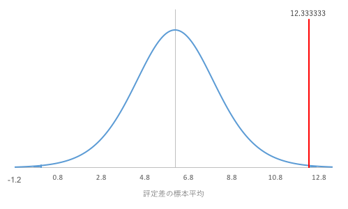

今回使うファイルです。ダウンロードしてください。必要に応じてご利用ください。（ダウンロード後、ファイルが保護ビューで開かれた場合は、[編集を有効にする]をクリックしてください。）
<ul>
<li><a href="04_1.csv">[練習問題1]東京と愛媛のみかん5kgあたりの価格（円）(04_1.csv)</a></li>
</ul>

母平均の差に関する検定と推定
----------------------------

2つのグループのデータ（2つの<a href="../02/#sample">標本</a>）は、対応のないデータと対応のあるデータの2つの場合に分けることができます。2グループの母<a href="../01/#mean">平均</a>の差に関する検定や推定を行う場合、この対応の有無が重要になってきます。どちらなのか注意しましょう。

### 対応のないデータ

一方のグループのデータが他方のグループのデータとは無関係な場合のデータです。グループ内のデータの順番を入れ替えることができます。

例：2つの病棟間の最高血圧、2つのクラスの得点など

この対応のないデータの場合は、まず、2つの母集団の<a href="../01/#variance">分散</a>（母分散）同士が等しいと仮定できるか確認する、等分散性（homogeneity of variance）の検定を行います。その後、母<a href="../01/#mean">平均</a>に関する検定や推定を行いますが、等分散性を仮定できるか否かで用いる検定・推定法が異なります。

- 等分散を仮定する（Studentの$t$検定）
    - 2つの母平均の差に関する検定
    - 2つの母平均の差の推定
-  等分散を仮定しない（Welchの$t$検定）
    - 2つの母平均の差に関する検定
    - 2つの母平均の差の推定（省略）

### 対応のあるデータ

一方のグループのデータと他方のグループのデータとがペアになっている場合のデータです。グループ内のデータの順番を入れ替えることができません。

例：同一人物の最高血圧と最低血圧、同一人物の前期と後期の得点など

この対応のあるデータの場合は、<a href="#homogeneity_of_variance_test">等分散性の検定</a>を行わず、最初から母<a href="../01/#mean">平均</a>に関する検定と推定とを行うことができます。

- ２つの母平均の差に関する検定
- ２つの母平均の差の推定

等分散を仮定したときの2つの母平均の差の検定（対応のないデータ）
---------------------------------------------------------------

### 練習問題1

東京と愛媛のみかんの価格について調べたところ、以下のような<a href="../02/#sample">標本</a>が得られました。東京と愛媛ではみかん5kgあたりの価格の<a href="../01/#mean">平均</a>に差があるといえるでしょうか。

　<a href="04_1.csv">[練習問題1]東京と愛媛のみかん5kgあたりの価格（円）(04_1.csv)</a>　

### 仮説の設定

* <a href="../02/#null_hypothesis">帰無仮説</a>H0：東京と愛媛では価格の<a href="../01/#mean">平均</a>に差がない（$\mu_\text{A} = \mu_\text{B}$）
* <a href="../02/#alternative_hypothesis">対立仮説</a>H1：東京と愛媛では価格の平均に差がないとは言えない（$\mu_\text{A} \ne \mu_\text{B}$）

ここで、$\mu_\text{A}$は東京のみかん5kgあたりの価格を<a href="../02/#population">母集団</a>とする母平均、$\mu_\text{B}$は愛媛のみかん5kgあたりの価格を母集団とする母平均です。

なお、後の<a href="#chapter9">検定統計量$t$の算出</a>では、東京の<a href="../02/#sample_mean">標本平均</a>$\overline{x}\_\text{A}$と愛媛の標本平均$\overline{x}\_\text{B}$との差$\overline{x}\_\text{A} - \overline{x}\_\text{B}$を<a href="../02/#standardization">標準化</a>して$t$を求めます。そのため、$\mu_\text{A}$と$\mu_\text{B}$とを2つの値として扱うのではなく、$\mu_\text{A}$と$\mu_\text{B}$との差である$\mu_\text{A} - \mu_\text{B}$を1つの値として扱います。したがって、仮説を

* 帰無仮説H0：$\mu_\text{A} - \mu_\text{B} = 0$
* 対立仮説H1：$\mu_\text{A} - \mu_\text{B} \ne 0$

と表すほうが理解しやすいかもしれません。

### 有意水準$\alpha$の設定

<a href="../04/#chapter1">有意水準</a>$\alpha$ = 0.05とします。

### 共通分散$V_\text{AB}$の算出

東京の<a href="../02/#population">母集団</a>が<a href="../01/#mean">平均</a>$\mu_\text{A}$、<a href="../01/#standard_deviation">標準偏差</a>$\sigma_\text{A}$の<a href="../02/#normal_distribution">正規分布</a>に従い、愛媛の母集団が平均$\mu_\text{B}$、標準偏差$\sigma_\text{B}$の正規分布に従うとすると、<a href="#difference"><q cite="#difference">東京の標本平均$\overline{x}\_\text{A}$と愛媛の標本平均$\overline{x}\_\text{B}$との差$\overline{x}\_\text{A} - \overline{x}\_\text{B}$</q></a>は、平均$\mu_\text{A} - \mu_\text{B}$、標準偏差
$\displaystyle \sqrt{\frac{\sigma_\text{A}^2}{N_\text{A}} + \frac{\sigma_\text{B}^2}{N_\text{B}}}$
の正規分布に従うことがわかっています。
ここで、等分散性が成立し（$\sigma_\text{A}^2 = \sigma_\text{B}^2$）、
かつ、<a href="../02/#null_hypothesis">帰無仮説</a>（$\mu_\text{A} - \mu_\text{B} = 0$）の下では、
$\displaystyle \overline{x}\_\text{A} - \overline{x}\_\text{B}$
は平均0、分散
$\displaystyle \sqrt{\sigma^2 \left( \frac{1}{N_\text{A}} + \frac{1}{N_\text{B}} \right)}$
の正規分布に従うことになります。

なお、$\sigma^2$は$\sigma^2 = \sigma_\text{A}^2 = \sigma_\text{B}^2$であるような値です。
したがって、検定にあたっては<a href="../02/#standardization">標準化</a>した
$\displaystyle z = \frac{\overline{x}\_\text{A} - \overline{x}\_\text{B}}{\displaystyle \sqrt{\sigma^2 \left( \frac{1}{N_\text{A}} + \frac{1}{N_\text{B}} \right)}}$
を考えることになります。

しかし、$\sigma^2$も$\sigma_\text{A}^2$も$\sigma_\text{B}^2$も未知なので、<a href="../02/#sample">標本</a>から求める<a href="../01/#variance">不偏分散</a>Vで代用することになり、その結果、標準化した値は<a href="../02/#student_s_t-distribution">$t$分布</a>に従うことになります。さらに、算出できる不偏分散は、東京の標本から求めた不偏分散$V_\text{A}$と愛媛の標本から求めた不偏分散$V_\text{B}$の2つで、必ずしも$V_\text{A} = V_\text{B}$が成立するとは限りません。そこで、$V_\text{A}$と$V_\text{B}$との平均とも言うべき共通分散$V_\text{AB}$を算出することになります。

共通分散$V_\text{AB}$は、東京の標本の<a href="../01/#sum_of_squared_deviations">偏差平方和</a>$S_\text{A}$と愛媛の標本の偏差平方和$S_\text{B}$との和を、不偏分散$V_\text{A}$の自由度$\phi_\text{A}$と不偏分散$V_\text{B}$の自由度$\phi_\text{B}$との和$\phi$で割る、すなわち、以下の数式で求めることができます。
$\displaystyle V_\text{AB} = \frac{S_\text{A} + S_\text{B}}{\phi}$

* $\displaystyle S_\text{A} = \sum_{i=1}^{N_\text{A}} {\left( x_{\text{A}i} - \overline{x}\_\text{A} \right)}^2$
* $\displaystyle S_\text{B} = \sum_{j=1}^{N_\text{B}} {\left( x_{\text{B}j} - \overline{x}\_\text{B} \right)}^2$
* $x_{\text{A}i}$：東京の標本の$i$番目の測定値
* $x_{\text{B}j}$：愛媛の標本の$j$番目の測定値
* $\overline{x}\_\text{A}$：東京の標本平均
* $\overline{x}\_\text{B}$：愛媛の標本平均
* $\phi = \phi_\text{A} + \phi_\text{B}$：共通分散$V$の自由度
* $\phi_\text{A} = N_\text{A} - 1$
* $\phi_\text{B} = N_\text{B} - 1$
* $N_\text{A}$：東京の<a href="../01/#sample_size">標本の大きさ</a>
* $N_\text{B}$：愛媛の標本の大きさ

### 検定統計量$t$値の算出

以下の数式で<a href="../02/#test_statistic">検定統計量</a>$t$値を求めます。
$\displaystyle t = \frac{\overline{x}\_\text{A} - \overline{x}\_\text{B}}{\sqrt{V_\text{AB} \left( \frac{1}{N_\text{A}} + \frac{1}{N_\text{B}} \right)}}$
ここで、$\overline{x}\_\text{A}$は東京の<a href="../02/#sample_mean">標本平均</a>、$\overline{x}\_\text{B}$は愛媛の標本平均、$V_\text{AB}$は<a href="chapter8">共通分散</a>、$N_\text{A}$はＡ組の<a href="../01/#sample_size">標本の大きさ</a>、$N_\text{B}$はＢ組の標本の大きさです。なお、この検定統計量$t$値は自由度$\phi$の<a href="../02/#student_s_t-distribution">$t$分布</a>に従うことがわかっています。

### $p$値の算出

<a href="../04/#chapter1">有意水準</a>と比較する確率$p$値を求めます。$p$値は、自由度$\phi$の<a href="../02/#student_s_t-distribution">$t$分布</a>において、$-t$未満の値が発生する確率と$t$より大きい値が発生する確率との和です。

### 判定

<dl>
 	<dt><a href="#p_of_t">$p$値</a> ≦ <a href="../04/#chapter1">有意水準</a>$\alpha$</dt>
 	<dd><a href="../02/#null_hypothesis">帰無仮説</a>H0を棄却する</dd>
 	<dt>$p$値 &gt; 有意水準$\alpha$</dt>
 	<dd>帰無仮説H0を受容する</dd>
</dl>

### Rの操作

Rを使って、<a href="#chapter5">練習問題1</a>に取り掛かりましょう。

&#9312; 東京のみかんの価格と愛媛のみかんの価格との間には<a href="#chapter2">対応がない</a>ので、まず<a href="#homogeneity_of_variance_test">等分散性の検定</a>を行います。<a href="../levene_s_test/">ここ</a>を参照して等分散性の検定を行ってください。すでにデータを入力してある　<a href="04_1.csv">[練習問題1]東京と愛媛のみかん5kgあたりの価格（円）(04_1.csv)</a>　を利用しても構いません。

##### コード

<pre class="Rcode">
#データの読み込み  
data04_1<- read.csv("04_1.csv")  
#等分散かどうか  
var.test(data04_1$東京,data04_1$愛媛)  
</pre>

##### 結果

<pre class="Rres">
	F test to compare two variances

data:  data04_1$東京 and data04_1$愛媛
F = 1.0648, num df = 19, denom df = 19, p-value = 0.8926
alternative hypothesis: true ratio of variances is not equal to 1
95 percent confidence interval:
 0.4214555 2.6901313
sample estimates:
ratio of variances 
          1.064787 
</pre>

$p$値 = 0.8926 &lt; <a href="../04/#chapter1">有意水準</a>$\alpha$ = 0.05より、帰無仮説は棄却されません。つまり、東京と愛媛のみかんの価格は、等分散ではないとは言えません。よって、この後は等分散を仮定したt検定を行います。

 

&#9313; 等分散性の検定を行った結果、等分散性であることがわかったので、<a href="#student_s_t-test">Studentの$t$検定</a>を行います。

##### コード

<pre class="Rcode">
#studentの t 検定  
t.test(data04_1$東京,data04_1$愛媛,var=T)
</pre>

##### 結果

<pre class="Rres">
Two Sample t-test

data:  data04_1$東京 and data04_1$愛媛
t = -2.8796, df = 38, p-value = 0.006507
alternative hypothesis: true difference in means is not equal to 0
95 percent confidence interval:
 -2035.6907  -355.0093
sample estimates:
mean of x mean of y 
  4606.40   5801.75 
</pre>
 

#### 結果

<a href="#p_of_t">$p$値</a> = 0.006507が求まりました。下図の塗りつぶされた領域が全体に対してpの割合になっています。

設定した<a href="../04/#chapter1">有意水準</a>$\alpha$は0.05であるので、$p$値 = 0.006507 &lt; 有意水準$\alpha$ = 0.05となり、<a href="../02/#null_hypothesis">帰無仮説</a>H0は棄却されます。したがって、東京と愛媛でみかんの価格の母<a href="../01/#mean">平均</a>には差があると判断します。
 

### 等分散を仮定したときの2つの母平均の差の推定（対応のないデータ）

母<a href="../01/#mean">平均</a>の差$\mu_\text{A} - \mu_\text{B}$について<a href="../02/#interval_estimation">区間推定</a>する場合、母平均の差$\mu_\text{A} - \mu_\text{B}$の(1 - $\alpha$) × 100%<a href="../02/#confidence_interval">信頼区間</a>は以下の式で与えられます。

$\displaystyle (\overline{x}_A-\overline{x}_B)-t(\phi,\alpha)\sqrt{V(\frac{1}{n_A}+\frac{1}{n_B})}<\mu_A-\mu_B<(\overline{x}_A-\overline{x}_B)+t(\phi,\alpha)\sqrt{V(\frac{1}{n_A}+\frac{1}{n_B})}$

<a href="#chapter5">練習問題1</a>のＡ組の母<a href="../01/#mean">平均</a>とＢ組の母平均との差$\mu_\text{A} - \mu_\text{B}$が取り得る範囲について、95%<a href="../02/#confidence_interval">信頼区間</a>で考えてみましょう。

#### 結果

Studentの$t$検定の実行結果から、東京の母<a href="../01/#mean">平均</a>と愛媛の母平均との差$\mu_\text{A} - \mu_\text{B}$の95%<a href="../02/#confidence_interval">信頼区間</a>は-2035.6907 &lt; $\mu_\text{A} - \mu_\text{B}$ &lt; -355.0093と求まりました。<a href="../02/#lower_confidence_limit">下側信頼限界</a>は-2035.6907、<a href="../02/#upper_confidence_limit">上側信頼限界</a>は-355.0093で、下図の塗りつぶされた領域が全体の95%になっています。

等分散を仮定しないときの2つの母平均の差の検定・推定（対応のないデータ）
-----------------------------------------------------------------------

等分散を仮定しないときは、検定のみ説明し、推定に関しては省略します。

### 練習問題2

ある学校のＣ組とＤ組のテスト結果について調べたところ、以下のような<a href="../02/#sample">標本</a>が得られました。Ｃ組とＤ組ではクラスの<a href="../01/#mean">平均</a>点に差があるといえるでしょうか。



### 仮説の設定

* <a href="../02/#null_hypothesis">帰無仮説</a>H0：Ｃ組とＤ組では<a href="../01/#mean">平均</a>点に差がない（$\mu_\text{C} = \mu_\text{D}$）
* <a href="../02/#alternative_hypothesis">対立仮説</a>H1：Ｃ組とＤ組では平均点に差がないとは言えない（$\mu_\text{C} \ne \mu_\text{D}$）

ここで、$\mu_\text{C}$はＣ組全員のテスト結果を<a href="../02/#population">母集団</a>とする母平均、$\mu_\text{D}$はＤ組全員のテスト結果を母集団とする母平均です。

なお、<a href="#chapter4">等分散を仮定したとき</a>と同様に、<a href="#chapter21">検定統計量$t$値の算出（Welchの$t$検定）</a>では、Ｃ組の<a href="../02/#sample_mean">標本平均</a>$\overline{x}\_\text{C}$とＤ組の標本平均$\overline{x}\_\text{C}$との差$\overline{x}\_\text{C} - \overline{x}\_\text{D}$を扱います。同様に、<a href="#chapter6">2つの母平均を扱うのではなく、差を1つの値として扱う</a>ので、ここでも

* 帰無仮説H0：$\mu_\text{C} - \mu_\text{D} = 0$
* 対立仮説H1：$\mu_\text{C} - \mu_\text{D} \ne 0$

と表すほうが理解しやすいかもしれません。

### 有意水準$\alpha$の設定

<a href="../04/#chapter1">有意水準</a>$\alpha$ = 0.05とします。

### 検定統計量$t$値の算出（Welchの$t$検定）

以下の数式で<a href="../02/#test_statistic">検定統計量</a>$t$値を求めます。

$\displaystyle t_0=\frac{\overline{x}\_C-\overline{x}\_D}{\sqrt{\frac{V_C}{n_C}+\frac{V_D}{n_D}}}$

<a href="#chapter4">等分散を仮定したとき</a>と同様に、Ｃ組の<a href="../02/#population">母集団</a>が<a href="../01/#mean">平均</a>$\mu_\text{C}$、<a href="../01/#standard_deviation">標準偏差</a>$\sigma_\text{C}$の<a href="../02/#normal_distribution">正規分布</a>に従い、Ｄ組の母集団が平均$\mu_\text{D}$、標準偏差$\sigma_\text{D}$の正規分布に従うとすると、Ｃ組の<a href="../02/#sample_mean">標本平均</a>$\overline{x}\_\text{C}$とＤ組の標本平均$\overline{x}\_\text{C}$との差$\overline{x}\_\text{C} - \overline{x}\_\text{D}$は、平均$\mu_\text{C} - \mu_\text{D}$、標準偏差

$\displaystyle \sqrt{\frac{\sigma_\text{C}^2}{N_\text{C}} + \frac{\sigma_\text{D}^2}{N_\text{D}}}$

の正規分布に従うことがわかっています。ここで、<a href="../02/#null_hypothesis">帰無仮説</a>の下（$\mu_\text{C} - \mu_\text{D} = 0$）では、$\overline{x}\_\text{C} - \overline{x}\_\text{D}$は平均0、標準偏差

$\displaystyle \sqrt{\frac{\sigma_\text{C}^2}{N_\text{C}} + \frac{\sigma_\text{D}^2}{N_\text{D}}}$

の正規分布に従うことになり、検定にあたっては<a href="../02/#standardization">標準化</a>した

$\displaystyle z=\frac{\overline{x}_C-\overline{x}_D}{\sqrt{\frac{\sigma_C^2}{N_C}+\frac{\sigma_D^2}{N_D}}}$

を考えることになります。しかし、母<a href="../01/#variance">分散</a>$\sigma_\text{C}^2$、$\sigma_\text{D}^2$は未知なので、<a href="#t">上の
$t$
の式</a>ではそれぞれ<a href="../01/#variance">不偏分散</a>$V_\text{C}$、$V_\text{D}$を用いています。なお、<a href="#welch_s_t-test">Welchの$t$検定</a>では、この検定統計量$t$が<a href="#chapter22"> 等価自由度$\phi^*$ </a>の<a href="../02/#student_s_t-distribution">$t$分布</a>に近似的に従うことがわかっています。

### 等価自由度$\phi^*$の算出

以下の数式で、等価自由度$\phi^*$を求めます。

$\displaystyle \phi^* = \frac{\displaystyle {\left( \frac{V_\text{C}}{N_\text{C}} + \frac{V_\text{D}}{N_\text{D}} \right)}^2}{\displaystyle \frac{V_\text{C}}{N_\text{C}^2} \frac{V_\text{C}}{\phi_\text{C}} + \frac{V_\text{D}}{N_\text{D}^2} \frac{V_\text{D}}{\phi_\text{D}}}$

* $V_\text{C}$：Ｃ組の<a href="../01/#variance">不偏分散</a>
* $V_\text{D}$：Ｄ組の不偏分散
* $N_\text{C}$：Ｃ組の<a href="../01/#sample_size">標本の大きさ</a>
* $N_\text{D}$：Ｄ組の標本の大きさ
* $\phi_\text{C} = N_\text{C} - 1$：Ｃ組の不偏分散の自由度
* $\phi_\text{D} = N_\text{D} - 1$：Ｄ組の不偏分散の自由度

### $p$値の算出

<a href="../04/#chapter1">有意水準</a>と比較する確率$p$値を求めます。$p$値は、自由度$\phi^*$の<a href="../02/#student_s_t-distribution">$t$分布</a>において、$-t$未満の値が発生する確率と$t$より大きい値が発生する確率との和です。

### 判定

<dl>
 	<dt><a href="#p_of_t">$p$値</a> ≦ <a href="../04/#chapter1">有意水準</a>$\alpha$</dt>
 	<dd><a href="../02/#null_hypothesis">帰無仮説</a>H0を棄却する</dd>
 	<dt>$p$値 &gt; 有意水準$\alpha$</dt>
 	<dd>帰無仮説H0を受容する</dd>
</dl>

### Rの操作

Rを使って、<a href="#chapter18">練習問題2</a>に取り掛かりましょう。

&#9312; Ｃ組のテスト結果とＤ組のテスト結果との間には<a href="#chapter2">対応がない</a>ので、まず<a href="#homogeneity_of_variance_test">等分散性の検定</a>を行います。<a href="../levene_s_test/">ここ</a>を参照して等分散性の検定を行ってください。

##### コード

<pre class="Rcode">
# データの読み込み
C<-c(27,98,48,74,91,8,88,78,93,30,72)
D<-c(32,62,29,45,42,56,21,24,32)
# 等分散かどうか
var.test(C,D)
</pre>

##### 結果

<pre class="Rres">
F test to compare two variances

data:  C and D
F = 4.7805, num df = 10, denom df = 8, p-value = 0.03648
alternative hypothesis: true ratio of variances is not equal to 1
95 percent confidence interval:
  1.112996 18.428150
sample estimates:
ratio of variances 
           4.78046 
</pre>
 

&#9313; 等分散性の検定を行った結果、$p$ = 0.03648 ≦ <a href="../04/#chapter1">有意水準</a>$\alpha$ = 0.05となり、等分散性でないことがわかったので、<a href="#welch_s_t-test">Welchの$t$検定</a>を行います。

##### コード

<pre class="Rcode">
# Welchの t 検定
t.test(C, D,var=F)
</pre>

##### 結果

<pre class="Rres">
Welch Two Sample t-test

data:  C and D
t = 2.502, df = 14.576, p-value = 0.0248
alternative hypothesis: true difference in means is not equal to 0
95 percent confidence interval:
  3.817696 48.505536
sample estimates:
mean of x mean of y 
 64.27273  38.11111 
</pre>
 

#### 結果

<a href="#p_of_t">$p$値</a> = 0.0248が求まりました。 よって、$p$値 = 0.0248 &lt; <a href="../04/#chapter1">有意水準</a>$\alpha$ = 0.05であるので、Ｃ組とＤ組では点数の母<a href="../01/#mean">平均</a>に違いがあると判断されたことになります。下図の塗りつぶされた領域が全体に対してpの割合になっています。

2つの母平均の差の検定（対応のあるデータ）
-----------------------------------------

### 練習問題3

次のデータは、あるパーソナルジムにおける、受講生15人の入会前と入会後（入会から１年後）の体重を示したものです。入会後の体重は、入会前の体重よりも減っていると考えられるでしょうか。



### 仮説の設定

* <a href="../02/#null_hypothesis">帰無仮説</a>H0：入会後と入会前では、体重の<a href="../01/#mean">平均</a>に差がない（$\mu_\text{A} = \mu_\text{B}$）
* <a href="../02/#alternative_hypothesis">対立仮説</a>H1：入会後と入会前では、体重の平均に差がないとは言えない（$\mu_\text{A} \ne \mu_\text{B}$）

ここで、$\mu_\text{A}$はあるパーソナルジムにおける受講生全員の入会前の体重を<a href="../02/#population">母集団</a>とする母平均、$\mu_\text{B}$はあるパーソナルジムにおける受講生全員の入会後の体重を母集団とする母平均です。

なお、後の<a href="#chapter31">各ペアの差の算出</a>では、<i>i</i>番目の受講生の入会前の体重<i>x</i>A<i>i</i>と入会後の体重<i>x</i>B<i>i</i>を2つの値として扱うのではなく、両者の差<i>x</i>B<i>i</i> - <i>x</i>A<i>i</i>を1つの値として扱います。すなわち、<a href="#chapter2">対応のないデータ</a>（<a href="#chapter4">等分散を仮定したとき</a>、<a href="#chapter17">等分散を仮定しないとき</a>）のように、<a href="#chapter6">2つの母平均を扱うのではなく、差を1つの値として扱う</a>ことになるため、仮説を

* 帰無仮説H0：$\mu_\text{B} - \mu_\text{A} = 0$
* 対立仮説H1：$\mu_\text{B} - \mu_\text{A} \ne 0$

と表すほうが理解しやすいかもしれません。

### 有意水準$\alpha$の設定

<a href="../04/#chapter1">有意水準</a>$\alpha$ = 0.05とします。

### 各ペアの差の算出

入会前の体重と入会後の体重を1つのペアとして扱います。

<i>d</i><i>i</i><i></i> = <i>x</i>B<i>i</i> - <i>x</i>A<i>i</i>

この式から、各ペアの差を求めます。ここで、<i>x</i>A<i>i</i>は<i>i</i>番目の受講生の入会前の体重、<i>x</i>B<i>i</i>は同じ受講生の入会後の体重であり、<i>d</i><i>i</i>は同じ受講生の入会前の体重と入会後の体重との差になります。さらに、差<i>d</i><i>i</i>を<a href="../02/#sample">標本</a>として、その<a href="../01/#mean">平均</a>$\overline{d}$と<a href="../01/#variance">不偏分散</a>$V_d$との算出を行います。

### 検定統計量$t$値の算出

今回は、以下の式で<a href="../02/#test_statistic">検定統計量</a>$t$値が求まります。

$\displaystyle t = \frac{\overline{d}}{\sqrt{\frac{V_d}{N_d}}}$

ここで、$\overline{d}$はペアごとの差<i>d</i><i>i</i>の<a href="../01/#mean">平均</a>、$V_d$はペアごとの差<i>d</i><i>i</i>の<a href="../01/#variance">不偏分散</a>、$N_d$はペアの<a href="../01/#sample_size">標本の大きさ</a>です。

$\overline{d}$は、平均$\mu_\text{B} - \mu_\text{A}$、<a href="../01/#standard_deviation">標準偏差</a>
$\displaystyle \sqrt{\frac{\sigma_d^2}{N_d}}$
の<a href="../02/#normal_distribution">正規分布</a>に従うことがわかっています。ここで$\sigma_d^2$は、あるパーソナルジムにおける受講生の入会前の体重と入会後の体重との差を<a href="../02/#population">母集団</a>とする母<a href="../01/#variance">分散</a>です。<a href="../02/#null_hypothesis">帰無仮説</a>（$\mu_\text{B} - \mu_\text{A} = 0$）下では、平均0、標準偏差
$\displaystyle \sqrt{\frac{\sigma_d^2}{N_d}}$
の正規分布に従うことになりますが、$\sigma_d^2$は未知です。そこで、代わりに不偏分散$V_d$を用いて、かつ、<a href="../02/#standardization">標準化</a>した$t$を考えると、自由度$\phi_d = N_d - 1$の<a href="../02/#student_s_t-distribution">$t$分布</a>に従うことがわかっています。

### $p$値の算出

<a href="../04/#chapter1">有意水準</a>と比較する確率$p$値を求めます。 $p$値は、自由度$\phi_d$の<a href="../02/#student_s_t-distribution">$t$分布</a>において、$-t$未満の値が発生する確率と$t$より大きい値が発生する確率との和です。

### 判定

<dl>
 	<dt><a href="#p_of_t_d">$p$値</a> ≦ <a href="../04/#chapter1">有意水準</a>$\alpha$</dt>
 	<dd><a href="../02/#null_hypothesis">帰無仮説</a>H0を棄却する</dd>
 	<dt>$p$値 &gt; 有意水準$\alpha$</dt>
 	<dd>帰無仮説H0を受容する</dd>
</dl>

### Rの操作

Rを使って、<a href="#chapter28">練習問題3</a>に取り掛かりましょう。

&#9312; <a href="#table3">表3</a>のデータをRに入力します。

##### コード

<pre class="Rcode">
#データの読み込み  
before<-c(68,77,54,80,118,84,82,69,97,76,94,50,81,98,66)  
after<-c(64,64,41,74,112,71,70,66,80,72,90,44,72,91,47)  
</pre>
 

&#9313; 対応のあるT検定を行います。

##### コード

<pre class="Rcode">
#対応のあるT検定  
t.test(before,after,paired=TRUE)  
</pre>

##### 結果

<pre class="Rres">
	Paired t-test

data:  before and after
t = 6.8967, df = 14, p-value = 7.362e-06
alternative hypothesis: true mean difference is not equal to 0
95 percent confidence interval:
  6.247064 11.886269
sample estimates:
mean difference 
       9.066667 
</pre>
 

#### 結果

<a href="#p_of_t_d">$p$値</a> = 7.362 x 10-6が求まりました。

下図の塗りつぶされた領域が全体に対してpの割合になっています。

よって、$p$値 = 7.362 x 10-6 &lt; <a href="../04/#chapter1">有意水準</a>$\alpha$ = 0.05であるので、<a href="../02/#null_hypothesis">帰無仮説</a>H0は棄却されます。入会前の体重と入会後の体重の母平均とには有意差があることがわかり、

また、入会前の<a href="../02/#sample_mean">標本平均</a>$\overline{x}\_\text{A}$ = 62.58333で入会後の標本平均$\overline{x}\_\text{B}$ = 68.75であることから、後期試験の成績（Ｂ）は、前期試験の成績（Ａ）よりも向上していると判断できます。

### 2つの母平均の差の推定（対応のあるデータ）

母<a href="../01/#mean">平均</a>の差$\mu_\text{B} - \mu_\text{A}$について<a href="../02/#interval_estimation">区間推定</a>する場合、母平均の差$\mu_\text{A} - \mu_\text{B}$の(1 - $\alpha$) 100%<a href="../02/#confidence_interval">信頼区間</a>は以下の式で与えられます。

$\displaystyle \overline{d} - t_{\phi_d}(\alpha) \sqrt{ \frac{V_d}{N_d}} &lt; \mu_\text{B} - \mu_\text{A} &lt; \overline{d} + t_{\phi_d}(\alpha) \sqrt{ \frac{V_d}{N_d}}$

<a href="#chapter28">練習問題3</a>の入会前の体重の母<a href="../01/#mean">平均</a>と入会後の体重の母平均との差$\mu_\text{A} - \mu_\text{B}$が取り得る範囲について、95%<a href="../02/#confidence_interval">信頼区間</a>で考えてみましょう。

#### 結果

$t$検定の実行結果から、入会前の母<a href="../01/#mean">平均</a>と入会後の母平均との差$\mu_\text{B} - \mu_\text{A}$の95%<a href="../02/#confidence_interval">信頼区間</a>は6.247064 &lt; $\mu_\text{B} - \mu_\text{A}$ &lt; 11.886269と求まりました。<a href="../02/#lower_confidence_limit">下側信頼限界</a>は6.247064、<a href="../02/#upper_confidence_limit">上側信頼限界</a>は11.886269で、下図の塗りつぶされた領域が全体の95%になっています。

課題1
-------

Ａ、Ｂの両地方で収穫した同種の大豆のタンパク質の含有率を調べたところ、次の結果が得られました。 含有率の正規性を仮定して、地方差が認められるか、<a href="../04/#chapter1">有意水準</a>5％で検定してください。

表4：Ａ、Ｂ地方の大豆のタンパク質含有率（％）

課題2
-------

次のデータはＡ市内のあるレストランとＢ市内のあるレストランのアルバイトの時給を示しています。2地域のレストランのアルバイトの時給に差はあるでしょうか。<a href="../04/#chapter1">有意水準</a>5％で検定してください。

表5：Ａ市、Ｂ市のあるレストランのアルバイトの時給（円）

課題3
-------

次のデータは7人があるダイエット法によりダイエットを行った前後の体重を表しています。このダイエット法で体重の変化は見られたと言って良いでしょうか。<a href="../04/#chapter1">有意水準</a>5％で検定してください。また、2つの母<a href="../01/#mean">平均</a>の差を<a href="../02/#confidence_coefficient">信頼係数</a>95％で<a href="../02/#section4.1">区間推定</a>してください。

表6：あるダイエット法の前後の体重(kg)

