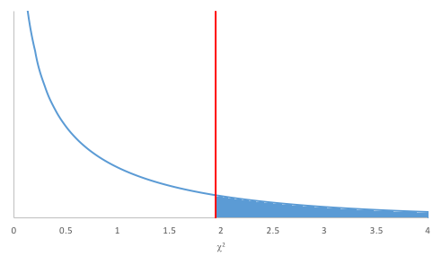

今回使うファイルです。ダウンロードしてください。必要に応じてご利用ください。文字コードはUTF-8です。
<ul>
<li><a href="05_1.csv" download>[練習問題1]ウニとイクラのどちらが好きか(05_1.csv)</a></li>
<li><a href="05_3.csv" download>[練習問題3]好きな鍋の種類(05_3.csv)</a></li>
</ul>

有意水準について
----------------

例えば、2つの平均値の差を検討する場合、まず「2つの母平均に差はない」と仮定を立てます。これを帰無仮説と呼んでいます。その後、標本から検定統計量（z値や$t$値など）を算出して、その検定統計量より大きな値が発生する確率$p$値を求めます。その際、その確率と比較する基準値を設けますが、これを有意水準（significance level）と呼んでいます。

<q cite="#p-value">求めた検定統計量より大きな値が発生する確率$p$値</q>がこの有意水準よりも小さいとき、2つの母集団から抽出された標本の平均（標本平均）の差が偶然生じたわけではなく、まれなことが起こった、すなわち統計的に有意なことが起こったと考え、帰無仮説が誤りだったと考えます。したがって、この場合、帰無仮説は棄却され、2つの母平均に差はない<strong>とはいえない</strong>という結論に至ります。有意水準は、一般的には5％を用います。より小さな1％を用いる場合もあります。5％に比べて、1％の方が条件としてはよりシビアになります。

検定統計量より大きな値が発生する確率（出現確率）と有意水準との関係、その関係を論文に記すための表現をまとめると以下のようになります。



### 論文表現

論文中で、母平均の差に関する検定について書くとこのようになります。



> 表は、条件Ａと条件Ｂの平均および標準偏差を示したものである。$t$検定の結果、両条件の平均の差は有意であった（$t$(10) = 2.53, $p$ &lt; .05）。したがって、条件Ａより条件Ｂの方が優れた成績をあげるといえる。

ここで、$t$(10) = 2.53は、自由度が10の$t$分布に従う検定統計量$t$値が2.53であったことを示し、また、$p$ &lt; .05はt = 2.53に対応する$p$値が0.05未満であったことを示しています。

分割表（クロス集計表）の分析
----------------------------

### 分割表

分割表（contingency table）とは、縦横の各項目について、別々に考える表のことです。横方向に一塊の項目を行（row）と呼び、縦方向に一塊の項目を列（column）と呼びます。縦の項目がＬ個、横の項目がＭ個ある表のことをＬ行Ｍ列分割表と呼びます。簡単にＬ×Ｍ分割表と呼ぶこともあります。



例えば、男性1000人、女性1000人にラグビーとバレーのどちらが好きか聞いたとします。男性は600 人がラグビー、400人がバレーと答えました。女性は300がラグビー、700人がバレーと答えました。その回答を分割表にするとこのようになります。

性別とスポーツ競技との２行２列分割表

|  | ラグビー | バレー |
| -- | -- | -- |
| 男性 | 600 | 400 |
| 女性 | 300 | 700 |

これは縦に性別、横にスポーツ競技をとった２行２列分割表です。この表を見れば、男性と女性でどれだけの人数がラグビーを好きか、バレーを好きかがわかります。なお、この例のとおり、違いの元になると思われる条件（この例では性別）を行として、具体的に選択されるカテゴリーを列として、それぞれ配置することが一般的です。この場合、行に配置された条件を独立変数（independent variable）、列に配置されたカテゴリーを従属変数（dependent variable）と呼びます。あるいは、前者を説明変数（explanatory variable）、後者を目的変数（target variable）、と呼ぶこともあります。

また、分割表はクロス集計表（cross table）と言われることもあります。

### 練習問題1_1

10代25人、50代25人の合計50人に、ウニとイクラのどちらが好きかを調査しました。次のデータは、その結果です。このデータを集計し、分割表に整理しましょう。

データ  
<a href="05_1.csv" download>[練習問題1]ウニとイクラのどちらが好きか(05_1.csv)</a>　

 

### Rの操作

Rを使って、練習問題1_1に取り掛かりましょう。

&#9312; データをRに入力します。

##### コード

<pre class="Rcode">
# データの読み込み
data05_1 <- read.csv("05_1.csv")
</pre>
 

&#9313; 分割表を作成します。

##### コード

<pre class="Rcode">
#分割表の作成
table(data05_1$年代, data05_1$好み)
</pre>

##### 結果

<pre class="Rres">
     　　いくら  うに
  10代     15   10
  50代      6   19
</pre>

分割表の検定
------------

2行2列分割表

|  | B1 | B2 | 計 |
| -- | -- | -- | -- |
| A1 | $ a$ | $ b$ | $ l_1$ |
| A2 | $ c$ | $ d$ | $ l_2$ |
| 計 | $ m_1$ | $ m_2$ | $ N$ |

2行2列分割表は条件が異なる2つの母集団におけるカテゴリ間の比（母比）の違いで分析します。すなわち、検定で設定される仮説は以下のとおりです。

* 帰無仮説H0：カテゴリーB1とカテゴリーB2との度数の比は母集団A1と母集団A2とで等しい
* 対立仮説H1：カテゴリーB1とカテゴリーB2との度数の比は母集団A1と母集団A2とで等しくない

上の2行2列分割表では、

* 独立変数である条件A1における従属変数であるカテゴリーB1の度数：$ a$
* 独立変数である条件A1における従属変数であるカテゴリーB2の度数：$ b$
* 独立変数である条件A2における従属変数であるカテゴリーB1の度数：$ c$
* 独立変数である条件A2における従属変数であるカテゴリーB2の度数：$ d$

が実際に測定されたデータの度数になっています。一方、行周辺度数（row marginal frequency）$ l_1$、$ l_2$、列周辺度数（column marginal frequency）$ m_1$、$ m_2$、および、総計（grand total）$ N$から、

* 独立変数である条件A1における従属変数であるカテゴリーB1の期待値：$ l_1 \times m_1 \div N$
* 独立変数である条件A1における従属変数であるカテゴリーB2の期待値：$ l_1 \times m_2 \div N$
* 独立変数である条件A2における従属変数であるカテゴリーB1の期待値：$ l_2 \times m_1 \div N$
* 独立変数である条件A2における従属変数であるカテゴリーB2の期待値：$ l_2 \times m_2 \div N$

のように、期待値（theoretical frequency）を計算することもできます。分割表の検定は、実際に測定された度数とこれら期待値との関係を用いて行われます。ここで、この期待値の計算は、独立変数と従属変数とが互いに独立している前提の計算となっています。このことから分割表の検定を「独立性の検定」とも言います。

母比の差の検定と独立性の検定とは区別されることもあります。
あらかじめ定められた複数の母集団に対してそれぞれ標本を取得する場合は母比の差の検定、標本を取得した後に要因に基づいて分割する場合は独立性の検定と区別することがあります。

主な検定法に、ピアソンの$ \chi^2$検定（Pearson's $ \chi^2$-test）があります。

 

### 練習問題1_2

練習問題1_1のデータを用いて、10代と50代とで、ウニとイクラのどちらが好きかに違いがあるかどうか、検定してください。

### 仮説の設定

* 帰無仮説H0：10代と50代とで、ウニが好きな人とイクラが好きな人の比は同じである
* 対立仮説H1：10代と50代とで、ウニが好きな人とイクラが好きな人の比は同じではない

### 有意水準αの設定

有意水準α = 0.05とします。

### 検定統計量$ \chi^2$（カイじじょう）値の算出

以下の数式で検定統計量$ \chi^2$値を求めます。

$ \displaystyle \chi^2 = \frac{\{(ad - bc)\}^2 \times N}{l_1 \times l_2 \times m_1 \times m_2}$

帰無仮説H0、すなわち、<q>カテゴリーB1とカテゴリーB2との度数の比は母集団A1と母集団A2とで等しい</q>が成立する場合、独立変数と従属変数とは互いに独立です。この条件下では、

* 独立変数である条件A1における従属変数であるカテゴリーB1の度数と期待値との差：$ a - l_1 \times m_1 \div N$
* 独立変数である条件A1における従属変数であるカテゴリーB2の度数と期待値との差：$ b - l_1 \times m_2 \div N$
* 独立変数である条件A2における従属変数であるカテゴリーB1の度数と期待値との差：$ c - l_2 \times m_1 \div N$
* 独立変数である条件A2における従属変数であるカテゴリーB2の度数と期待値との差：$ d - l_2 \times m_2 \div N$

はすべて0になります。ここで、度数と期待値との差を
$ \displaystyle \chi^2 = \frac{\displaystyle {\left(a - \frac{l_1 m_1}{N} \right)}^2}{\displaystyle \frac{l_1 m_1}{N}} + \frac{\displaystyle {\left(b - \frac{l_1 m_2}{N} \right)}^2}{\displaystyle \frac{l_1 m_2}{N}} + \frac{\displaystyle {\left(c - \frac{l_2 m_1}{N} \right)}^2}{\displaystyle \frac{l_2 m_1}{N}} + \frac{\displaystyle {\left(d - \frac{l_2 m_2}{N} \right)}^2}{\displaystyle \frac{l_2 m_2}{N}}$
で表すとすると、検定統計量の式のように整理され、検定統計量$ \chi^2$は自由度1の$ \chi^2$分布（chi squared-distribution）に近似的に従うことがわかっています。

### $p$値の算出

有意水準と比較する確率$p$値を求めます。$p$値は、自由度1の$ \chi^2$分布において、検定統計量$ \chi^2$値より大きい値が発生する確率です。

### 判定



$ \chi^2$分布はこのようなグラフを描きます。 このグラフで、$p$値を表す面積が有意水準の確率を表す面積より大きいか小さいかで帰無仮説の棄却を決定します。なお、図のとおり、自由度によって、この$ \chi^2$分布のグラフは変わります。

<dl>
 	<dt>$p$値 ≤ 有意水準α</dt>
 	<dd>帰無仮説H0を棄却する</dd>
 	<dt>$p$値 &gt; 有意水準α</dt>
 	<dd>帰無仮説H0を受容する</dd>
</dl>

### Rの操作

Rを使って、練習問題1_2に取り掛かりましょう。

&#9312; 練習問題1_1において、データの読み込みと分割表の作成を終えていることとします。

&#9313; 分割表の検定を行います。

##### コード

<pre class="Rcode">
data05_1_matrix <- table(data05_1$年代, data05_1$好み)
#分割表の検定
chisq.test(data05_1_matrix, correct = F)
</pre>

##### 結果

<pre class="Rres">
Pearson's Chi-squared test

data:  data05_1_matrix
X-squared = 6.6502, df = 1, p-value = 0.009914
</pre>

### 結果

$p$値 = 0.009914が求まりました。下図の塗りつぶされた領域が全体に対してpの割合になっています。

$p$値 = 0.009914 &lt; 有意水準α = 0.05であるので、帰無仮説H0は棄却されます。よって、10代と50代とで、ウニが好きな人とイクラが好きな人の比は異なるといえます。

### 論文では

論文中では、このようになります。
> 表1に関して$ \chi^2$検定を行ったところ、有意差が認められた($ \chi^2$(1) = 6.6502, $p$ &gt; .05）。 よって、10代と50代とで、ウニが好きな人とイクラが好きな人の比は違いがあるといえる。

なお、$ \chi^2$(1) = 6.6502は、自由度1の$ \chi^2$分布において検定統計量$ \chi^2$値がであったことを示し、また、$p$ &gt; .05は$ \chi^2$ = 6.6502 に対応する$p$値が0.05より大きかったことを示しています。

フィッシャーの正確確率検定
-----------------------------------

これまで、分割表の検定にピアソンの$ \chi^2$検定を用いましたが、総計や期待値の値によっては<q cite="chi_squared-approximation">検定統計量$ \chi^2$は自由度1の$ \chi^2$分布（chi squared-distribution）に近似的に従う</q>わけではないため、ピアソンの$ \chi^2$検定を行うことが適切ではない場合もあります。例えば、

* 1未満の期待値が1つ以上ある
* 5未満の期待値が期待値の個数ＬＭの20%以上ある
* 総計が20以下

などの場合は、ピアソンの$ \chi^2$検定を行うことが適切ではないと言われています。

ピアソンの$ \chi^2$検定を行うことが適切ではない場合、フィッシャーの正確確率検定を用いて分割表の検定を行います。なお、ピアソンの$ \chi^2$検定を行うことが適切な場合でもフィッシャーの正確確率検定を行って構いません。

### 練習問題2

ある会社では、新薬Xを開発しています。現在の薬と開発中の新薬Xについて、効果に差があるかどうか調査を行いました。その結果を表にしたのが、次の表2です。開発中の新薬Xは、現在の薬より効果がある人の割合が高いと言えるか検定してください。

 
表2：現在の薬と新薬Xの効果（人）

<table>
  <tr>
    <th> </th>
    <th>現在の薬</th>
    <th>新薬X</th>
  </tr>
  <tr>
    <td>効果あり</td>
    <td>219</td>
    <td>18</td>
  </tr>
  <tr>
    <td>効果なし</td>
    <td>103</td>
	<td>2</td>
  </tr>
</table>

### 仮説の設定

* 帰無仮説H0：効果ありと効果なしとの人数の比は、現在の薬と新薬Xとで等しい
* 対立仮説H1：効果ありと効果なしとの人数の比は、現在の薬と新薬Xとで等しくない

### 有意水準αの設定

有意水準α = 0.05とします。

### 判定

p値が有意水準より大きいか小さいかで帰無仮説の受容か棄却かを決定します。
<dl>
 	<dt>p値 ≦ 有意水準α</dt>
 	<dd>帰無仮説H0を棄却する</dd>
 	<dt>p値 &gt; 有意水準α</dt>
 	<dd>帰無仮説H0を受容する</dd>
</dl>

### Rの操作

Rを使って、練習問題2に取り掛かりましょう。

&#9312; データをRに入力します。

##### コード

<pre class="Rcode">
data05_2 = matrix(c(219, 18, 103, 2), nrow=2, byrow=T)
</pre>  
`matrix`関数では、`nrow`で列数、 `byrow`で表に分割する向きを指定できます。  
（この関数でデータを表の形に整形しています。）

 

&#9313; フィッシャーの正確確率検定を行います。

##### コード

<pre class="Rcode">
fisher.test(data05_2)
</pre>

##### 結果

<pre class="Rres">
	Fisher's Exact Test for Count Data

data:  data05_2
p-value = 0.04468
alternative hypothesis: true odds ratio is not equal to 1
95 percent confidence interval:
 0.02617264 1.01983063
sample estimates:
odds ratio 
 0.2369815 
</pre>

### 結果

$p$値 = 0.04468 &lt; 有意水準α = 0.05であるので、帰無仮説H0は棄却されます。よって、現在の薬と新薬Xとで効果がある人の割合は異なるといえます。

Ｌ行Ｍ列分割表の検定
--------------------

### 練習問題3

20代、40代、60代に、好きな鍋の種類について調査を行いました。次のデータは、その結果です。20代、40代、60代で、好きな鍋の種類に違いがあるかどうか、検定してください。

データ  
<a href="05_3.csv" download>[練習問題3]好きな鍋の種類(05_3.csv)</a>　

 

### 検定の手順

Ｌ行Ｍ列分割表の検定には、2行2列分割表の検定と同様にピアソンの$ \chi^2$検定を用いることができます。

#### 仮説の設定

* 帰無仮説H0：好きな鍋の種類は、年代によらず同じである
* 対立仮説H1：好きな鍋の種類は、年代によって異なる

#### 有意水準αの設定

有意水準α = 0.05とします。

#### 検定統計量$ \chi^2$値の算出

今回、検定統計量$ \chi^2$は以下の数式で求まります。

$
\displaystyle \chi^2 = \sum_{i=1}^L\sum_{j=1}^M\frac{( f_{ij} - t_{ij})^2}{t_{ij}}
$

ここで、$ f_{ij}$は以下の表のとおり、Ｌ行Ｍ列分割表における$ i$行$ j$列の度数です。一方、$ t_{ij}$は$ f_{ij}$に対する期待値で、

$ \displaystyle t_{ij} = \frac{l_i m_j}{N}$

で与えられます。なお、L = 2、M = 2を代入し、展開すると2行2列分割表の場合の式になります。

|  | 項目B1 | 項目B2 | … | 項目Bj | … | 項目BM-1 | 項目BM| 計 |
| -- | -- | -- | -- | -- | -- | -- | --| -- |
| 項目A | $ f_{11}$ | $ f_{12}$ | … | $ f_{1j}$ | … | $ f_{1M-1}$ | $ f_{1M}$ | $ l_1$ |
| 項目A2 | $ f_{21}$ | $ f_{22}$ | … | $ f_{2j}$ | … | $ f_{2M-1}$ | $ f_{2M}$ | $ l_2$ |
| ⋮ | ⋮ | ⋮ | ⋱ | ⋮ | ⋱ | ⋮ | ⋮ | ⋮ |
| 項目Ai | $ f_{i1}$ | $ f_{i2}$ | … | $ f_{ij}$ | … | $ f_{iM-1}$ | $ f_{iM}$ | $ l_i$ |
| ⋮ | ⋮ | ⋮ | ⋱ | ⋮ | ⋱ | ⋮ | ⋮ | ⋮ |
| 項目AL-1 | $ f_{L-11}$ | $ f_{L-12}$ | … | $ f_{L-1j}$ | … | $ f_{L-1M-1}$ | $ f_{L-1M}$ | $ l_{L-1}$ |
| 項目AL | $ f_{L1}$ | $ f_{L2}$ | … | $ f_{Lj}$ | … | $ f_{LM-1}$ | $ f_{LM}$ | $ l_L$ |
| 計 | $ m_1$ | $ m_2$ | … | $ m_j$ | … | $ m_{M-1}$ | $ m_M$ | $ N$ |

#### 自由度の算出

また、検定統計量$ \chi^2$は自由度φの$ \chi^2$分布に従うことがわかっています。自由度φは以下の式で求まります。
φ = (L - 1)×(M - 1)
2行2列分割表の場合、<q cite="../04/#chapter12">検定統計量$ \chi^2$は自由度1の$ \chi^2$分布に近似的に従うことがわかっています</q>が、これも上式にL = 2、M = 2を代入した結果に一致します。

#### $p$値の算出

有意水準と比較する$p$値を求めます。$p$値は、自由度φの$ \chi^2$分布において、検定統計量$ \chi^2$値より大きい値が発生する確率です。

#### 判定



自由度φ = 6の$ \chi^2$分布はこのようなグラフを描きます。このグラフで、$p$値を表す面積が有意水準の確率を表す面積より大きいか小さいかで帰無仮説の棄却を決定します。

<dl>
 	<dt>$p$値 ≤ 有意水準α</dt>
 	<dd>帰無仮説H0を棄却する</dd>
 	<dt>$p$値 &gt; 有意水準α</dt>
 	<dd>帰無仮説H0を受容する</dd>
</dl>

### Rの操作

Rを使って、練習問題3に取り掛かりましょう。

&#9312; データをRに入力します。

##### コード

<pre class="Rcode">
# データの読み込み
data05_3<-read.csv("05_3.csv")
</pre>

分割表を作成します。

##### コード

<pre class="Rcode">
#L行M列分割表の作成
table(data05_3$年代, data05_3$鍋)
</pre>

##### 結果

<pre class="Rres">
         キムチ   すき焼き  よせ鍋
  20代     36       36     36
  40代     44       44     24
  60代      8       48     28
</pre>
 

&#9314; L行M列分割表の検定を行います。

##### コード

<pre class="Rcode">
data05_3_matrix <- table(data05_3$年代, data05_3$鍋)
#L行M列分割表の検定
chisq.test(data05_3_matrix, correct = F)
</pre>

##### 結果

<pre class="Rres">
Pearson's Chi-squared test

data:  data05_3_matrix
X-squared = 25.96, df = 4, p-value = 3.223e-05
</pre>

### 結果

$p$値 = 3.223×10-05が求まりました。  
 
$p$値 = 3.223×10-05 &lt; 有意水準α = 0.05 なので、帰無仮説H0は棄却されます。 よって、鍋の種類の好みは年代によって異なるといえます。

### 論文では

論文では以下のような文章になります。

> $ \chi^2$検定を行ったところ、有意差が認められた（$ \chi^2$(4) = 25.96, $p$ &lt; .05）。よって、鍋の種類の好みは年代によって異なるといえる。

課題1
------

次の表は、2つのメーカーのデジタルカメラの5年後の状況を追跡調査した結果です。Ａ社、Ｂ社それぞれに使用ができなくなったカメラが存在しています。どちらのメーカーのデジタルカメラを購入したほうが長持ちする傾向があるのでしょうか、有意水準5％で検定しなさい。ただし、不良品や事故により壊れた台数は除いてあります。

表4：5年後のデジタルカメラの使用状況（個）

|  | ５年後使用可（個） | ５年後使用不可（個） | 計 | 
| -- | -- | -- | -- |
| Ａ社 | 10533 | 31 | 10564 |
| Ｂ社 | 8896 | 167 | 9063 |
| 計 | 19429 | 198 | 19627 |

