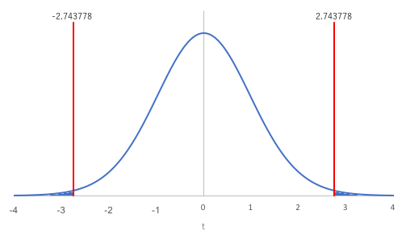
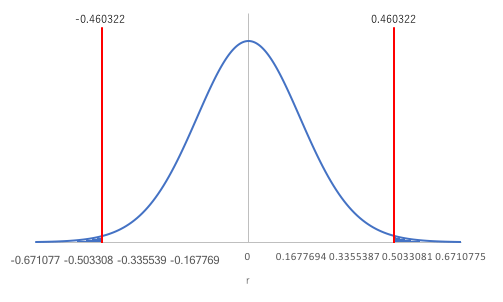

今回使うファイルです。必要に応じてご利用ください。文字コードはUTF-8です。 
<ul>
<li><a href="06.csv" download>ある小学校の児童30人の身長、体重(06.csv)</a></li>
</ul>

相関分析
--------

### 相関関係

2つの変数$ x$と$ y$があるときに、$ x$の変化に伴って$ y$も変化するような関係を「相関関係（correlation）」といいます。相関関係を調べるには散布図や相関係数を用います。相関関係は正の相関関係と負の相関関係、無相関に分けられます。この正負は後で述べる相関係数によって決まります。
<dl>
 	<dt id="positive_correlation">正の相関関係（positive correlation）</dt>
 	<dd>$ x$が増加していったとき、$ y$も増加している。$ x$と$ y$が比例している関係。</dd>
 	<dt id="negative_correlation">負の相関関係（negative correlation）</dt>
 	<dd>$ x$が増加していったとき、$ y$は減少している。$ x$と$ y$が比例（傾きが負）している関係。</dd>
 	<dt id="uncorrelated">無相関（uncorrelated）</dt>
 	<dd>$ x$と$ y$に（比例）関係が見出せない。</dd>
</dl>

散布図
------

散布図（scatter plot）は相関関係の有無を視覚的に表す図です。2つの変数の内、一方を横軸にとり他方を縦軸にとって、対応するデータを1点ずつプロットしていきます。



### 散布図の分析

散布図の分析では以下のような点に着目します。

* はずれ点がないか
* 2つの変数$ x$と$ y$との間にはどのような関係があるか
    * 直線
    * 曲線
    * 無関係
* グループが形成されているか

上図を見てみると、ある程度の点が身長145～170、体重40～70の範囲でグループを形成しているように見えます。そのグループは左下から右上がりになっていて、身長と体重とには比例の関係があるように思われます。体重80以上に幾つかはずれ点が見らますが、大幅に外れているとはいえなさそうです。

このようにデータの分布を視覚的に見ることによって、$ x$と$ y$の2変数の関係に方向性が見えてきます。その方向性がデータをよく表しているかどうか、計算によって判定します。

相関係数
--------

相関係数（correlation coefficient）は、相関関係の有無を数量的に調べるために用います。

標本に基づく相関係数（標本相関係数、sample correlation coefficient）$ r$の範囲は-1 ≤ $ r$ ≤ 1です。

* $ r$が正数（0より大きい数）のとき、正の相関関係があるといいます
* $ r$が負数（0より小さい数）のとき、負の相関関係があるといいます
* $ r$が0に近い場合は、無相関であるといいます

標本相関係数$ r$は以下の数式で求めることができます。

$ \displaystyle r = \frac{V_{xy}}{s_x s_y}$

* *$ \displaystyle V_{xy} = \frac{1}{N - 1} \sum_{i = 1}^N \left( x_i - \overline{x} \right) \left( y_i - \overline{y} \right)$：$ x$と$ y$の不偏共分散
* $ \displaystyle s_x = \sqrt{ \frac{1}{N - 1} \sum_{i = 1}^N {\left( x_i - \overline{x} \right)}^2 }$：$ x$の標準偏差（不偏分散の平方根）
* $ \displaystyle s_y = \sqrt{ \frac{1}{N - 1} \sum_{i = 1}^N {\left( y_i - \overline{y} \right)}^2 }$：$ y$の標準偏差（不偏分散の平方根）
* $ \displaystyle \overline{x} = \frac{1}{N} \sum_{i = 1}^N x_i$：$ x$の平均
* $ \displaystyle \overline{y} = \frac{1}{N} \sum_{i = 1}^N y_i$：$ y$の平均

また、標本相関係数の絶対値によって、その相関の強さがわかります。

* 0.7 ≤ $ \left| r \right|$：強い相関あり





* 0.4 ≤ $ \left| r \right|$ &lt; 0.7：中程度の相関あり



* 0.2 ≤ $ \left| r \right|$ &lt; 0.4：弱い相関あり



* $ \left| r \right|$ &lt; 0.2：ほとんど相関なし



### 練習問題1

次のデータは、ある小学校の児童30人の身長（$ x$）と体重（$ y$）とを測定したものです。このデータをグラフで表現し、身長$ x$と体重$ y$の関係を把握してください。
 

データ  
<a href="06.csv" download>ある小学校の児童30人の身長、体重(06.csv)</a>

<a href="http://www.mext.go.jp">文部科学省</a><cite>平成20年度学校保健統計調査</cite>の結果を基に作成した仮想データ

### Rの操作

Rを用いて練習問題1に取り掛かりましょう。

&#9312; データをRに入力します。

##### コード

<pre class="Rcode">
# データの読み込み
data06<- read.csv("06.csv")
</pre>
 

&#9312; 散布図を作成します。

##### コード

<pre class="Rcode">
#散布図の作成
plot(data06$身長, data06$体重, xlab="身長" , ylab="体重")
</pre>

実行すると、以下のようなグラフが出力されます。



出力された散布図を見ると、左下から右上がりに点が分布しているように見えます。身長（$ x$）と体重（$ y$）には正の相関関係があるのかもしれません。それを確かめるために、次に相関係数を求めます。

相関係数の検定
--------------

### 練習問題2

練習問題1のデータを利用して、身長と体重の相関係数を求め、無相関の検定をしてください。

### 無相関の検定

相関係数には、標本に基づいた標本相関係数$ r$と、母集団の相関係数（母相関係数）ρ（ロー）が存在します。

<dl>
 	<dt>母集団の相関係数</dt>
 	<dd>母相関係数ρ</dd>
 	<dt>標本の相関係数</dt>
 	<dd>標本相関係数$ r$</dd>
</dl>

標本は母集団全体を表しているわけではないので、母相関係数ρ = 相関係数$ r$とは言えません。母相関係数ρ = 0であっても、抽出された標本によっては相関がある場合もあります。

そこで、母相関係数ρが0かを検定します。これを無相関の検定と言います。

#### 仮説の設定

* 帰無仮説H0：母相関係数は0である（ρ = 0）
* 対立仮説H1：母相関係数は0ではない（ρ ≠ 0）

#### 有意水準$\alpha$の設定

有意水準$\alpha$ = 0.05とします。

#### 検定統計量$ t$値の算出

今回は以下の数式で検定統計量$ t$値を求められます。

$ \displaystyle t = \frac{r}{\sqrt{\frac{1 - r^2}{N - 2}}}$

この$ t$値は自由度がφ = $ N - 2$の$t$分布に従うことがわかっています。これは、標本相関係数$ r$が平均ρ、標準偏差
$ \displaystyle \sqrt{\frac{1 - r^2}{N - 2}}$
の分布に従うと解釈すれば、他の検定同様標準化でき、さらに、帰無仮説の条件下ではρ = 0なので、上式のようになると考えることもできます。

#### $p$値の算出

有意水準と比較する確率$p$値を計算します。$p$値は、自由度φの$t$分布において、$ -t$未満の値が発生する確率と$ t$より大きい値が発生する確率との和です。

#### 判定

<dl>
 	<dt>$p$値 ≦ 有意水準α</dt>
 	<dd>帰無仮説H0を棄却する</dd>
 	<dt>$p$値 &gt; 有意水準α</dt>
 	<dd>帰無仮説H0を受容する</dd>
</dl>

### Rの操作

Rを使って、練習問題2に取り掛かりましょう。

&#9312; データをRに入力します。練習問題1から続けて行う場合は不要です。

##### コード

<pre class="Rcode">
# データの読み込み
data06<- read.csv("06.csv")
</pre>
 

&#9313; 相関係数を求めます。

##### コード

<pre class="Rcode">
#相関係数を求める
cor(data06$身長, data06$体重)
</pre>

##### 結果

<pre class="Rres">
[1] 0.9375383
</pre>

相関係数 $r$ = 0.9375383が求まりました。ここから、児童30人の身長と体重には強い正の相関関係が成り立つということが分かります。 すなわち、身長が高くなるにつれて、体重は重くなっていくようだということが分かりました。

 

&#9314; 無相関検定を行います。

##### コード

<pre class="Rcode">
#無相関検定
cor.test(data06$身長, data06$体重)
</pre>

##### 結果

<pre class="Rres">
	Pearson's product-moment correlation

data:  data06$身長 and data06$体重
t = 14.261, df = 28, p-value = 2.294e-14
alternative hypothesis: true correlation is not equal to 0
95 percent confidence interval:
 0.8716998 0.9701303
sample estimates:
      cor 
0.9375383 
</pre>
 

### 結果

$p$値 = 2.294 × 10-14が求まりました。下図の塗りつぶされた領域が全体に対してpの割合になっています。

$p$値 = 2.294 × 10-14 &lt; 有意水準α = 0.05 なので帰無仮説H0は棄却されます。

すなわち、身長と体重の間には、相関関係が存在するということがわかりました。また、相関係数は 0.9375383と強い正の相関が認められたので、身長が高ければ体重は重いと判断されました。

課題
----

次の表は、あるクラスの生徒10名を対象に行った家庭での書籍数と国語の試験結果（得点）の調査をまとめた表です。書籍数と国語の得点には相関関係が見られるでしょうか。相関係数を求め、無相関検定をし、相関関係を考察してください。

表4：書籍数（冊）と得点（点）

