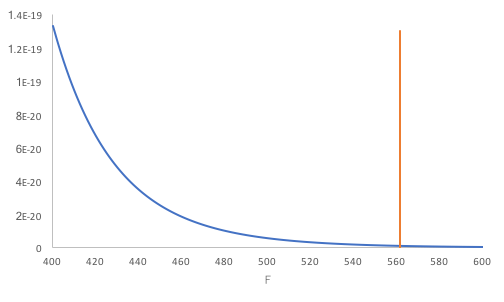
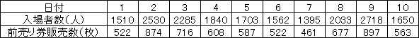

今回使うファイルです。必要に応じてご利用ください。文字コードはUTF-8です。

<ul>
<li><a href="07.csv">[練習問題]ジェラート屋の1日の売上(07.csv)</a></li>
</ul>

回帰分析
--------

### 変数の関係を探る流れ

<a href="../06/">相関分析</a>では、2変数の<a href="../06/#chapter2">相関関係</a>がわかりました。この関係を式で表すことで、一方の変数から他方の変数を予測したりすることができます。この式を求めることなどを回帰分析（regression analysis）と呼び、求められた式を回帰式（regression equation）と呼びます。

回帰分析では、例えば、$ x$、$ y$の2変数について、$ x$を<a href="../04/#explanatory_variable">説明変数</a>、$ y$を<a href="../04/#target_variable">目的変数</a>として、その関係を表す式（$ y$の$ x$への回帰式（regression equation of $ y$ on $ x$））を求めます。なお、回帰式は$ x$と$ y$の関係を完全には表しきれていない（$ x$から$ y$の<a href="##chapter11">予測の精度</a>が高くない）場合もあることに注意してください。

|  | 線形回帰（linear regression） | 非線形回帰（nonlinear regression） |
| -- | -- | -- |
| 単回帰分析（simple regression analysis） 説明変数が1つ | $ y = a + bx$ など | $ y = ax^b$ など |
| 重回帰分析（multiple regression analysis） 説明変数が2つ以上 | $ y = a + bx_1 + cx_2$ など | $ y = ax_1^{x_2}$ など |

ここでは特に、説明変数が1つである単回帰分析、かつ、2変数の関係を1次式で表現する線形回帰、つまり、$ y = a + bx$と表す線形単回帰分析（simple linear regeression）について扱います。

線形単回帰分析
----------

線形単回帰分析では2つの変数の関係は1次式で表され、図示すると直線になります。この、<a href="../04/#explanatory_variable">説明変数</a>の値から<a href="../04/#target_variable">目的変数</a>の値を予測する直線を、単回帰直線（simple regression line）といいます。

### 回帰式の求め方

対になったデータ$ x_i$と$ y_i$（$ i$ = 1, 2, … , $ N$）から<a href="#regression_equation">回帰式</a>$ y = a + bx$を求めるには以下の数式を用います。

&#9312; $ \displaystyle b = \frac{S_{xy}}{S_x}$：回帰係数（regression coefficient）

&#9313; $ a = \overline{y} - b\overline{x}$：切片（intercept）

* $ \displaystyle S_{xy} = \sum_{i = 1}^N \left( x_i - \overline{x} \right) \left( y_i - \overline{y} \right)$：$ x$と$ y$との<a href="../01/#deviation">偏差</a>積和
* $ \displaystyle S_x = \sum_{i = 1}^N {\left( x_i - \overline{x} \right)}^2$：$ x$の<a href="../01/#sum_of_squared_deviations">偏差平方和</a>
* $ \displaystyle \overline{x} = \frac{1}{N} \sum_{i = 1}^N x_i$：$ x_i$の<a href="../01/#mean">平均</a>
* $ \displaystyle \overline{y} = \frac{1}{N} \sum_{i = 1}^N y_i$：$ y_i$の平均

$ i$番目の<a href="../04/#explanatory_variable">説明変数</a>$ x_i$に対する<a href="../04/#target_variable">目的変数</a>$ y_i$とある直線$ y = a + bx$との距離（<a href="#residual">残差</a>）を$ Q_i$で表すと，その二乗値は

$ \displaystyle Q_{i}^2 = {\\{y_{i} - (a + bx_{i})\\}}^2$

で与えられます。この$ Q_i^2$の合計（残差平方和）
$ \displaystyle \sum_{i = 1}^N Q_i^2$
を最小にすることによって、2変数$ x$と$ y$との関係を表すのに最も適した回帰式を求めることができる、とする方法を最小二乗法（least squares method）と呼びます。最小二乗法で求めた$ a$と$ b$が<a href="#equation_derivation">上式</a>の切片$ a$と回帰係数$ b$になっています。ここで、説明変数$ x_i$に対して求めた回帰式によって予測した目的変数の値を$\hat{y}\_i = a + bx_i$で表すと、<a href="#intercept">切片を求める式</a>から$ \hat{y}_i$の平均$\displaystyle \frac{1}{N} \sum\_{i = 1}^N \hat{y}\_i$は$\overline{y}$と等しくなることがわかります。

なお、$ x$と$ y$とをそれぞれ<a href="../02/#standardization">標準化</a>して回帰係数$ b$を求めると，$ b$は<a href="../06/#chapter7">相関係数</a>rと等しくなります。

### 練習問題1

次のデータは、あるジェラート屋の1日の売上高と客数、気温のデータです。客数（$ x$）から売上高（$ y$）を予測してください。

データ  
<a href="07.csv">[練習問題]ジェラート屋の1日の売上(07.csv)</a>　

 

### Rの操作

Rを用いて<a href="#chapter5">練習問題1</a>に取り掛かりましょう。

&#9312; データをRに入力します。

##### コード

<pre class="Rcode">
# データの読み込み
data07<- read.csv("07.csv")
</pre>
 

&#9313; 客数（$ x$）から売上高（$ y$）を予測する単回帰分析を実行します。

##### コード

<pre class="Rcode">
# 列の抽出
uriage = data07$売上高
kyaku= data07$客数
#単回帰分析
lm(uriage ~ kyaku, data<-data07)
</pre>

##### 結果

<pre class="Rres">
Call:
lm(formula = uriage ~ kyaku, data = data <- data07)

Coefficients:
(Intercept)        kyaku  
   -42014.6        827.2  
</pre>
 

回帰式$ y$ = 827.2 - 42014.6$ x$が求まりました。

 

&#9314; 回帰式を含む散布図を作成します。

##### コード

<pre class="Rcode">
#散布図の作成
plot(kyaku,uriage)
abline(lm(uriage ~ kyaku, data<-data07))
</pre>

##### 結果

<pre class="Rres">

</pre>
 

### 回帰式の吟味

<a href="#regression_equation">回帰式</a>によって予測した$ y$の値と、実際の$ y$の値との差を残差（residual）といいます。この残差を用いて、求めた回帰係数$ b$が予測に役立っているかを検定することができます。

#### 仮説の設定

* <a href="../02/#null_hypothesis">帰無仮説</a>H0：回帰係数$ b$は予測に役立っていない（極端に言えば$ b$ = 0）
* <a href="../02/#alternative_hypothesis">対立仮説</a>H1：回帰係数$ b$は予測に役立っている（$ b$ ≠ 0）

#### 有意水準αの設定

<a href="../04/#chapter1">有意水準</a>α = 0.05とします。

#### 検定統計量$ F$値の算出

今回、<a href="../02/#test_statistic">検定統計量</a>$ F$値は以下の数式で求めることができます。

$ \displaystyle F = \frac{V_{\hat{y}}}{V_Q}$

* $ \displaystyle V_{\hat{y}} = \frac{1}{1} \sum_{i = 1}^N {\left( \hat{y}_i - \overline{y} \right)}^2$：予測値$ \hat{y}$の<a href="../01/#variance">不偏分散</a>（自由度1）
* $ \displaystyle V_Q = \frac{1}{N - 2} \sum_{i = 1} Q_i^2$：<a href="#residual">残差</a>の不偏分散（自由度$ N - 2$）
* $ \displaystyle \overline{y} = \frac{1}{N} \sum_{i = 1}^N y_i = \frac{1}{N} \sum_{i = 1}^N \hat{y}_i$：$ y$の<a href="../01/#mean">平均</a>、<a href="#same_mean">予測値$ \hat{y}$の平均</a>

残差$ Q_i$は<a href="../04/#target_variable">目的変数</a>の値$ y_i$と<a href="#estimated_value">回帰式によって予測した値$ \hat{y}_i$</a>とを用いて$ Q_i = y_i - \hat{y}_i$と表すことができます。これを$ y_i = \hat{y}_i + Q_i$と変形し、左辺から$ y$の平均$ \overline{y}$を、右辺から$ \hat{y}_i$の平均$ \overline{y}$を、それぞれ引くと$ y_i - \overline{y} = \left( \hat{y}_i - \overline{y} \right) + Q_i$となります。これは、左辺の目的変数$ y$の偏差$ y_i - \overline{y}$が右辺第1項の$ x_i$への回帰で表される（予測値$ \hat{y}_i$の偏差で説明できる）部分$ \hat{y}_i - \overline{y}$と右辺第2項の回帰で表されない部分$ Q_i$とから成り立つことを意味します。この$ y$の散らばり具合を不偏分散を用いて表せば、$V_y = V\_{\hat{y}} + V_Q$となります。

* $ \displaystyle V_y = \frac{1}{N - 1} \sum_{i = 1}^N {\left( y_i - \overline{y} \right)}^2$：$ y$の不偏分散（自由度$ N - 1$）

検定統計量$ F$は<a href="#explained">回帰式で説明できる部分</a>の不偏分散と<a href="#unexplained">説明できない部分</a>の不偏分散との比で、<a href="../02/#null_hypothesis">帰無仮説</a>が成立する場合、$ F$は自由度が(1, $ N - 2$)の<a href="../levene_s_test/#f-distribution">F分布</a>に従うことがわかっています。

#### $p$値の算出

<a href="../04/#chapter1">有意水準</a>と比較する確率$p$値を計算します。$p$値は、自由度が(1, $ N - 2$)の<a href="../levene_s_test/#f-distribution">F分布</a>において$ F$値より大きい値が発生する確率です。<a href="../02/#null_hypothesis">帰無仮説</a>が成立する場合、$ V_{\hat{y}}$が$ V_Q$より小さくなるため、結果として$ F$値は小さくなり、$p$値は大きくなります。逆に帰無仮説が成立しない場合は、$ F$値は大きいため$p$値は小さくなります。

#### 判定



<a href="../levene_s_test/#f-distribution">F分布</a>はこのようなグラフを描きます。このグラフで<a href="#p_of_F">$p$値</a>を表す面積が<a href="../04/#chapter1">有意水準</a>の確率を表す面積より大きいか小さいかで<a href="../02/#null_hypothesis">帰無仮説</a>の受容か棄却かを決定します。なお、図のとおり、自由度によって、このF分布のグラフは変わります。
<dl>
 	<dt>$p$値 ≦ 有意水準α</dt>
 	<dd>帰無仮説H0を棄却する</dd>
 	<dt>$p$値 &gt; 有意水準α</dt>
 	<dd>帰無仮説H0を受容する</dd>
</dl>

### Rの操作

ここまで検定の理論について説明してきましたが、Rを用いて検定を行ってみましょう。

&#9312; 単回帰分析の実行まで終えていることとして、データの詳細を表示します。

##### コード

<pre class="Rcode">
#データの詳細を表示
summary(lm(uriage ~ kyaku, data<-data07))
</pre>

##### 結果

<pre class="Rres">
Call:
lm(formula = uriage ~ kyaku, data = data <- data07)

Residuals:
     Min       1Q   Median       3Q      Max 
-27359.8 -12870.3   -789.6  13432.3  30370.9 

Coefficients:
            Estimate Std. Error t value Pr(>|t|)    
(Intercept) -42014.6    19846.7  -2.117   0.0436 *  
kyaku          827.2      108.7   7.609 3.48e-08 ***
---
Signif. codes:  0 ‘***’ 0.001 ‘**’ 0.01 ‘*’ 0.05 ‘.’ 0.1 ‘ ’ 1

Residual standard error: 16090 on 27 degrees of freedom
Multiple R-squared:  0.682,	Adjusted R-squared:  0.6702 
F-statistic:  57.9 on 1 and 27 DF,  p-value: 3.483e-08
</pre>

### 結果

<a href="#p_of_F">$p$値</a> = 3.483 × 10-08が求まりました。下図の塗りつぶされた領域が全体に対してpの割合になっています。

$p$値 = 3.483 × 10-08 &lt; <a href="../04/#chapter1">有意水準</a>α = 0.05 なので<a href="../02/#null_hypothesis">帰無仮説</a>H0は棄却されます。したがって、<a href="#regression_equation">回帰式</a>は統計的に有意であると分かります。

### 決定係数

<a href="#regression_equation">回帰式</a>は統計的に意味があることはわかりましたが、<a href="../04/#explanatory_variable">説明変数</a>$ x$は<a href="../04/#target_variable">目的変数</a>$ y$の変動をどれくらい説明できるのでしょうか。

<a href="#section2.4.3">検定統計量$ F$値の算出</a>で述べたとおり、<q cite="#section2.4.3">左辺の目的変数$ y$の偏差$ y_i - \overline{y}$が<a href="#explained">右辺第1項の$ x_i$への回帰で表される（予測値$ \hat{y}_i$の偏差で説明できる）部分$ \hat{y}_i - \overline{y}$と</a><a href="#unexplained">右辺第2項の回帰で表されない部分$ Q_i$とから成り立</a></q>っています。そこで、$ x_i$への回帰で表される部分$ \hat{y}_i - \overline{y}$が$ y$の散らばり具合$ y_i - \overline{y}$をどの程度表しているかを比で表します。回帰で表される部分に対する<a href="../01/#sum_of_squared_deviations">偏差平方和</a>

$ \displaystyle S_{\hat{y}} = \sum_{i = 1}^N {\left( \hat{y}_i - \overline{y} \right)}^2$

と目的変数$ y$の偏差平方和

$ \displaystyle S_y = \sum_{i = 1}^N {\left( y_i - \overline{y} \right)}^2$

とを用いて比を取った

$ \displaystyle R^2 = \frac{S_{\hat{y}}}{S_y}$

を考えます。

この$ R^2$は決定係数（coefficient of determination）と呼ばれ、0 ≤ $ R^2$ ≤ 1です。予測値$ \hat{y}\_i$の散らばり具合が大きければ$ S\_{\hat{y}}$が大きくなり、$ R^2$は大きくなるので、$ R^2$が1に近ければ予測値の散らばり具合は目的変数$ y$の散らばり具合に近く、説明変数$ x$が目的変数$ y$の変動を説明できていることになります。なお、<a href="#simple_regression_analysis">単回帰分析</a>では決定係数と<a href="../06/#chapter7">相関係数</a>rの二乗値とが等しい、すなわち、$ R^2$ = r2です。

### Rの操作

Rで確認してみましょう。単回帰分析を実行し、データの詳細を表示した結果を見ます。

<pre class="Rres">
Multiple R-squared:  0.682
</pre>

$ R^2$ = 0.682であると分かりました。

重回帰分析
----------

### 練習問題2

次のデータは、あるジェラート屋の1日の売上高と客数、気温のデータです。<a href="#chapter5">練習問題1</a>と同じデータです。今度は、客数（$ x$1）と気温（$ x$2）から売上高（$ y$）を予測してください。

データ  
<a href="07.csv">[練習問題]ジェラート屋の1日の売上(07.csv)</a>　
 

### Rの操作

Rを用いて<a href="#chapter5">練習問題2</a>に取り掛かりましょう。

&#9312; データをRに入力します。<a href="#chapter5">練習問題1</a>から続けて行う場合は不要です。

##### コード

<pre class="Rcode">
# データの読み込み
data07<- read.csv("07.csv")
</pre>
 

&#9313; 客数（$ x$1）と気温（$ x$2）から売上高（$ y$）を予測する重回帰分析を実行し、データの詳細を表示します。
<a href="#chapter5">練習問題1</a>から続けて行う場合は、売上高と客数の列の抽出は不要です。

##### コード

<pre class="Rcode">
# 列の抽出
uriage = data07$売上高
kyaku= data07$客数
kion= data07$気温

# 重回帰分析
data07.lm<-lm(uriage ~ kyaku+kion,  data=data07)

#データの詳細を表示
summary(data07.lm)
</pre>

##### 結果

<pre class="Rres">
Call:
lm(formula = uriage ~ kyaku + kion, data = data07)

Residuals:
     Min       1Q   Median       3Q      Max 
-27224.2  -7714.0    545.4  10762.8  21627.8 

Coefficients:
             Estimate Std. Error t value Pr(>|t|)   
(Intercept) -156916.3    45497.6  -3.449  0.00193 **
kyaku           519.8      148.5   3.499  0.00170 **
kion           5754.2     2096.7   2.744  0.01084 * 
---
Signif. codes:  0 ‘***’ 0.001 ‘**’ 0.01 ‘*’ 0.05 ‘.’ 0.1 ‘ ’ 1

Residual standard error: 14440 on 26 degrees of freedom
Multiple R-squared:  0.7534,	Adjusted R-squared:  0.7344 
F-statistic: 39.72 on 2 and 26 DF,  p-value: 1.247e-08
</pre>
 

### 共線性の確認

### 結果

課題
----

次の表は、あるアミューズメント施設の入場者数と前売り券の販売枚数を10日にわたり調査した結果です。 入場者数を<a href="../04/#target_variable">目的変数</a>（$ y$）、前売り券の販売枚数を<a href="../04/#explanatory_variable">説明変数</a>（$ x$）として、<a href="#regression_equation">回帰式</a>を求め、<a href="#regression_line">回帰直線</a>を図示し、その後、回帰式の検定を行ってください。また、回帰式が有意である場合、前売り券が700枚売れたとき、当日入場者数はどのくらい見込めると予測できるでしょうか？

表2：入場者数と前売り券販売枚数

